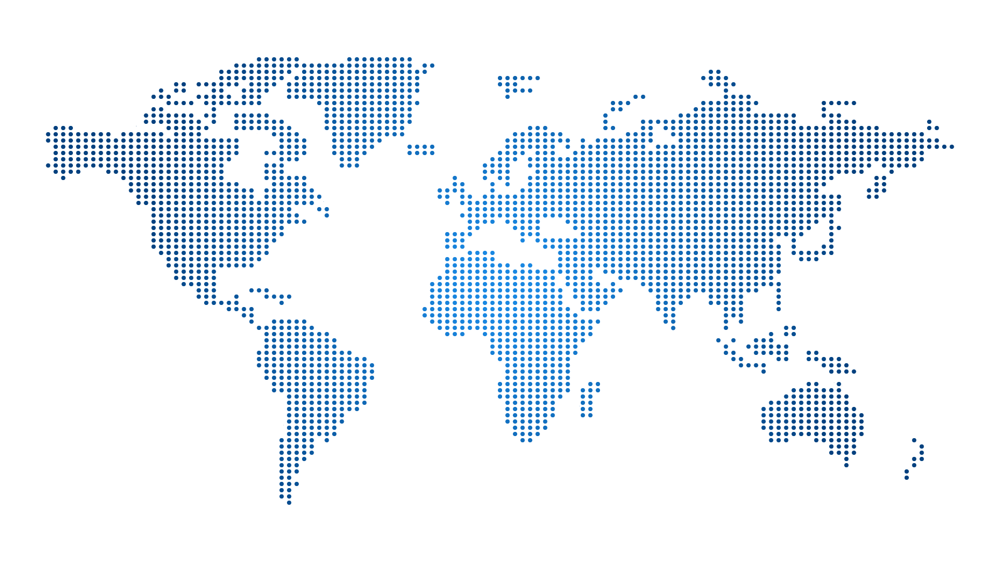

# Server Salad — Website Build Spec & Reference

> **How to use this document.** This file fully specifies the Server Salad
> website: *why* it's built the way it is, and the *exact* HTML/CSS/JS/PHP
> needed to build it from nothing. **Part B — Build Steps** embeds every
> source file verbatim, in dependency order — copy each code block into the
> named file and the site is reproduced exactly, no other source required.
> **Part C onward** explains every design decision, content provenance flag,
> and open item, so whoever continues the work (human or AI) understands not
> just the code but the reasoning behind it. Read top to bottom once; after
> that, jump to the section you need.

---

## Part A — Orientation

### A.1 What this is
A website for a web hosting business, **Server Salad** — Sri Lanka-based
support, European infrastructure. Built and served locally via XAMPP (Apache)
from `htdocs/server-salad-cloud-services-web`. Local URL:
`http://localhost/server-salad-cloud-services-web/`.

### A.2 Stack
- **HTML + CSS + JavaScript only.** No build tools, no frameworks.
- **One deliberate exception: a single PHP endpoint for live pricing**
  (`api/pricing.php`). A browser can't speak MySQL directly, and DB
  credentials must never reach client-side code (fully exposed to any visitor
  via view-source) — so pulling the cpanel-hosting Plans table's prices from a
  real database needs a server-side layer. This is the **only** PHP in the
  project; everything else stays static HTML/CSS/JS.

### A.3 Standing conventions
- **Only update this README when explicitly asked.** Make code changes
  without touching README.md by default; when an update *is* requested,
  update the relevant section in place — this file describes *what the site
  is*, not *what was done to it*.
- **Narrow scope by default.** When an instruction shows one specific element,
  change only that element — don't assume it applies to lookalike elements
  elsewhere (e.g. the hero cards and the Web Hosting▾ mega-menu cards look
  similar but are separate). Broaden scope only if needed to avoid visual
  inconsistency, and flag that decision.
- **Never invent unverified factual claims** (fake review scores, fake
  pricing, fabricated statistics/partnerships/logos) — use neutral
  placeholders and flag them clearly until real content is supplied. This
  extends to unverifiable **qualitative** claims too (e.g. "award-winning").
- **Image rule — every image, every time:** place it under `assets/img/`
  (its own subfolder for a distinct group), and rename it to a
  lowercase-hyphenated SEO-friendly filename that **tallies with the
  card/section title it illustrates** — never keep an upload's original name
  (camera/export names, "(1)" suffixes, stock-photo IDs, spaces).
- **Cache-busting:** `css/styles.css` is linked with `?v=N` (currently
  **v=259**); `js/main.js` has its own separate `?v=N` (currently **v=13**).
  Bump the relevant one any time that file changes, in **every** page's tag,
  so browsers fetch the latest version instead of a stale cached copy.
- **Brand name.** The brand name is **two words: "Server Salad"** in **all
  human-readable text** — page copy, headings, `alt`/`aria-label` text, page
  titles. The tab title is "Server Salad Cloud Services" on every page.
  **Machine-readable slugs stay one lowercase word `serversalad`**: image
  filenames (`serversalad-logo.png`, `serversalad-favicon.svg`), CSS classes,
  the `info@serversalad.com` / `+94 71 200 0006` contact details, and any real
  external URL/domain (`serversalad.com`, the Trustpilot/LinkedIn links).
  **The project folder and every root-relative site path use the longer slug
  `server-salad-cloud-services-web`** instead — distinct from the one-word
  slugs above, which stayed unchanged when the repo was renamed. If you see
  the one-word "ServerSalad" in visible text, it's a bug — fix it to the
  two-word form.
- **Brand colours usage:** official brand colours (from the logo) are dark
  slate `#323D41` and orange `#F57E20` (`--brand-dark`, `--brand-orange`).
  These don't need to appear everywhere — use them at genuine brand
  touchpoints; elsewhere prefer the broader orange→red accent palette
  (`--accent`/`--accent-2`). The homepage Plans section, "Why Choose Server
  Salad" heading/icons, eco/hero accents, and the **entire cpanel-hosting
  page** use `--brand-orange` throughout; the homepage hero cards and main nav
  keep the rose/red `--accent` palette. This split is intentional.
- **Reference-styling rule:** when implementing or restyling an element from a
  supplied reference/template (e.g. a font-inspector screenshot), match its
  **typography and box dimensions** (font family/size/weight/line-height,
  padding, icon size, gaps) but **not its colours** — keep the site's own
  colour for that element unless told otherwise for that specific request.
  Any such override applies only to the element named, not as a blanket rule.
- **Homepage section underlines are unified:** `.features__underline`,
  `.migration__underline`, `.cloud__underline` all share one look — 150px
  wide, 4px tall, flat solid `--brand-orange`, sharp square corners.
  `.eco__underline` is the one exception (green→red→orange gradient,
  deliberate one-off).
- Folder-with-`index.html` structure (not `<page>.html`) for every page, so
  URLs stay clean (`/server-salad-cloud-services-web/cpanel-hosting/`, not
  `.../cpanel-hosting.html`) — Apache serves `index.html` automatically for a
  directory request. Apply this to any future page.

### A.4 Design tokens (consolidated reference)

All in `:root`, `css/styles.css`:

| Token | Value | Usage |
|---|---|---|
| `--brand-dark` | `#323d41` | Genuine brand touchpoints only |
| `--brand-orange` | `#f57e20` | Brand touchpoints + entire cpanel-hosting page |
| `--bg-dark` | `#0a0a0b` | Main nav background |
| `--bg-topbar` | `#000` | Topbar, footer, cph-table package header, nav mega-features box |
| `--text` | `#f5f5f7` | Light text on dark sections |
| `--text-muted` | `#b5b5bd` | Topbar text |
| `--accent` | `#e5484d` | Rose/red — hero title accent, nav, plan-card badge gradient |
| `--accent-2` | `#ff8a5c` | Paired with `--accent` in gradients |
| `--eco-green-light` | `rgb(95, 227, 154)` | Sustainability section only |
| `--radius` | `8px` | Default border-radius |
| `--container` | `1240px` | Max content width, every section |
| `--gutter` | `24px` (16px ≤600px) | Left/right page spacing, every section |
| `--font-heading` | `"Poppins", "Segoe UI", Roboto, Helvetica, Arial, sans-serif` | Base heading stack |
| `--font-body` | `"Inter", "Segoe UI", Roboto, Helvetica, Arial, sans-serif` | Base body stack |

**Layered per-element font families** (not site-wide — see each component's CSS
in Part B for exactly which class uses which): **Cairo** (400/600/900) on most
headings/titles instead of Poppins; **Manrope** (300/400/500/600) on most
body/description text instead of Inter; **Montserrat** (600/800) narrowly on
the hero title and main nav links. All three are pinned to specific weights in
the Google Fonts `<link>` in every page's `<head>` (see B.5/B.6) — add a new
weight there before using it in CSS, or the browser fakes it.

**`.container`** = `max-width: var(--container)`, centred,
`padding: 0 var(--gutter)`. Every full-width band colours the **outer**
section element and keeps the inner `.container` for content — never add
ad-hoc left/right margins on components.

**Breakpoints used across the site:** 1240 (container), 980, 900, 860, 700,
600, 560, 480, 400/480/760 (hero logo carousel visible-count steps only).

### A.5 Project structure
```
server-salad-cloud-services-web/
  README.md                        <- this file
  index.html                       <- homepage
  css/
    styles.css                     <- all styles (tokens in :root at top)
  js/
    main.js                        <- nav, hero carousel, header/footer inject,
                                       live pricing + billing toggle
  partials/
    header.html                    <- topbar + nav, injected into every page
    footer.html                    <- footer, injected into every page
  cpanel-hosting/
    index.html                     <- 2nd page, /server-salad-cloud-services-web/cpanel-hosting/
  api/
    pricing.php                    <- the one server-side file (live pricing)
  downloads/                       <- staging folder for new images (git-ignored contents)
  assets/
    img/
      brand/       <- nav logo, footer logo, favicon (serversalad-*)
      photos/       <- eco-forest-canopy.jpg
      graphics/     <- world-map-dots.png, jetbackup-illustration.png, cpanel-dashboard-devices.webp
      partners/     <- 6 "powered by" carousel logos
      flags/        <- uk-flag.svg, uk-flag-circle.png
      hero/         <- 4 homepage hero-card icons (reused by Plans + mega-menu)
      why-choose/   <- 6 homepage "Why Choose Server Salad" icons
      migration/    <- 4 homepage "Effortless cPanel Transfer" icons
      cloud/        <- 6 homepage "Our Cloud Infrastructure" icons
      reviews/      <- google-logo.png, trustpilot-logo.png
      features/     <- 12 cph "Features" icons
      why/          <- 3 cph "Why Server Salad" icons
      email/        <- 6 cph "Business Email" icons
      backups/      <- 6 cph "Backups" icons
      apps/         <- 7 one-click-install app logos (real brand colours)
      nav/          <- mega-menu mouse-pointer icon
      footer/       <- footer icons (phone/email/socials/CTA)
```
Every `assets/img/<section>/` icon (except `apps/`, real brand logos) is a
single-colour SVG saved with `fill="currentColor"`; CSS recolours it to
`--brand-orange` (or `currentColor`) via `mask` — see the masked-icon pattern
in Part B's CSS.

---

## Part B — Build Steps

Follow in order. Every code block is the complete, exact file content — copy
it verbatim into the named path.

### B.0 Before you start
Load these fonts in the `<head>` of **every** HTML page (both `index.html`
and `cpanel-hosting/index.html`):
```html
<link rel="preconnect" href="https://fonts.googleapis.com">
<link rel="preconnect" href="https://fonts.gstatic.com" crossorigin>
<link href="https://fonts.googleapis.com/css2?family=Cairo:wght@400;500;600;700;900&family=Inter:wght@400;500;600;700&family=Manrope:wght@300;400;500;600;700&family=Montserrat:wght@600;700;800&family=Poppins:wght@600;700;800&display=swap" rel="stylesheet">
```
Every page also carries the same `<title>Server Salad Cloud Services</title>`
and the same favicon tag:
```html
<link rel="icon" type="image/svg+xml" href="/server-salad-cloud-services-web/assets/img/brand/serversalad-favicon.svg">
```

### B.1 `css/styles.css`
```css
/* ===== Base / tokens ===== */
:root {
  /* Official brand colours (from the logo). Not used everywhere by default — reach
     for these at brand touchpoints; the rest of the UI uses a broader accent palette
     for visual interest. */
  --brand-dark: #323d41;
  --brand-orange: #f57e20;

  --bg-dark: #0a0a0b;
  --bg-topbar: #000;
  --text: #f5f5f7;
  --text-muted: #b5b5bd;
  --accent: #e5484d;
  --accent-2: #ff8a5c;
  --eco-green-light: rgb(95, 227, 154); /* used only in the sustainability section */
  --radius: 8px;
  --container: 1240px;   /* max content width — same on every section */
  --gutter: 24px;        /* left/right page spacing — same on every section */

  /* Type system — 2 families site-wide: Poppins for headings/emphasis (bold, punchy),
     Inter for body/UI text (readable at small sizes). Both loaded via Google Fonts
     in index.html <head>. Fall back to the system stack if the webfont fails. */
  --font-heading: "Poppins", "Segoe UI", Roboto, Helvetica, Arial, sans-serif;
  --font-body: "Inter", "Segoe UI", Roboto, Helvetica, Arial, sans-serif;
}

* { box-sizing: border-box; }

html, body { margin: 0; }

body {
  font-family: var(--font-body);
  color: #1b1b1f;
  background: #fff;
}

h1, h2, h3, h4,
.nav__link, .btn,
.hero-card__badge,
.mega-card__title {
  font-family: var(--font-heading);
}

a { color: inherit; text-decoration: none; }
button { font: inherit; cursor: pointer; }

/* Every full-width section wraps its content in .container so the left/right
   gutter is identical site-wide. A full-bleed background = colour the outer
   section, keep the inner .container. */
.container {
  max-width: var(--container);
  margin: 0 auto;
  padding: 0 var(--gutter);
}

@media (max-width: 600px) {
  :root { --gutter: 16px; }
}

/* ===== Top utility bar ===== */
.topbar {
  background: var(--bg-topbar);
  color: var(--text-muted);
  font-family: "Manrope", var(--font-body);
  font-size: 13px;
  font-weight: 500;
  line-height: 20px;
}

.topbar__inner {
  display: flex;
  align-items: center;
  justify-content: space-between;
  gap: 28px;
  height: 34px;
}

.topbar__group {
  display: flex;
  align-items: center;
  gap: 24px;
}

.topbar__link {
  display: inline-flex;
  align-items: center;
  gap: 6px;
  color: var(--text-muted);
  transition: color .15s;
}
.topbar__link:hover { color: var(--text); }

/* ===== Nav dropdown (simple lists: Discount Programs, Support) ===== */
.caret {
  width: 0;
  height: 0;
  border-left: 4px solid transparent;
  border-right: 4px solid transparent;
  border-top: 5px solid currentColor;
  transition: transform .15s;
}
.nav__item.is-open .caret { transform: rotate(180deg); }

.nav__item { position: relative; }

.nav__sub {
  position: absolute;
  top: calc(100% + 10px);
  left: 0;
  min-width: 200px;
  background: #17171a;
  border: 1px solid #26262b;
  border-radius: var(--radius);
  padding: 6px;
  list-style: none;
  margin: 0;
  box-shadow: 0 18px 40px rgba(0, 0, 0, .4);
  opacity: 0;
  visibility: hidden;
  transform: translateY(-6px);
  transition: opacity .15s, transform .15s, visibility .15s;
  z-index: 60;
}
.nav__item.is-open .nav__sub {
  opacity: 1;
  visibility: visible;
  transform: translateY(0);
}

.nav__sub li a {
  display: block;
  width: 100%;
  text-align: left;
  background: none;
  border: 0;
  color: var(--text-muted);
  padding: 9px 12px;
  border-radius: 6px;
  font-size: 13px;
  transition: background .12s, color .12s;
}
.nav__sub li a:hover {
  background: #23232a;
  color: var(--text);
}

/* ===== Mega menu (Web Hosting) =====
   .nav__item.has-mega overrides position back to static so .nav__mega (absolute,
   left:0; right:0) resolves against .nav (the full-width sticky header) instead of
   the li — that's what makes the panel span edge-to-edge. The inner .container
   re-applies the site's standard gutter so card content lines up with everything else. */
.nav__item.has-mega { position: static; }

.nav__mega {
  position: absolute;
  top: 100%;
  left: 0;
  right: 0;
  background: #fff;
  border-top: 1px solid #e3e3e8;
  border-bottom: 2px solid var(--brand-orange);
  box-shadow: 0 24px 48px rgba(0, 0, 0, .12);
  opacity: 0;
  visibility: hidden;
  transform: translateY(-8px);
  transition: opacity .18s, transform .18s, visibility .18s;
  z-index: 60;
}
.nav__item.is-open .nav__mega {
  opacity: 1;
  visibility: visible;
  transform: translateY(0);
}

.nav__mega-inner {
  display: grid;
  grid-template-columns: repeat(auto-fit, minmax(240px, 1fr));
  gap: 18px;
  padding-top: 28px;
  padding-bottom: 32px;
}
/* Web Hosting▾ only (so far — the only one with real existing copy to fill an
   intro column with, see its comment in header.html): a fixed-width intro column
   + thin divider + a flexible row of cards, instead of the plain auto-fit grid
   the other (introless) mega menus use. */
.nav__mega-inner--intro {
  grid-template-columns: 1fr 260px;
  align-items: stretch;
  gap: 0;
}
/* Tops already line up (both start at the grid row's top); stretch makes the
   Key Features box grow to match .nav__mega-left's height too, so its bottom
   edge lands level with the apps strip's bottom instead of ending short. */
.nav__mega-left { display: flex; flex-direction: column; }
/* Intro + divider + cards, side by side — everything left of the Key
   Features box. The app-logos strip sits below this as a 2nd row, its width
   naturally capped to this wrapper's own width (see .nav__mega-apps). */
.nav__mega-left-top {
  display: grid;
  grid-template-columns: 300px 1fr;
  align-items: start;
  gap: 0;
}
.nav__mega-intro { padding: 12px 28px 4px 0; }
.nav__mega-intro-title {
  margin: 0 0 10px;
  font-family: "Montserrat", var(--font-heading);
  font-size: 33px;
  line-height: 33px;
  font-weight: 700;
  text-transform: uppercase;
  color: rgb(40, 39, 39);
  white-space: nowrap;
}
/* Gradient accent word — same red/orange gradient as .hero__title-accent. */
.nav__mega-intro-title strong {
  font-weight: 700;
  background: linear-gradient(90deg, var(--accent), var(--accent-2));
  -webkit-background-clip: text;
  background-clip: text;
  color: transparent;
}
.nav__mega-intro-desc {
  margin: 0;
  font-family: "Cairo", var(--font-heading);
  font-size: 16px;
  font-weight: 500;
  line-height: 24px;
  color: rgb(122, 122, 122);
}
/* Divider + cards are flex siblings here (not separate grid columns) so the
   divider stretches to the cards' own content height, not the taller Key
   Features box's height. */
.nav__mega-middle { display: flex; align-items: stretch; }
.nav__mega-intro-divider { width: 1px; flex-shrink: 0; background: #e3e3e8; }
/* Stacked top-to-bottom (not side-by-side) — matches the reference's product-row
   layout, where each card runs the full width of its column. */
.nav__mega-cards { flex: 1 1 auto; display: flex; flex-direction: column; gap: 18px; padding-left: 28px; margin-right: 28px; }
.nav__mega-cards .mega-card { width: 100%; }

/* App-install logos strip — 2nd row under intro+cards, width-capped to
   .nav__mega-left (never reaches the Key Features box at any viewport
   width); wraps to a 2nd line rather than overflowing if it doesn't fit. */
.nav__mega-apps {
  position: relative;
  margin-top: 18px;
  width: max-content;
  max-width: calc(100% - 28px);
  padding: 34px 18px;
  border-radius: var(--radius);
  background: #f8f8fa;
}
/* Same traveling-bolt effect as .plans__note-beam (see its comment for why
   an SVG stroke, not a conic-gradient) — reuses its keyframes as-is. */
/* Single stroke (no separate white core), softened with an actual blur so it
   reads as a hazy glow rather than a crisp line. */
.nav__mega-apps-beam {
  position: absolute;
  inset: 0;
  pointer-events: none;
  filter: blur(1.6px) drop-shadow(0 0 6px rgba(245, 126, 32, .8));
  animation: plans-note-flicker 4.2s ease-in-out infinite;
}
.nav__mega-apps-beam svg { display: block; width: 100%; height: 100%; overflow: visible; }
.nav__mega-apps-beam-glow {
  fill: none;
  stroke-linecap: round;
  stroke: var(--brand-orange);
  stroke-width: 3;
  opacity: .9;
  animation: plans-note-travel 4.2s linear infinite,
             plans-note-length 5.6s ease-in-out infinite;
}
.nav__mega-apps-row {
  display: flex;
  align-items: center;
  gap: 22px;
  flex-wrap: wrap;
}
.nav__mega-apps-logo {
  height: 38px;
  width: auto;
  object-fit: contain;
  flex-shrink: 0;
}
/* The whole link (text + pointer) bounces together as one unit, on top of
   which the pointer also gets its own press-squash + ripple — so the text
   isn't just sitting still while only the icon animates. All 4 animations
   below are scoped to ".nav__item.is-open" (not applied unconditionally) so
   they restart from 0% the instant the mega menu opens, instead of running
   continuously in the background the whole time it's closed — where
   visibility:hidden doesn't pause them — and being caught mid-cycle (often
   the idle stretch) whenever it's opened. */
.nav__mega-apps-link {
  display: inline-flex;
  align-items: center;
  gap: 8px;
  margin-left: 14px;
  font-family: "Cairo", var(--font-heading);
  font-size: 14px;
  font-weight: 700;
  line-height: 14px;
  color: var(--brand-orange);
}
.nav__item.is-open .nav__mega-apps-link { animation: nav-apps-link-bounce 1.8s ease-in-out infinite; }
.nav__mega-apps-link-text { max-width: 150px; text-align: right; }
.nav__item.is-open .nav__mega-apps-link-text { animation: nav-apps-text-glow 1.8s ease-in-out infinite; }
@keyframes nav-apps-link-bounce {
  0%, 100% { transform: translateY(0); }
  18% { transform: translateY(3px); }
  32% { transform: translateY(0); }
}
@keyframes nav-apps-text-glow {
  0%, 100% { text-shadow: none; }
  18% { text-shadow: 0 0 10px rgba(245, 126, 32, .6); }
  32% { text-shadow: none; }
}
/* Press-and-ripple loop — the finger dips down like it's pressing, then two
   rings expand outward from it and fade, like a tap/click ripple. */
.nav__mega-apps-link-arrow {
  position: relative;
  width: 30px;
  height: 30px;
  flex-shrink: 0;
  background-color: currentColor;
  -webkit-mask: var(--apps-link-icon) center / contain no-repeat;
  mask: var(--apps-link-icon) center / contain no-repeat;
}
.nav__item.is-open .nav__mega-apps-link-arrow { animation: nav-apps-press 1.8s ease-in-out infinite; }
.nav__mega-apps-link-arrow::before,
.nav__mega-apps-link-arrow::after {
  content: "";
  position: absolute;
  left: 50%;
  top: 50%;
  width: 100%;
  height: 100%;
  border-radius: 50%;
  border: 1.5px solid currentColor;
  transform: translate(-50%, -50%) scale(.4);
  opacity: 0;
  pointer-events: none;
}
.nav__item.is-open .nav__mega-apps-link-arrow::before,
.nav__item.is-open .nav__mega-apps-link-arrow::after { animation: nav-apps-wave 1.8s ease-out infinite; }
.nav__mega-apps-link-arrow::after { animation-delay: .5s; }
@keyframes nav-apps-press {
  0%, 100% { transform: translateY(0) scale(1); }
  18% { transform: translateY(3px) scale(.88); }
  32% { transform: translateY(0) scale(1); }
}
@keyframes nav-apps-wave {
  0% { transform: translate(-50%, -50%) scale(.4); opacity: .6; }
  18% { opacity: .45; }
  100% { transform: translate(-50%, -50%) scale(2); opacity: 0; }
}
@media (prefers-reduced-motion: reduce) {
  .nav__mega-apps-link,
  .nav__mega-apps-link-text,
  .nav__mega-apps-link-arrow,
  .nav__mega-apps-link-arrow::before,
  .nav__mega-apps-link-arrow::after,
  .nav__item.is-open .nav__mega-apps-link,
  .nav__item.is-open .nav__mega-apps-link-text,
  .nav__item.is-open .nav__mega-apps-link-arrow,
  .nav__item.is-open .nav__mega-apps-link-arrow::before,
  .nav__item.is-open .nav__mega-apps-link-arrow::after { animation: none; }
}

/* "Key Features" / "cPanel Business Hosting Difference" box — owner-supplied
   real plan-spec copy. Solid black, same token as the footer/topbar, not a
   new colour; checkmarks use --brand-orange, not the reference's red. */
.nav__mega-features {
  padding: 20px 20px 22px;
  border-radius: var(--radius);
  background: var(--bg-topbar);
}
.nav__mega-features-title {
  margin: 0 0 12px;
  font-family: "Montserrat", var(--font-heading);
  font-size: 18px;
  line-height: 18px;
  font-weight: 600;
  text-transform: uppercase;
  letter-spacing: .3px;
  color: #fff;
}
.nav__mega-features-title strong {
  font-weight: 600;
  background: linear-gradient(90deg, var(--accent), var(--accent-2));
  -webkit-background-clip: text;
  background-clip: text;
  color: transparent;
}
.nav__mega-features-title--sub { margin-top: 20px; }
.nav__mega-features-list {
  list-style: none;
  margin: 0;
  padding: 0;
  display: flex;
  flex-direction: column;
  gap: 8px;
}
.nav__mega-features-list li {
  display: flex;
  align-items: flex-start;
  gap: 8px;
  font-family: "Manrope", var(--font-body);
  font-size: 13px;
  font-weight: 300;
  line-height: 20px;
  color: rgb(255, 255, 255);
}
.nav__mega-features-list li strong { color: #fff; font-weight: 700; }
.nav__mega-features-check {
  flex-shrink: 0;
  width: 13px;
  height: 13px;
  margin-top: 2px;
  color: var(--brand-orange);
}

.mega-card {
  position: relative;
  display: flex;
  flex-direction: column;
  align-items: flex-start;
  gap: 8px;
  padding: 18px;
  border-radius: var(--radius);
  background: #f8f8fa;
  border: 1px solid #e3e3e8;
  transition: border-color .15s, transform .15s, background .15s;
}
.mega-card:hover {
  border-color: var(--brand-orange, var(--accent-2));
  background: #f1f1f5;
  transform: translateY(-2px);
}

/* Icon + title sit inline on one row (reference-inspired layout), rather than
   icon stacked above title. */
.mega-card__row { display: flex; align-items: center; gap: 10px; }

/* Solid orange icon on a light orange-tinted tile — same combo as
   .migration-card__icon — reads with far more contrast at this small size than
   the previous white-icon-on-gradient treatment, where the thin icon linework
   washed out against the busy background. */
.mega-card__icon {
  width: 36px;
  height: 36px;
  display: flex;
  align-items: center;
  justify-content: center;
  flex-shrink: 0;
  border-radius: 8px;
  background: rgba(245, 126, 32, .14);
  color: var(--brand-orange);
}

/* Same masked-external-SVG technique as .hero-card__icon-img (see its comment) —
   reuses the exact same icon files as the matching hero cards (cPanel Hosting /
   cPanel Business Hosting) via the --mega-icon custom property, so the icon glyph
   stays identical between the hero section and this mega-menu card. */
.mega-card__icon-img {
  width: 18px;
  height: 18px;
  background-color: currentColor;
  -webkit-mask: var(--mega-icon) center / contain no-repeat;
  mask: var(--mega-icon) center / contain no-repeat;
}

.mega-card__title {
  font-family: "Montserrat", var(--font-heading);
  font-size: 22px;
  line-height: 26px;
  font-weight: 500;
  letter-spacing: 0;
  text-transform: none;
  color: rgb(40, 39, 39);
}
.mega-card__title strong { font-weight: 500; }

.mega-card__desc {
  font-family: "Manrope", var(--font-body);
  font-size: 14px;
  font-weight: 300;
  line-height: 21px;
  color: rgb(122, 122, 122);
}

/* ===== Hero ===== */
.hero {
  position: relative;
  overflow: hidden;
  color: var(--text);
  /* Fill the rest of the viewport on load: 100vh minus the fixed header above it
     (34px topbar + 74px main nav). Content is vertically centred within that. */
  min-height: calc(100vh - 108px);
  display: flex;
  align-items: center;
}

.hero__bg {
  position: absolute;
  inset: 0;
  z-index: 0;
  background:
    radial-gradient(circle at 15% 20%, rgba(255, 255, 255, .12) 0, transparent 60%),
    linear-gradient(120deg, #2c1240 0%, #171a2e 45%, #0c2f37 100%);
}
.hero__bg::after {
  content: "";
  position: absolute;
  inset: 0;
  background-image: radial-gradient(rgba(255, 255, 255, .35) 1px, transparent 1px);
  background-size: 34px 34px;
  opacity: .12;
}

.hero__inner {
  position: relative;
  z-index: 1;
  width: 100%; /* .hero is now a flex container (for vertical centring) — without an
                  explicit width this flex item would shrink to its content instead
                  of filling/centring like a normal block .container would. */
  padding: 64px 0 56px;
  text-align: center;
}

.hero__title {
  margin: 0 0 14px;
  font-family: "Montserrat", var(--font-heading);
  font-size: clamp(26px, 3.6vw, 40px);
  font-weight: 800;
  line-height: 1;
  letter-spacing: .3px;
  text-transform: uppercase;
  color: rgb(255, 255, 255);
}
.hero__title-accent {
  font-weight: 600;
  background: linear-gradient(90deg, var(--accent), var(--accent-2));
  -webkit-background-clip: text;
  background-clip: text;
  color: transparent;
}

.hero__cards {
  display: grid;
  grid-template-columns: repeat(auto-fit, minmax(230px, 1fr));
  gap: 22px;
  margin-top: 88px;
  margin-bottom: 40px;
}

.hero-card {
  position: relative;
  display: flex;
  flex-direction: column;
  align-items: center;
  justify-content: center;
  text-align: center;
  gap: 14px;
  min-height: 340px;
  background: #fff;
  color: #1b1b1f;
  text-decoration: none;
  border: 1px solid transparent;
  border-radius: 14px;
  padding: 48px 26px;
  transition: transform .18s, box-shadow .18s, border-color .18s;
}
.hero-card:hover {
  transform: translateY(-4px);
  border-color: var(--accent);
  box-shadow: 0 18px 40px rgba(0, 0, 0, .35);
}

/* Floating pill centred on the card's top edge, half in / half out — replaces the
   earlier corner-ribbon treatment. */
.hero-card__badge {
  position: absolute;
  top: -14px;
  left: 50%;
  transform: translateX(-50%);
  background: #fff;
  color: var(--brand-orange);
  border: 1.5px solid var(--brand-orange);
  font-family: "Cairo", var(--font-heading);
  font-size: 13px;
  font-weight: 600;
  text-transform: uppercase;
  letter-spacing: .3px;
  line-height: 13px;
  text-align: center;
  padding: 6px 16px;
  border-radius: 999px;
  box-shadow: 0 4px 10px rgba(0, 0, 0, .12);
  white-space: nowrap;
}

.hero-card__icon {
  display: flex;
  align-items: center;
  justify-content: center;
  color: var(--brand-orange);
  margin-bottom: 4px;
}

/* Icon graphic itself: same masked-external-SVG technique as the cpanel-hosting
   page's .cph-feature__icon (see its comment) — painted via CSS `background-color`
   through a `mask`, so recolouring only ever means changing `color` here, not
   editing each SVG file. Each card sets its own icon file via the --hero-icon
   custom property inline on the element. */
.hero-card__icon-img {
  display: block;
  width: 34px;
  height: 34px;
  background-color: currentColor;
  -webkit-mask: var(--hero-icon) center / contain no-repeat;
  mask: var(--hero-icon) center / contain no-repeat;
}

.hero-card__title {
  margin: 0;
  font-family: "Cairo", var(--font-heading);
  font-size: 26px;
  font-weight: 600;
  line-height: 26px;
  color: rgb(40, 39, 39);
}

.hero-card__desc {
  margin: 0;
  font-family: "Manrope", var(--font-body);
  font-size: 15px;
  font-weight: 400;
  line-height: 23px;
  color: rgb(40, 39, 39);
}

/* "Powered by" partner logo strip — stretches to the same width as .hero__cards
   above it (both are full-width children of .hero__inner). */
.hero__strip {
  margin-top: 72px;
  border-top: 1px solid rgba(255, 255, 255, .12);
  padding-top: 28px;
}

/* Fixed "window" that only ever shows 4 logo slots; the track inside slides past it.
   js/main.js sets --logo-slot = this element's width ÷ 4 on load/resize. */
.hero__logos-viewport {
  overflow: hidden;
  cursor: grab;
  -webkit-user-select: none;
  user-select: none;
}
.hero__logos-viewport.is-dragging { cursor: grabbing; }

.hero__logos {
  display: flex;
  align-items: center;
  list-style: none;
  margin: 0;
  padding: 0;
  width: max-content;
  will-change: transform;
}
.hero__logos li {
  flex: 0 0 auto;
  width: var(--logo-slot, 200px);
  display: flex;
  align-items: center;
  justify-content: center;
}
.hero__logos img {
  display: block;
  height: 34px;
  width: auto;
  max-width: 85%;
  opacity: .75;
  filter: brightness(0) invert(1); /* normalise all partner logos to solid white */
  transition: opacity .15s;
  -webkit-user-drag: none;
  pointer-events: none; /* clicks/drags go to the viewport, not individual images */
}

@media (max-width: 600px) {
  .hero__inner { padding: 48px 0 40px; }
  .hero__cards { grid-template-columns: 1fr; }
}

/* ===== "What Makes Us Different" ===== */
.features {
  background: #f7f7f9;
  padding: 88px 0;
}

.features__title {
  margin: 0 0 20px;
  text-align: center;
  font-family: "Cairo", var(--font-body);
  font-size: clamp(24px, 3vw, 36px);
  font-weight: 400;
  line-height: 1;
  text-transform: uppercase;
  letter-spacing: 1px;
  color: rgb(40, 39, 39);
}

.features__underline {
  width: 150px;
  height: 4px;
  margin: 0 auto 64px;
  border-radius: 0;
  background: var(--brand-orange);
}

.features__grid {
  display: grid;
  grid-template-columns: repeat(3, 1fr);
  column-gap: 40px;
  row-gap: 56px;
}

.feature__icon {
  display: inline-flex;
  color: var(--brand-orange);
  margin-bottom: 16px;
}

/* Same masked-external-SVG technique as .hero-card__icon-img (see its comment) —
   background-color painted through a mask, so each card's icon file is just an
   asset swap via the --why-icon custom property, no colour baked into the file. */
.feature__icon-img {
  display: block;
  width: 30px;
  height: 30px;
  background-color: currentColor;
  -webkit-mask: var(--why-icon) center / contain no-repeat;
  mask: var(--why-icon) center / contain no-repeat;
}

.feature__title {
  margin: 0 0 10px;
  font-family: "Cairo", var(--font-heading);
  font-size: 28px;
  font-weight: 600;
  line-height: 1;
  text-transform: uppercase;
  letter-spacing: .3px;
  color: rgb(40, 39, 39);
}
.feature__title-accent {
  display: block;
  font-weight: 900;
}

.feature__desc {
  margin: 0;
  max-width: 320px;
  font-family: "Manrope", var(--font-body);
  font-size: 16px;
  font-weight: 400;
  line-height: 24px;
  color: rgb(122, 122, 122);
}

.features__reviews {
  display: flex;
  justify-content: center;
  flex-wrap: wrap;
  gap: 28px;
  margin-top: 76px;
  padding-bottom: 12px;
}
.review-btn {
  display: inline-flex;
  align-items: center;
  gap: 10px;
  padding: 14px 22px;
  border-radius: 8px; /* same rounded-corner as .plan-card .btn--outline */
  background: #fff;
  border: 1px solid #e3e3e8;
  box-shadow: 0 6px 16px rgba(0, 0, 0, .05);
  font-family: "Manrope", var(--font-body);
  font-size: 14px;
  font-weight: 600;
  line-height: 20px;
  color: rgb(76, 73, 96);
  transition: transform .15s, box-shadow .15s, border-color .15s;
}
.review-btn:hover {
  transform: translateY(-2px);
  box-shadow: 0 12px 24px rgba(0, 0, 0, .09);
  border-color: #d4d4db;
}
.review-btn__icon { width: 18px; height: 18px; flex-shrink: 0; }
.review-btn__arrow {
  color: var(--brand-orange);
  font-weight: 700;
  transition: transform .15s;
}
.review-btn:hover .review-btn__arrow { transform: translateX(3px); }

@media (max-width: 860px) {
  .features__grid { grid-template-columns: repeat(2, 1fr); }
}

@media (max-width: 560px) {
  .features { padding: 64px 0; }
  .features__grid { grid-template-columns: 1fr; row-gap: 40px; }
  .feature__desc { max-width: none; }
  .features__reviews { flex-direction: column; align-items: stretch; }
  .review-btn { justify-content: center; }
}

/* ===== Main navigation ===== */
.nav {
  background: var(--bg-dark);
  color: var(--text);
  border-bottom: 1px solid #1c1c20;
  position: sticky;
  top: 0;
  z-index: 50;
}

.nav__inner {
  display: flex;
  align-items: center;
  gap: 40px;
  height: 74px;
}

.brand {
  display: inline-flex;
  align-items: center;
  flex-shrink: 0;
}
.brand__logo {
  display: block;
  height: 46px;
  width: auto;
  border-radius: 9px;
}

.nav__menu {
  display: flex;
  align-items: center;
  justify-content: flex-end;  /* whole group (links + My Account) flush to the right,
                                  mirroring the logo's gutter on the left */
  gap: 30px;
  flex: 1;
}

.nav__list {
  display: flex;
  align-items: center;
  gap: 30px;
  list-style: none;
  margin: 0;
  padding: 0;
}

.nav__link {
  display: inline-flex;
  align-items: center;
  gap: 7px;
  background: none;
  border: 0;
  color: rgba(255, 255, 255, .9);
  font-family: "Montserrat", var(--font-heading);
  font-size: 12px;
  font-weight: 600;
  line-height: 18px;
  letter-spacing: .3px;
  text-transform: uppercase;
  padding: 0;
  transition: color .15s;
}
.nav__link:hover { color: var(--brand-orange); }

.btn {
  display: inline-flex;
  align-items: center;
  justify-content: center;
  border-radius: 999px;
  padding: 12px 26px;
  font-weight: 700;
  font-size: 14px;
  transition: transform .12s, box-shadow .15s, background .15s;
}
.btn--account {
  background: #fff;
  color: rgb(54, 51, 65);
  font-family: "Montserrat", var(--font-heading);
  line-height: 14px;
}
.btn--account:hover {
  background: var(--brand-orange);
  transform: translateY(-1px);
  box-shadow: 0 10px 24px rgba(255, 255, 255, .18);
}

.nav__burger {
  display: none;
  flex-direction: column;
  gap: 5px;
  background: none;
  border: 0;
  margin-left: auto;
  padding: 6px;
}
.nav__burger span {
  width: 24px;
  height: 2px;
  background: var(--text);
  border-radius: 2px;
  transition: transform .2s, opacity .2s;
}
.nav__burger.is-active span:nth-child(1) { transform: translateY(7px) rotate(45deg); }
.nav__burger.is-active span:nth-child(2) { opacity: 0; }
.nav__burger.is-active span:nth-child(3) { transform: translateY(-7px) rotate(-45deg); }

/* ===== Responsive ===== */
@media (max-width: 980px) {
  .topbar__inner { gap: 16px; flex-wrap: wrap; height: auto; padding-top: 8px; padding-bottom: 8px; }

  .nav__burger { display: flex; }

  .nav__inner { gap: 16px; }

  .nav__menu {
    position: absolute;
    top: 100%;
    left: 0;
    right: 0;
    flex-direction: column;
    align-items: stretch;
    justify-content: flex-start;
    gap: 0;
    background: var(--bg-dark);
    border-bottom: 1px solid #1c1c20;
    padding: 8px 24px 20px;
    max-height: 0;
    overflow: hidden;
    transition: max-height .25s ease;
  }
  .nav__menu.is-open { max-height: 90vh; overflow: auto; }

  .nav__list { flex-direction: column; align-items: stretch; gap: 0; }
  .nav__item { border-bottom: 1px solid #1c1c20; }
  .nav__link { width: 100%; justify-content: space-between; padding: 16px 0; }

  .nav__sub {
    position: static;
    opacity: 1;
    visibility: visible;
    transform: none;
    box-shadow: none;
    border: 0;
    background: #101013;
    display: none;
    margin: 0 0 10px;
  }
  .nav__item.is-open .nav__sub { display: block; }

  /* Mega menu collapses to the same stacked-list treatment as a simple dropdown —
     card grid doesn't make sense on small screens. */
  .nav__mega {
    position: static;
    opacity: 1;
    visibility: visible;
    transform: none;
    box-shadow: none;
    border: 0;
    background: #101013;
    display: none;
  }
  .nav__item.is-open .nav__mega { display: block; }

  .nav__mega-inner,
  .nav__mega-inner--intro {
    display: flex;
    flex-direction: column;
    gap: 0;
    padding: 0 0 10px;
    max-width: none;
    margin: 0;
  }

  /* Intro column (Web Hosting▾ only) stacks above the card list instead of
     sitting beside it, and its divider (a vertical rule on desktop) is dropped
     rather than rendered sideways. */
  .nav__mega-left-top { display: flex; flex-direction: column; gap: 0; }
  .nav__mega-intro { padding: 12px 0; }
  .nav__mega-middle { flex-direction: column; }
  .nav__mega-intro-divider { display: none; }
  .nav__mega-cards { flex-direction: column; padding-left: 0; margin-right: 0; gap: 0; }
  .nav__mega-apps { margin: 12px 0 0; width: auto; max-width: 100%; padding: 14px; }
  .nav__mega-apps-row { flex-wrap: wrap; justify-content: flex-start; }
  .nav__mega-features { margin: 12px 0 0; }

  .mega-card {
    flex-direction: row;
    align-items: center;
    gap: 12px;
    padding: 12px 0;
    border: 0;
    border-radius: 0;
    border-bottom: 1px solid #1c1c20;
    background: none;
  }
  .mega-card:hover { background: none; transform: none; }
  .mega-card__desc { display: none; }

  .btn--account { margin: 16px 0 0; align-self: flex-start; }
}

/* ===== Sustainability ===== */
.eco {
  position: relative;
  z-index: 0; /* establishes a stacking context so .eco__photo's z-index:-1 stays
                 contained inside .eco instead of escaping below the page background */
  overflow: hidden;
  color: var(--text);
}

/* Photo sits at full strength as the base layer; .eco__bg on top is a *translucent*
   (not opaque) dark-green tint, so the photo shows through faintly instead of being
   fully blocked by a solid colour. (Previously .eco__bg's gradient stops had no
   alpha at all, so it was 100% opaque and hid the photo completely regardless of
   z-index/opacity — that was the actual bug, not a caching issue.) */
.eco__photo {
  position: absolute;
  inset: 0;
  z-index: -1;
  background-image: url("../assets/img/photos/eco-forest-canopy.jpg");
  background-position: center center;
  background-size: cover;
  background-repeat: no-repeat;
  background-attachment: fixed; /* parallax: image stays put in the viewport while
    the page scrolls past it, instead of scrolling with the section. Desktop only —
    background-attachment:fixed is unreliable on mobile Safari/iOS, which falls back
    to normal scrolling there regardless of this rule. */
}

.eco__bg {
  position: absolute;
  inset: 0;
  z-index: 0;
  background:
    radial-gradient(circle at 20% 30%, rgba(255, 255, 255, .08) 0, transparent 55%),
    linear-gradient(120deg, rgba(10, 61, 44, .68) 0%, rgba(6, 42, 32, .74) 55%, rgba(4, 26, 21, .8) 100%);
}

.eco__inner {
  position: relative;
  z-index: 1;
  display: flex;
  flex-direction: column;
  align-items: center;
  text-align: center;
  padding: 80px 0;
}

.eco__content { max-width: 560px; }

.eco__label {
  display: block;
  margin-bottom: 10px;
  font-family: "Manrope", var(--font-body);
  font-size: 12px;
  font-weight: 600;
  line-height: 18px;
  letter-spacing: 1px;
  text-transform: uppercase;
  color: var(--eco-green-light);
}

.eco__title {
  margin: 0;
  font-family: "Cairo", "Manrope", var(--font-heading);
  font-size: clamp(24px, 3vw, 35px);
  font-weight: 600;
  line-height: 1.2;
  color: rgb(255, 255, 255);
}
.eco__title-accent { color: var(--brand-orange); }

.eco__underline {
  width: 150px;
  height: 4px;
  margin: 16px auto 18px;
  border-radius: 0;
  background: linear-gradient(90deg, #2f9e44, var(--accent), var(--accent-2));
}

.eco__desc {
  margin: 0;
  font-family: "Manrope", var(--font-body);
  font-size: 15px;
  font-weight: 300;
  line-height: 24px;
  color: rgba(255, 255, 255, .78);
}

/* The global `a { color: inherit; text-decoration: none }` reset would make this
   indistinguishable from the surrounding text, so it needs explicit link styling.
   Underlined (not colour alone) so it still reads as a link without relying on
   colour perception. */
.eco__link {
  color: #fff;
  font-weight: 600;
  text-decoration: underline;
  text-underline-offset: 3px;
  text-decoration-thickness: 1px;
  text-decoration-color: rgba(255, 255, 255, .45);
  transition: color .15s, text-decoration-color .15s;
}
.eco__link:hover,
.eco__link:focus-visible {
  color: var(--brand-orange);
  text-decoration-color: var(--brand-orange);
}

@media (max-width: 900px) {
  .eco__inner { padding: 56px 0; }
}

/* ===== Plans ===== */
.plans-locations {
  background: linear-gradient(to bottom, #ffffff 0%, #f5f5f7 35%, #e2e2e8 100%);
}

.plans {
  padding: 88px 0 48px;
}

.plans__inner {
  text-align: center;
}

.plans__title {
  margin: 0 0 10px;
  font-family: "Cairo", var(--font-heading);
  font-size: clamp(22px, 3vw, 33px);
  font-weight: 600;
  line-height: 1;
  color: rgb(40, 39, 39);
}
.plans__title strong { font-weight: 900; }
.plans__title-accent { font-weight: 600; }

.plans__subtitle {
  margin: 18px 0 32px;
  font-family: "Manrope", var(--font-body);
  font-size: 14px;
  font-weight: 300;
  line-height: 14px;
  color: rgb(122, 122, 122);
}

.plans__note {
  position: relative;
  display: inline-flex;
  align-items: center;
  gap: 14px;
  margin: 0 0 56px;
  padding: 18px 30px;
  border: 1px solid #e3e3e8;
  border-radius: 14px;
  font-family: "Cairo", var(--font-heading);
  font-size: 16px;
  font-weight: 600;
  line-height: 24px;
  color: rgb(122, 122, 122);
  background: #fff;
}

/* A single bright bar of light travels continuously around the card's border,
   instead of the whole border blinking/pulsing on and off. This is drawn as an SVG
   rect stroke (not a conic-gradient) specifically because conic-gradient's angle is
   measured from the box's *center* — on a wide, short pill like this one, equal
   angle steps cover very uneven physical distances near the corners, which made the
   comet visually stretch/tear into two pieces as it crossed them. An SVG stroke
   with pathLength="200" walks the *actual* rounded-rect perimeter at constant
   speed, so the bar stays one continuous piece all the way around, on any box size. */
.plans__note-beam {
  position: absolute;
  inset: 0;
  pointer-events: none;
  filter: blur(1.6px) drop-shadow(0 0 6px rgba(245, 126, 32, .8));
  animation: plans-note-flicker 4.2s ease-in-out infinite;
}
.plans__note-beam svg { display: block; width: 100%; height: 100%; overflow: visible; }

/* Single stroke (no separate white core) travels the border at one constant
   speed (plans-note-travel is linear, no dart/stall), softened by the blur
   on .plans__note-beam above so it reads as a hazy glow, not a crisp line. */
.plans__note-beam-glow {
  fill: none;
  stroke-linecap: round;
  stroke: var(--brand-orange);
  stroke-width: 3;
  opacity: .9;
  animation: plans-note-travel 4.2s linear infinite,
             plans-note-length 5.6s ease-in-out infinite;
}
/* Constant travel speed — a plain linear loop around the full perimeter, no
   dart/stall pacing. Paired with a soft brightness flicker on the glow so it
   still reads as an arc rather than a plain progress bar. */
@keyframes plans-note-travel {
  0%   { stroke-dashoffset: 0; }
  100% { stroke-dashoffset: -200; }
}
/* The bolt's length pulses on its own timeline (uneven stops, a duration that
   doesn't evenly divide the travel loop) so it reads as "sometimes short,
   sometimes long" rather than a metronomic grow/shrink synced to the travel. */
@keyframes plans-note-length {
  0%, 100% { stroke-dasharray: 22 178; }
  35%      { stroke-dasharray: 55 145; }
  60%      { stroke-dasharray: 30 170; }
  85%      { stroke-dasharray: 48 152; }
}
@keyframes plans-note-flicker {
  0%, 100% { filter: drop-shadow(0 0 5px rgba(245, 126, 32, .75)); }
  20%      { filter: drop-shadow(0 0 9px rgba(245, 126, 32, .95)); }
  38%      { filter: drop-shadow(0 0 2px rgba(245, 126, 32, .4)); }
  42%      { filter: drop-shadow(0 0 5px rgba(245, 126, 32, .75)); }
  60%      { filter: drop-shadow(0 0 10px rgba(245, 126, 32, 1)); }
  80%      { filter: drop-shadow(0 0 2px rgba(245, 126, 32, .4)); }
  84%      { filter: drop-shadow(0 0 5px rgba(245, 126, 32, .75)); }
}

@media (prefers-reduced-motion: reduce) {
  .plans__note-beam,
  .nav__mega-apps-beam { display: none; }
}

.plans__note-icon { display: flex; color: var(--brand-orange); flex-shrink: 0; }
.plans__note-icon svg { width: 34px; height: 34px; }

.plans__cards {
  display: grid;
  grid-template-columns: repeat(2, minmax(0, 480px));
  justify-content: center;
  gap: 26px;
  text-align: left;
}

.plan-card {
  display: flex;
  flex-direction: column;
  position: relative;
  overflow: hidden;
  padding: 40px 30px 46px;
  border: 1px solid #c9c9d2;
  border-radius: 14px;
  transition: border-color .18s, box-shadow .18s, transform .18s;
}
.plan-card:hover {
  border-color: var(--brand-orange);
  box-shadow: 0 18px 40px rgba(0, 0, 0, .08);
  transform: translateY(-3px);
}

/* A diagonal corner ribbon (not a centered banner) — sits across the top-right
   corner at 45deg, overhanging both edges slightly so the card's own
   `overflow: hidden` clips it flush with the rounded corner, the classic
   "Sale"/"Most Popular" ribbon treatment. */
.plan-card__badge {
  position: absolute;
  top: 22px;
  right: -38px;
  width: 150px;
  padding: 6px 0;
  transform: rotate(45deg);
  background: linear-gradient(135deg, var(--accent), var(--accent-2));
  color: rgb(255, 255, 255);
  font-family: "Cairo", var(--font-heading);
  font-size: 12px;
  font-weight: 600;
  line-height: 13px;
  text-align: center;
  text-transform: uppercase;
  letter-spacing: .3px;
  box-shadow: 0 4px 10px rgba(0, 0, 0, .18);
}

.plan-card__icon {
  display: block;
  width: 30px;
  height: 30px;
  margin-bottom: 20px;
  background-color: var(--brand-orange);
  mask: var(--plan-icon) center / contain no-repeat;
  -webkit-mask: var(--plan-icon) center / contain no-repeat;
}

.plan-card__title {
  margin: 0 0 10px;
  font-family: "Cairo", var(--font-heading);
  font-size: 26px;
  font-weight: 600;
  line-height: 26px;
  color: rgb(40, 39, 39);
}

.plan-card__desc {
  margin: 0 0 26px;
  font-family: "Manrope", var(--font-body);
  font-size: 15px;
  font-weight: 300;
  line-height: 23px;
  color: rgb(153, 153, 153);
}

.plan-card__features {
  display: flex;
  flex-direction: column;
  gap: 14px;
  margin: 0 0 44px;
  padding: 0;
  list-style: none;
}
.plan-card__features li {
  position: relative;
  padding-left: 24px;
  font-family: "Manrope", var(--font-body);
  font-size: 15px;
  font-weight: 300;
  line-height: 23px;
  color: rgb(153, 153, 153);
}
.plan-card__features li::before {
  content: "";
  position: absolute;
  left: 0;
  top: 5px;
  width: 14px;
  height: 14px;
  border-radius: 50%;
  background: rgba(245, 126, 32, .12);
}
.plan-card__features li::after {
  content: "";
  position: absolute;
  left: 4px;
  top: 8px;
  width: 6px;
  height: 3px;
  border-left: 1.6px solid var(--brand-orange);
  border-bottom: 1.6px solid var(--brand-orange);
  transform: rotate(-45deg);
}

.plan-card__price {
  display: flex;
  flex-direction: column;
  justify-content: center;
  gap: 4px;
  min-height: 58px;
  margin: 16px 0 26px;
}
.plan-card__price-label {
  font-family: "Manrope", var(--font-body);
  font-size: 14px;
  font-weight: 300;
  line-height: 14px;
  letter-spacing: .08em;
  color: rgb(122, 122, 122);
}
.plan-card__price-value {
  font-family: "Manrope", var(--font-body);
  font-size: 24px;
  font-weight: 700;
  line-height: 36px;
  color: var(--brand-orange);
}
.plan-card__price-period {
  font-family: "Manrope", var(--font-body);
  font-size: 14px;
  font-weight: 400;
  line-height: 21px;
  color: rgb(136, 136, 136);
  margin-left: 2px;
}
.plan-card__price--soon {
  font-family: "Manrope", var(--font-body);
  font-size: 15px;
  font-weight: 600;
  letter-spacing: .02em;
  color: rgb(122, 122, 122);
}
/* "billed as LKR X/year" line — the annual-equivalent total that backs the
   per-month figure above it. Populated by renderPrices() via [data-billed].
   The cPanel Business Hosting card carries an EMPTY copy of this element
   (aria-hidden, no [data-billed]) purely as a spacer, so its description /
   features / button line up row-for-row with the cPanel Hosting card's —
   hence the min-height, which reserves the line whether or not it has text. */
.plan-card__billed {
  min-height: 14px;
  margin: -18px 0 24px; /* -18 pulls it up close under .plan-card__price's 26px bottom */
  font-family: "Manrope", var(--font-body);
  font-size: 14px;
  font-weight: 300;
  line-height: 14px;
  color: rgb(122, 122, 122);
}

.plan-card .btn--outline {
  width: auto;
  align-self: center;
  padding: 12px 32px;
  margin-top: auto;
  border-radius: 8px; /* rounded-corner button (overrides the base .btn pill) */
}

.btn--outline {
  display: inline-flex;
  width: 100%;
  justify-content: center;
  background: transparent;
  border: 1.5px solid var(--brand-orange);
  font-family: "Montserrat", var(--font-heading);
  font-size: 15px;
  font-weight: 700;
  line-height: 15px;
  color: var(--brand-orange);
}
.btn--outline:hover { background: var(--brand-orange); color: #fff; }

@media (max-width: 860px) {
  .plans__cards { grid-template-columns: 1fr; }
}

@media (max-width: 560px) {
  .plans { padding: 64px 0 36px; }
}

/* ===== Locations ===== */
.locations {
  padding: 48px 0 88px;
  text-align: center;
}

.locations__map {
  position: relative;
  max-width: 900px;
  margin: 0 auto;
}
.locations__map-img {
  display: block;
  width: 100%;
  height: auto;
}

/* Pin coordinates are hand-placed to sit over London, UK on this specific map image. */
.locations__pin {
  position: absolute;
  left: 46.5%;
  top: 37%;
  transform: translate(-50%, -50%);
  width: 14px;
  height: 14px;
}
.locations__pin-dot {
  position: absolute;
  inset: 0;
  border-radius: 50%;
  background: var(--brand-orange);
  box-shadow: 0 0 0 5px rgba(245, 126, 32, .18);
}
.locations__pin-pulse {
  position: absolute;
  inset: 0;
  border-radius: 50%;
  background: var(--brand-orange);
  animation: locations-pulse 2s ease-out infinite;
}
@keyframes locations-pulse {
  0% { transform: scale(1); opacity: .55; }
  100% { transform: scale(3.4); opacity: 0; }
}
@media (prefers-reduced-motion: reduce) {
  .locations__pin-pulse { animation: none; opacity: 0; }
}

.sr-only {
  position: absolute;
  width: 1px;
  height: 1px;
  padding: 0;
  margin: -1px;
  overflow: hidden;
  clip: rect(0, 0, 0, 0);
  white-space: nowrap;
  border: 0;
}

/* Hover/focus card: hidden by default, revealed when the pin is hovered or
   focused (keyboard users can tab to it, since .locations__pin has tabindex="0"). */
.locations__pin { display: block; cursor: pointer; }
.locations__pin:focus { outline: none; }
.locations__pin:focus .locations__pin-dot { box-shadow: 0 0 0 5px rgba(245, 126, 32, .32); }

.locations__card {
  position: absolute;
  left: calc(100% + 18px);
  top: 50%;
  transform: translateY(-50%) translateX(-6px);
  width: 260px;
  text-align: left;
  background: #fff;
  border-radius: 14px;
  padding: 22px 24px;
  box-shadow: 0 20px 44px rgba(0, 0, 0, .16);
  opacity: 0;
  visibility: hidden;
  pointer-events: none;
  transition: opacity .18s, transform .18s, visibility .18s;
  z-index: 5;
}
.locations__pin:hover .locations__card,
.locations__pin:focus .locations__card,
.locations__pin:focus-within .locations__card {
  opacity: 1;
  visibility: visible;
  transform: translateY(-50%) translateX(0);
}
.locations__card-title {
  display: flex;
  align-items: center;
  gap: 10px;
  margin: 0 0 12px;
  font-family: "Manrope", var(--font-body);
  font-size: 28px;
  font-weight: 700;
  line-height: 28px;
  color: rgb(40, 39, 39);
}
.locations__card-flag {
  width: 26px;
  height: 26px;
  flex-shrink: 0;
  border-radius: 50%;
}
.locations__card p {
  margin: 0 0 10px;
  font-family: "Manrope", var(--font-body);
  font-size: 16px;
  font-weight: 400;
  line-height: 24px;
  color: rgb(40, 39, 39);
}
.locations__card p:last-child { margin-bottom: 0; }

@media (max-width: 700px) {
  .locations__card {
    left: 50%;
    top: calc(100% + 16px);
    transform: translateX(-50%) translateY(-6px);
    width: min(280px, 80vw);
  }
  .locations__pin:hover .locations__card,
  .locations__pin:focus .locations__card,
  .locations__pin:focus-within .locations__card {
    transform: translateX(-50%) translateY(0);
  }
}

@media (max-width: 560px) {
  .locations { padding: 36px 0 64px; }
}
```
*(CSS continues below — .migration, .cloud, .footer, and the cpanel-hosting
page's .cph-* rules are the second half of this same file, in the next block.)*

```css

/* ===== Migration ===== */
.migration {
  position: relative;
  overflow: hidden;
  color: var(--text);
  background:
    radial-gradient(circle at 12% 18%, rgba(245, 126, 32, .14) 0, transparent 45%),
    radial-gradient(circle at 88% 88%, rgba(229, 72, 77, .12) 0, transparent 45%),
    linear-gradient(135deg, #1b2427 0%, #2b383c 52%, #141b1d 100%);
}

.migration__inner { padding: 88px 0; }

.migration__top {
  display: grid;
  grid-template-columns: minmax(0, 1fr) minmax(0, 420px);
  align-items: center;
  gap: 48px;
  margin-bottom: 64px;
}

.migration__eyebrow {
  display: block;
  margin-bottom: 16px;
  font-family: "Manrope", var(--font-body);
  font-size: 12px;
  font-weight: 600;
  line-height: 18px;
  letter-spacing: 2px;
  text-transform: uppercase;
  color: #ffa45c; /* lighter tint of --brand-orange: the full-saturation orange
                     visually vibrates against this dark background at small
                     uppercase sizes */
}

.migration__title {
  margin: 0;
  font-family: "Cairo", var(--font-heading);
  font-size: clamp(28px, 3.6vw, 40px);
  font-weight: 600;
  line-height: 1.15;
  color: rgb(255, 255, 255);
}

.migration__underline {
  width: 150px;
  height: 4px;
  margin: 16px 0 20px;
  border-radius: 0;
  background: var(--brand-orange);
}

.migration__desc {
  margin: 0;
  max-width: 620px;
  font-family: "Manrope", var(--font-body);
  font-size: 15px;
  font-weight: 300;
  line-height: 25px;
  color: rgba(255, 255, 255, .82);
}
.migration__desc strong { color: #fff; font-weight: 700; }

/* Illustration: "your current host" box --dashed arrow--> "ServerSalad" box */
.migration__visual {
  display: flex;
  align-items: center;
  justify-content: center;
  gap: 4px;
}
.migration__box {
  display: flex;
  flex-direction: column;
  gap: 10px;
  width: 132px;
  padding: 18px 16px;
  border: 1px solid rgba(255, 255, 255, .12);
  border-radius: 14px;
  background: rgba(255, 255, 255, .04);
}
.migration__box--ours {
  align-items: center;
  text-align: center;
  border-color: rgba(245, 126, 32, .45);
  background: rgba(245, 126, 32, .08);
  box-shadow: 0 16px 34px rgba(0, 0, 0, .28);
}
.migration__box-label {
  font-family: "Cairo", var(--font-heading);
  font-size: 14px;
  font-weight: 600;
  line-height: 1.3;
  letter-spacing: .2px;
  color: rgba(255, 255, 255, .75);
}
.migration__box--ours .migration__box-label { color: #fff; }
.migration__bar {
  height: 7px;
  border-radius: 4px;
  background: rgba(255, 255, 255, .22);
}
.migration__bar--mid { width: 78%; }
.migration__bar--short { width: 52%; }
.migration__tick {
  display: flex;
  align-items: center;
  justify-content: center;
  width: 38px;
  height: 38px;
  margin: 2px 0;
  border-radius: 50%;
  border: 2px solid var(--brand-orange);
  color: var(--brand-orange);
}
.migration__tick svg { width: 20px; height: 20px; }
.migration__box-note {
  font-family: "Manrope", var(--font-body);
  font-size: 12px;
  font-weight: 300;
  letter-spacing: .4px;
  color: rgba(255, 255, 255, .6);
}
.migration__arrow {
  width: 110px;
  height: 60px;
  flex-shrink: 0;
  overflow: visible;
  color: rgba(245, 126, 32, .6);
}
/* Dashes travel toward the destination. -12 = one full dash+gap cycle (6 + 6), so
   the loop is seamless. The file packet riding the same path is animated in the
   markup via <animateMotion> + <mpath>, which references the path itself rather
   than duplicating its `d` here (so the two can never drift apart). */
.migration__arrow-path {
  animation: migration-flow 1s linear infinite;
}
@keyframes migration-flow {
  to { stroke-dashoffset: -12; }
}

/* Destination box glows as the packet lands (same 2.6s cycle as the packet). */
.migration__box--ours {
  animation: migration-arrive 2.6s ease-in-out infinite;
}
@keyframes migration-arrive {
  0%, 62% { box-shadow: 0 16px 34px rgba(0, 0, 0, .28); }
  80% { box-shadow: 0 16px 34px rgba(0, 0, 0, .28), 0 0 0 4px rgba(245, 126, 32, .18); }
  100% { box-shadow: 0 16px 34px rgba(0, 0, 0, .28); }
}

@media (prefers-reduced-motion: reduce) {
  .migration__arrow-path,
  .migration__box--ours { animation: none; }
  .migration__packet { display: none; }
}

.migration__grid {
  display: grid;
  grid-template-columns: repeat(4, minmax(0, 1fr));
  gap: 20px;
}
.migration-card {
  padding: 26px 22px;
  border: 1px solid rgba(255, 255, 255, .1);
  border-radius: 14px;
  background: rgba(255, 255, 255, .04);
  transition: border-color .18s, background .18s, transform .18s;
}
.migration-card:hover {
  border-color: rgba(245, 126, 32, .5);
  background: rgba(255, 255, 255, .07);
  transform: translateY(-3px);
}
.migration-card__icon {
  display: inline-flex;
  align-items: center;
  justify-content: center;
  width: 42px;
  height: 42px;
  margin-bottom: 18px;
  border-radius: 11px;
  background: rgba(245, 126, 32, .14);
  color: var(--brand-orange);
}

/* Same masked-external-SVG technique as .hero-card__icon-img (see its comment). */
.migration-card__icon-img {
  width: 22px;
  height: 22px;
  background-color: currentColor;
  -webkit-mask: var(--migration-icon) center / contain no-repeat;
  mask: var(--migration-icon) center / contain no-repeat;
}
.migration-card__title {
  margin: 0 0 10px;
  font-family: "Cairo", "Manrope", var(--font-heading);
  font-size: 17px;
  font-weight: 600;
  line-height: 21px;
  color: rgb(255, 255, 255);
}
.migration-card__desc {
  margin: 0;
  font-family: "Manrope", var(--font-body);
  font-size: 13px;
  font-weight: 300;
  line-height: 20px;
  color: rgba(255, 255, 255, .76);
}

@media (max-width: 980px) {
  .migration__top { grid-template-columns: 1fr; gap: 40px; }
  .migration__grid { grid-template-columns: repeat(2, minmax(0, 1fr)); }
}

@media (max-width: 560px) {
  .migration__inner { padding: 64px 0; }
  .migration__grid { grid-template-columns: 1fr; }
  .migration__arrow { width: 62px; }
}

/* ===== Cloud infrastructure ===== */
.cloud {
  padding: 88px 0;
  /* Airy "sky" wash instead of the reference's stock cloud photo — same reasoning as
     the Secret Sauce section: no stock image sourced without known licensing. */
  background: linear-gradient(180deg, #ffffff 0%, #eef3f8 55%, #e7eef6 100%);
}

/* Sizing/proportions here follow the owner's reference: a large, light-weight
   heading over a wide underline, then roomy cards with big icons and titles.
   Deliberately larger than the site's other card sections — don't normalise. */
.cloud__title {
  margin: 0;
  font-family: "Cairo", var(--font-heading);
  font-size: clamp(26px, 3.4vw, 36px);
  font-weight: 400;
  line-height: 1;
  color: rgb(40, 39, 39);
}

.cloud__underline {
  width: 150px;
  height: 4px;
  margin: 18px 0 46px;
  border-radius: 0;
  background: var(--brand-orange);
}

.cloud__grid {
  display: grid;
  grid-template-columns: repeat(2, minmax(0, 1fr));
  gap: 24px;
}

.cloud-card {
  display: flex;
  align-items: flex-start;
  gap: 22px;
  padding: 30px 32px;
  border: 1px solid rgba(245, 126, 32, .38);
  border-radius: 9px;
  background: rgba(255, 255, 255, .82);
  transition: border-color .18s, box-shadow .18s, transform .18s;
}
.cloud-card:hover {
  border-color: var(--brand-orange);
  box-shadow: 0 16px 34px rgba(50, 61, 65, .1);
  transform: translateY(-3px);
}

.cloud-card__icon {
  display: flex;
  flex-shrink: 0;
  margin-top: 1px;
  color: var(--brand-orange);
}
/* Same masked-external-SVG technique as .hero-card__icon-img (see its comment). */
.cloud-card__icon-img {
  display: block;
  width: 32px;
  height: 32px;
  background-color: currentColor;
  -webkit-mask: var(--cloud-icon) center / contain no-repeat;
  mask: var(--cloud-icon) center / contain no-repeat;
}

.cloud-card__title {
  margin: 0 0 16px;
  font-family: "Cairo", var(--font-heading);
  font-size: 28px;
  font-weight: 600;
  line-height: 36px;
  letter-spacing: .5px;
  text-transform: uppercase;
  color: rgb(40, 39, 39);
}
.cloud-card__title strong { font-weight: 900; }

.cloud-card__desc {
  margin: 0;
  font-family: "Manrope", var(--font-body);
  font-size: 16px;
  font-weight: 400;
  line-height: 24px;
  color: rgb(122, 122, 122);
}

@media (max-width: 860px) {
  .cloud__grid { grid-template-columns: 1fr; }
}

@media (max-width: 560px) {
  .cloud { padding: 64px 0; }
  .cloud-card { padding: 24px 22px; gap: 16px; }
  .cloud-card__title { font-size: 18px; }
  .cloud-card__icon-img { width: 28px; height: 28px; }
  .cloud__underline { width: 140px; }
}

/* ===== Footer ===== */
.footer {
  background: var(--bg-topbar); /* solid black — bookends the equally-black topbar */
  color: rgba(245, 245, 247, .68);
}

.footer__inner { padding: 72px 0 0; }

.footer__grid {
  display: grid;
  grid-template-columns: 1.4fr 1fr 1fr 1.2fr;
  gap: 40px;
  padding-bottom: 52px;
}

/* This logo (icon square + "SERVER" wordmark) is drawn in --brand-dark (#323D41),
   designed to sit on a LIGHT background — both the icon's own backdrop and the
   "SERVER" text are nearly invisible against this footer's pure black. A
   translucent chip (rgba(255,255,255,.08) ≈ near-black once composited) wasn't
   bright enough; needs a genuinely light/solid backing, not just "less black". */
.footer__logo-link {
  display: inline-flex;
  padding: 10px 16px;
  border-radius: 10px;
  background: #f5f5f7;
}
.footer__logo { display: block; height: 40px; width: auto; }

.footer__tagline-desc {
  margin: 22px 0 0;
  max-width: 320px;
  font-family: "Manrope", var(--font-body);
  font-size: 14px;
  font-weight: 300;
  line-height: 21px;
  color: rgb(247, 251, 250);
}
.footer__tagline {
  margin: 14px 0 22px;
  font-family: "Manrope", var(--font-body);
  font-size: 14px;
  font-weight: 300;
  line-height: 21px;
  letter-spacing: .3px;
  color: rgb(247, 251, 250);
}

.footer__cta {
  display: inline-flex;
  align-items: center;
  gap: 8px;
  background: rgba(255, 255, 255, .06);
  border: 1px solid rgba(255, 255, 255, .16);
  color: rgb(255, 255, 255);
  font-family: "Cairo", var(--font-heading);
  font-size: 13px;
  font-weight: 600;
  line-height: 20px;
}
.footer__cta:hover { background: rgba(255, 255, 255, .1); }
/* Same masked-external-SVG technique as .hero-card__icon-img (see its comment). */
.footer__cta-icon {
  display: block;
  width: 16px;
  height: 16px;
  flex-shrink: 0;
  background-color: var(--brand-orange);
  -webkit-mask: var(--footer-cta-icon) center / contain no-repeat;
  mask: var(--footer-cta-icon) center / contain no-repeat;
}

.footer__col-title {
  display: block;
  margin-bottom: 22px;
  padding-top: 12px;
  border-top: 3px solid var(--brand-orange);
  font-family: "Cairo", var(--font-heading);
  font-size: 17px;
  font-weight: 600;
  line-height: 17px;
  letter-spacing: .5px;
  text-transform: uppercase;
  color: rgb(255, 255, 255);
}
/* "Follow Us" title: no top border/padding (it's not the column's first item), and
   no bottom margin either — the flex column's own `gap` already spaces it from the
   icon row below; without zeroing this out, the margin and the gap stack (22px +
   14px = 36px), which is why the icons sat too far from the label. */
.footer__col--touch .footer__col-title:last-of-type {
  padding-top: 0;
  border-top: 0;
  margin-bottom: 0;
}

.footer__links { list-style: none; margin: 0; padding: 0; display: flex; flex-direction: column; gap: 12px; }
.footer__links a {
  font-family: "Manrope", var(--font-body);
  font-size: 13px;
  font-weight: 300;
  line-height: 13px;
  color: rgba(245, 245, 247, .68);
  transition: color .15s;
}
.footer__links a:hover { color: var(--brand-orange); }

.footer__col--touch { display: flex; flex-direction: column; gap: 14px; }

.footer__contact-line {
  display: flex;
  align-items: center;
  gap: 10px;
  font-family: "Manrope", var(--font-body);
  font-size: 13px;
  font-weight: 300;
  line-height: 13px;
  color: rgba(245, 245, 247, .78);
  transition: color .15s;
}
/* Same masked-external-SVG technique as .hero-card__icon-img (see its comment). */
.footer__contact-line-icon {
  display: block;
  width: 15px;
  height: 15px;
  flex-shrink: 0;
  background-color: var(--brand-orange);
  -webkit-mask: var(--footer-icon) center / contain no-repeat;
  mask: var(--footer-icon) center / contain no-repeat;
}
.footer__contact-line:hover { color: #fff; }

.footer__underline {
  width: 60px;
  height: 3px;
  margin: 6px 0 2px;
  background: var(--brand-orange);
}

/* Same lesson as the logo backdrop above: a faint translucent circle on pure black
   barely registers. Brighter fill + a visible border + full-white icon colour
   (was rgba(245,245,247,.7)) so the circles read clearly at rest, not just on hover. */
.footer__social { display: flex; gap: 12px; }
.footer__social a {
  display: flex;
  align-items: center;
  justify-content: center;
  width: 34px;
  height: 34px;
  border-radius: 50%;
  background: rgba(255, 255, 255, .14);
  border: 1px solid rgba(255, 255, 255, .22);
  color: #fff;
  transition: background .15s, border-color .15s, color .15s;
}
.footer__social a:hover { background: var(--brand-orange); border-color: var(--brand-orange); color: #fff; }
/* Same masked-external-SVG technique as .hero-card__icon-img (see its comment) —
   background-color: currentColor picks up the anchor's own `color: #fff`, so the
   icon stays white in both the resting and hover state, matching the old inline
   `fill/stroke="currentColor"` SVGs' behaviour exactly. */
.footer__social-icon {
  display: block;
  width: 16px;
  height: 16px;
  background-color: currentColor;
  -webkit-mask: var(--social-icon) center / contain no-repeat;
  mask: var(--social-icon) center / contain no-repeat;
}

.footer__bottom {
  padding: 22px 0;
  border-top: 1px solid rgba(255, 255, 255, .1);
  text-align: center;
}
.footer__bottom p {
  margin: 0;
  font-family: "Manrope", var(--font-body);
  font-size: 11px;
  font-weight: 300;
  line-height: 11px;
  color: rgb(247, 251, 250);
}

@media (max-width: 980px) {
  .footer__grid { grid-template-columns: 1fr 1fr; row-gap: 44px; }
  .footer__brand { grid-column: 1 / -1; }
}

@media (max-width: 560px) {
  .footer__inner { padding: 56px 0 0; }
  .footer__grid { grid-template-columns: 1fr; gap: 40px; }
}
```
*(Continued in B.1b below: the cpanel-hosting page's `.cph-*` rules.)*

```css

/* ===== cPanel Hosting page: hero ===== */
.cph-hero {
  position: relative;
  overflow: hidden;
  color: var(--text);
}

/* Same gradient + dot-grid treatment as the homepage .hero__bg (no stock "person
   at a laptop" photo was supplied for this page, so a CSS backdrop stands in) —
   deliberately reused rather than inventing a new palette, so this page still
   reads as part of the same site. */
.cph-hero__bg {
  position: absolute;
  inset: 0;
  z-index: 0;
  background:
    radial-gradient(circle at 15% 20%, rgba(255, 255, 255, .12) 0, transparent 60%),
    linear-gradient(120deg, #2c1240 0%, #171a2e 45%, #0c2f37 100%);
}
.cph-hero__bg::after {
  content: "";
  position: absolute;
  inset: 0;
  background-image: radial-gradient(rgba(255, 255, 255, .35) 1px, transparent 1px);
  background-size: 34px 34px;
  opacity: .12;
}

.cph-hero__inner {
  position: relative;
  z-index: 1;
  display: grid;
  grid-template-columns: minmax(0, 1fr) minmax(0, 620px);
  align-items: center;
  gap: 48px;
  padding: 96px 0;
}

.cph-hero__title {
  margin: 0;
  font-family: "Montserrat", var(--font-heading);
  font-size: 54px;
  line-height: 59px;
  font-weight: 800;
  letter-spacing: .3px;
  text-transform: uppercase;
}
.cph-hero__title-accent {
  font-weight: 600;
  background: linear-gradient(90deg, var(--accent), var(--accent-2));
  -webkit-background-clip: text;
  background-clip: text;
  color: transparent;
}

.cph-hero__underline {
  width: 64px;
  height: 3px;
  margin: 20px 0 24px;
  border-radius: 2px;
  background: linear-gradient(90deg, #ffb27a, var(--brand-orange));
}

.cph-hero__desc {
  margin: 0 0 18px;
  max-width: 520px;
  font-family: "Manrope", var(--font-body);
  font-size: 17px;
  font-weight: 400;
  line-height: 29px;
  color: rgba(255, 255, 255, .85);
}
.cph-hero__desc:last-of-type { margin-bottom: 0; }

.cph-hero__visual img {
  display: block;
  width: 100%;
  height: auto;
}

@media (max-width: 980px) {
  .cph-hero__inner { grid-template-columns: 1fr; padding: 72px 0; }
  .cph-hero__visual { order: -1; }
}

@media (max-width: 560px) {
  .cph-hero__inner { padding: 56px 0; gap: 36px; }
}

/* ===== cPanel Hosting page: Plans & feature comparison ===== */
.cph-plans {
  background: #f7f7f9;
  padding: 88px 0;
}

/* Billing toggle (Monthly / Annually) — see js/main.js for the switch handler
   and the monthly↔annual price math, README "Pricing API" for why the annual
   figures are calculated client-side rather than a 2nd DB column. */
.cph-billing-toggle {
  display: flex;
  align-items: center;
  justify-content: center;
  gap: 14px;
  margin-bottom: 32px;
}
.cph-billing-toggle__label {
  font-family: "Montserrat", var(--font-heading);
  font-size: 14px;
  font-weight: 600;
  line-height: 21px;
  color: rgba(40, 39, 39, .55);
  transition: color .15s;
}
.cph-billing-toggle__label.is-active { color: #1b1b1f; }
.cph-billing-toggle__badge {
  display: inline-block;
  margin-left: 6px;
  padding: 2px 8px;
  border-radius: 999px;
  background: rgba(245, 126, 32, .12);
  color: var(--brand-orange);
  font-size: 11px;
  font-weight: 700;
}
.cph-billing-toggle__switch {
  position: relative;
  width: 46px;
  height: 26px;
  border-radius: 999px;
  border: none;
  background: #d9d9de;
  cursor: pointer;
  transition: background .18s;
  flex-shrink: 0;
}
.cph-billing-toggle__switch[aria-checked="true"] { background: var(--brand-orange); }
.cph-billing-toggle__knob {
  position: absolute;
  top: 3px;
  left: 3px;
  width: 20px;
  height: 20px;
  border-radius: 50%;
  background: #fff;
  box-shadow: 0 2px 5px rgba(0, 0, 0, .25);
  transition: transform .18s;
}
.cph-billing-toggle__switch[aria-checked="true"] .cph-billing-toggle__knob {
  transform: translateX(20px);
}

.cph-table__pkg-billed {
  margin: -10px 0 0; /* pulls in against the wider 16px base gap, so price +
                         billed-as-line read as one paired unit, not two
                         separately-spaced lines */
  min-height: 16px; /* reserves space so toggling Monthly/Annually doesn't
                        reflow the row (the CTA button lives in its own row at
                        the bottom of the table now, not directly below this —
                        but this still keeps the price block's own height
                        steady between toggle states). */
  font-family: "Manrope", var(--font-body);
  font-size: 14px;
  font-weight: 400;
  line-height: 21px;
  color: #fff;
}
/* "(switch to Annual to save)" / "(16% Discount)" suffix — forced onto its own
   second line (set by renderPrices() in js/main.js). */
.cph-table__pkg-billed-note {
  display: block;
  font-family: "Manrope", var(--font-body);
  font-size: 14px;
  font-weight: 400;
  line-height: 21px;
  /* colour left to inherit from .cph-table__pkg-billed (#fff) — per owner */
}
/* The Monthly-state note is a real <button> that flips billing to Annual —
   strip the UA button chrome, keep it reading as an inline text link. */
.cph-table__pkg-billed-switch {
  width: 100%;
  margin: 0;
  padding: 0;
  border: 0;
  background: none;
  color: inherit;
  text-align: center;
  text-decoration: underline;
  text-underline-offset: 2px;
  cursor: pointer;
}
.cph-table__pkg-billed-switch:hover { opacity: .8; }
.cph-table__pkg-billed-switch:focus-visible {
  outline: 2px solid var(--brand-orange);
  outline-offset: 2px;
}

.cph-table__pkg-guarantee {
  margin: 6px 0 0;
  font-family: "Manrope", var(--font-body);
  font-size: 11px;
  font-weight: 400;
  line-height: 13px;
  color: #fff;
}

.cph-table-wrap { margin-top: 0; overflow-x: auto; }

/* Direct grid children in row-major order (label, val, val, val, repeat…) — CSS
   Grid auto-placement wraps them into rows on its own, so no wrapping "row" divs
   are needed. A shared-across-plans row (Support, Money-Back) just supplies one
   spanning value cell (`--span3`) instead of 3, and auto-placement still lands the
   next row's label in column 1 correctly. */
.cph-table {
  display: grid;
  grid-template-columns: minmax(160px, 1.2fr) repeat(3, minmax(150px, 1fr));
  min-width: 680px;
  background: #fff;
  border: 1px solid #e3e3e8;
  border-radius: 14px;
  overflow: hidden;
}

.cph-table__label {
  display: flex;
  align-items: center;
  padding: 13px 20px;
  font-family: "Manrope", var(--font-body);
  font-size: 13px;
  font-weight: 400;
  line-height: 20px;
  color: rgb(23, 25, 26);
  background: #fafafb;
  border-top: 1px solid #ececf0;
  border-right: 1px solid #ececf0;
}
.cph-table__label:first-child { border-top: none; background: #fff; }
/* The otherwise-empty top-left spacer cell carries an intro line instead of
   sitting blank next to the black package headers. */
.cph-table__intro {
  flex-direction: column;
  align-items: center;
  justify-content: center; /* centre the flag + heading block in the tall cell */
  gap: 14px;
  font-family: "Cairo", var(--font-heading);
  font-size: 24px;
  line-height: 24px;
  font-weight: 500;
  color: rgb(40, 39, 39);
  text-align: center;
}
.cph-table__intro-flag { width: 34px; height: auto; }

.cph-table__val {
  display: flex;
  align-items: center;
  justify-content: center;
  padding: 13px 14px;
  font-family: "Manrope", var(--font-body);
  font-size: 13px;
  font-weight: 700;
  line-height: 20px;
  text-align: center;
  color: rgb(23, 25, 26);
  border-top: 1px solid #ececf0;
}
.cph-table__cross { color: #d3382e; }

/* Data Center row: flag has white in it, which would vanish against the table's
   white cells without a border to define its edge. */
.cph-table__flag {
  display: block;
  border-radius: 2px;
  box-shadow: 0 0 0 1px #e3e3e8;
}

/* "Unlimited"/"Unmetered" replaced with ∞ — the visible glyph is aria-hidden and
   paired with a .sr-only span carrying the real word, so screen readers still
   announce "Unlimited"/"Unmetered" rather than a bare, ambiguous symbol. */
.cph-table__val--infinity [aria-hidden] {
  font-size: 19px;
  font-weight: 700;
  color: var(--brand-orange);
}

.cph-table__pkg {
  position: relative;
  display: flex;
  flex-direction: column;
  align-items: center;
  text-align: center;
  gap: 16px; /* was 8px — the individual elements' own margins below layer on
                top of this for an uneven, cramped rhythm; widened the base gap
                and re-tuned those margins for a more consistent, breathable
                spacing pattern (name → tagline → price [tightly paired with the
                billed-as line] → guarantee). */
  padding: 26px 18px;
  background: var(--bg-topbar);
}
.cph-table__pkg-name {
  font-family: "Cairo", var(--font-heading);
  font-size: 24px;
  line-height: 24px;
  font-weight: 500;
  color: #fff;
}
.cph-table__pkg-tagline {
  margin: 0;
  min-height: 34px;
  font-family: "Manrope", var(--font-body);
  font-size: 13px;
  font-weight: 500;
  line-height: 16px;
  color: rgb(255, 255, 255);
}
.cph-table__pkg-price {
  /* price + "/mo" share one baseline-aligned row instead of stacking */
  display: flex;
  align-items: baseline;
  justify-content: center;
  gap: 5px;
  margin: 4px 0 0;
  color: rgba(255, 255, 255, .6);
}
.cph-table__pkg-price strong {
  font-family: "Manrope", var(--font-body);
  font-size: 24px;
  font-weight: 700;
  line-height: 36px;
  color: var(--brand-orange);
}
.cph-table__pkg-price span {
  font-family: "Manrope", var(--font-body);
  font-size: 14px;
  font-weight: 400;
  line-height: 21px;
}
/* CTA row lives at the bottom of the table now (moved per owner — used to sit
   directly under each price in the header row). Each cell matches the padding/
   border rhythm of an ordinary .cph-table__val row so it reads as one more row,
   not a bolted-on footer. */
.cph-table__btn-cell {
  display: flex;
  align-items: center;
  justify-content: center;
  padding: 18px 16px;
  border-top: 1px solid #ececf0;
}
.cph-table__pkg-btn {
  width: 100%;
  background: transparent;
  border: 1.5px solid var(--brand-orange);
  border-radius: 8px; /* squared with a small corner — same as .plan-card .btn--outline / .review-btn (overrides the base .btn pill) */
  color: var(--brand-orange);
  font-family: "Manrope", var(--font-body);
  font-size: 15px;
  font-weight: 400;
  line-height: 15px;
  padding: 10px 14px;
}
.cph-table__pkg-btn:hover { background: var(--brand-orange); color: #fff; }

/* "Exclusive Benefits:" group heading — a full-width row inside the grid,
   bold + underlined like the source template. */
.cph-table__group {
  grid-column: 1 / -1;
  padding: 20px 20px 12px;
  font-family: "Manrope", var(--font-body);
  font-size: 13px;
  font-weight: 700;
  line-height: 20px;
  color: rgb(23, 25, 26);
  text-decoration: underline;
  text-underline-offset: 3px;
  background: #fafafb;
  border-top: 1px solid #ececf0;
}
/* "Yes" value cells under Exclusive Benefits — check glyph + label. */
.cph-table__val--yes { color: rgb(23, 25, 26); }
.cph-table__check { color: var(--brand-orange); flex-shrink: 0; }

@media (max-width: 560px) {
  .cph-plans { padding: 64px 0; }
}

/* ===== cPanel Hosting page: feature grid ===== */
.cph-features {
  position: relative;
  overflow: hidden;
  color: var(--text);
  /* Dark section so the page keeps alternating: dark hero -> light plans table ->
     dark features. Same --brand-dark-family gradient + soft orange glow as the
     homepage Migration section, for a consistent "dark content band" look. */
  background:
    radial-gradient(circle at 15% 12%, rgba(245, 126, 32, .12) 0, transparent 45%),
    radial-gradient(circle at 85% 90%, rgba(245, 126, 32, .08) 0, transparent 45%),
    linear-gradient(135deg, #1b2427 0%, #2b383c 52%, #141b1d 100%);
}

.cph-features__inner { padding: 88px 0; }

/* Header block sizing matches the source template: large light-weight title, a
   short thin rule set well below the subtitle, then a wide gap before the grid. */
.cph-features__head { text-align: center; margin-bottom: 64px; }

.cph-features__title {
  margin: 0;
  font-family: "Cairo", var(--font-heading);
  font-size: 40px;
  font-weight: 600;
  line-height: 40px;
  letter-spacing: .2px;
}

.cph-features__subtitle {
  margin: 14px auto 0;
  max-width: 560px;
  font-family: "Manrope", var(--font-body);
  font-size: 16px;
  font-weight: 400;
  line-height: 24px;
  color: rgba(245, 245, 247, .72);
}

.cph-features__underline {
  width: 64px;
  height: 2px;
  margin: 36px auto 0;
  border-radius: 2px;
  /* Brand orange + the site's red accent (same red used in the hero title /
     Web Hosting mega-menu gradient), not the previous light-orange tint. */
  background: linear-gradient(90deg, var(--accent), var(--brand-orange));
}

.cph-features__grid {
  display: grid;
  grid-template-columns: repeat(3, minmax(0, 1fr));
  gap: 24px 28px; /* row / column — template's horizontal gutter is a touch wider */
}

/* icon (col 1, row 1) | title (col 2, row 1) ; description spans both cols on row 2
   so its left edge lines up under the icon — matches the reference layout. */
.cph-feature {
  display: grid;
  grid-template-columns: auto 1fr;
  column-gap: 18px;
  row-gap: 14px;
  padding: 30px 28px;
  border: 1px solid rgba(255, 255, 255, .1);
  border-radius: 10px;
  background: rgba(255, 255, 255, .04);
  transition: border-color .18s, background .18s, transform .18s;
}
.cph-feature:hover {
  border-color: rgba(245, 126, 32, .5);
  background: rgba(255, 255, 255, .07);
  transform: translateY(-3px);
}

/* Icons are external single-colour SVGs in assets/img/features/ (each card sets
   its own file via the --feature-icon custom property). Painted with the brand
   orange via `mask`, so the colour stays defined once here rather than baked
   into 12 files — same idea as the partner-logo `filter` recolour. */
.cph-feature__icon {
  display: block;
  flex-shrink: 0;
  width: 36px;
  height: 36px;
  background-color: var(--brand-orange);
  -webkit-mask: var(--feature-icon) center / contain no-repeat;
  mask: var(--feature-icon) center / contain no-repeat;
}

.cph-feature__title {
  align-self: center;
  margin: 0;
  font-family: "Cairo", var(--font-heading);
  font-size: 25px;
  font-weight: 600;
  line-height: 25px;
  color: #fff;
}

.cph-feature__desc {
  grid-column: 1 / -1;
  margin: 0;
  font-family: "Manrope", var(--font-body);
  font-size: 14px;
  font-weight: 400;
  line-height: 21px;
  color: rgba(245, 245, 247, .72);
}

@media (max-width: 900px) {
  .cph-features__grid { grid-template-columns: repeat(2, minmax(0, 1fr)); }
}

@media (max-width: 560px) {
  .cph-features__inner { padding: 64px 0; }
  .cph-features__grid { grid-template-columns: 1fr; }
  .cph-feature__title { font-size: 19px; }
  .cph-feature__icon { width: 30px; height: 30px; }
}

/* ===== cPanel Hosting page: why / infrastructure ===== */
.cph-why {
  /* Light section — keeps the page alternating: dark features -> light "why". */
  background: linear-gradient(160deg, #ffffff 0%, #f4f7fb 58%, #eef1f7 100%);
}

.cph-why__inner { padding: 88px 0; }

.cph-why__top {
  display: grid;
  grid-template-columns: minmax(0, 1fr) minmax(0, 420px);
  align-items: center;
  gap: 48px;
  margin-bottom: 56px;
}

.cph-why__eyebrow {
  display: block;
  margin-bottom: 18px;
  font-family: "Manrope", var(--font-body);
  font-size: 12px;
  font-weight: 600;
  line-height: 18px;
  letter-spacing: 1.5px;
  text-transform: uppercase;
  color: var(--brand-orange);
}

/* Type scale + colour match the source template's font-inspector spec (Cairo
   600, 40px/46px) exactly, including its single-colour treatment — no
   gradient/accent split on this heading. */
.cph-why__title {
  margin: 0;
  font-family: "Cairo", var(--font-heading);
  font-size: 40px;
  line-height: 46px;
  font-weight: 600;
  color: #1b1b1f;
}

.cph-why__underline {
  width: 72px;
  height: 3px;
  margin: 18px 0 20px;
  border-radius: 2px;
  background: linear-gradient(90deg, var(--accent), var(--accent-2));
}

.cph-why__desc {
  margin: 0;
  max-width: 560px;
  font-family: "Manrope", var(--font-body);
  font-size: 15px;
  font-weight: 300;
  line-height: 25px;
  color: #55555c;
}

.cph-why__map {
  border: 1px solid #e6e6ec;
  border-radius: 14px;
  background: #fff;
  padding: 18px;
  box-shadow: 0 12px 32px rgba(50, 61, 65, .07);
  overflow: hidden; /* clips the zoomed map on hover to the card's rounded edge */
}
/* transform-origin matches .cph-why__pin's left/top below, so hovering zooms
   the whole map (image + pin, scaled together as one unit) in on London
   specifically rather than on the card's center. */
.cph-why__map-inner {
  position: relative;
  transform-origin: 46.5% 37%;
  transition: transform .5s ease;
}
.cph-why__map:hover .cph-why__map-inner { transform: scale(2.6); }
.cph-why__map-img { display: block; width: 100%; height: auto; }

/* Single marker over London — same map image and same coordinates as the
   homepage Locations pin, so the two stay consistent (London is the one data
   centre stated site-wide; see the homepage Locations section). */
.cph-why__pin {
  position: absolute;
  left: 46.5%;
  top: 37%;
  width: 12px;
  height: 12px;
  transform: translate(-50%, -50%);
}
.cph-why__pin-dot {
  position: absolute;
  inset: 0;
  border-radius: 50%;
  background: var(--brand-orange);
  box-shadow: 0 0 0 4px rgba(245, 126, 32, .18);
}
.cph-why__pin-label {
  position: absolute;
  left: 16px;
  top: 50%;
  transform: translateY(-50%);
  white-space: nowrap;
  font-family: "Manrope", var(--font-body);
  font-size: 12px;
  font-weight: 600;
  line-height: 18px;
  color: var(--brand-dark);
}

@media (prefers-reduced-motion: reduce) {
  .cph-why__map-inner { transition: none; }
  .cph-why__map:hover .cph-why__map-inner { transform: none; }
}

.cph-why__grid {
  display: grid;
  grid-template-columns: repeat(3, minmax(0, 1fr));
  align-items: stretch; /* equal-height cards regardless of description length */
  gap: 20px;
}

/* icon (col 1, row 1) | title (col 2, row 1) ; description spans row 2 under both */
.cph-why-card {
  display: grid;
  grid-template-columns: auto 1fr;
  column-gap: 14px;
  row-gap: 14px;
  padding: 22px;
  background: #fff;
  border: 1px solid #e6e6ec;
  border-radius: 12px;
  box-shadow: 0 4px 14px rgba(0, 0, 0, .04);
  transition: border-color .18s, box-shadow .18s, transform .18s;
}
.cph-why-card:hover {
  border-color: var(--brand-orange);
  box-shadow: 0 16px 34px rgba(50, 61, 65, .1);
  transform: translateY(-3px);
}

/* Brand-orange glyph (masked external SVG in assets/img/why/, set per card via
   --why-icon) inside a soft orange-tinted tile. */
.cph-why-card__icon {
  display: flex;
  align-items: center;
  justify-content: center;
  width: 38px;
  height: 38px;
  border-radius: 10px;
  background: rgba(245, 126, 32, .1);
}
.cph-why-card__icon::before {
  content: "";
  width: 20px;
  height: 20px;
  background-color: var(--brand-orange);
  -webkit-mask: var(--why-icon) center / contain no-repeat;
  mask: var(--why-icon) center / contain no-repeat;
}

.cph-why-card__title {
  align-self: center;
  margin: 0;
  font-family: "Cairo", var(--font-heading);
  font-size: 17px;
  font-weight: 600;
  line-height: 21px;
  color: #1b1b1f;
}
.cph-why-card__desc {
  grid-column: 1 / -1;
  margin: 0;
  font-family: "Manrope", var(--font-body);
  font-size: 13px;
  font-weight: 300;
  line-height: 20px;
  color: #6a6a72;
}

@media (max-width: 980px) {
  .cph-why__top { grid-template-columns: 1fr; gap: 36px; }
  .cph-why__map { width: 100%; max-width: 460px; margin: 0 auto; }
}

@media (max-width: 900px) {
  .cph-why__grid { grid-template-columns: repeat(2, minmax(0, 1fr)); }
}

@media (max-width: 560px) {
  .cph-why__inner { padding: 64px 0; }
  .cph-why__grid { grid-template-columns: 1fr; }
}

/* ===== cPanel Hosting page: business email ===== */
.cph-email {
  position: relative;
  overflow: hidden;
  color: var(--text);
  /* Dark section — keeps the page alternating: light "why" -> dark email. Same
     dark-band treatment as the Features section. */
  background:
    radial-gradient(circle at 15% 12%, rgba(245, 126, 32, .12) 0, transparent 45%),
    radial-gradient(circle at 85% 90%, rgba(245, 126, 32, .08) 0, transparent 45%),
    linear-gradient(135deg, #1b2427 0%, #2b383c 52%, #141b1d 100%);
}

.cph-email__inner { padding: 88px 0; }

.cph-email__top {
  display: grid;
  grid-template-columns: minmax(0, 360px) minmax(0, 1fr);
  align-items: center;
  gap: 72px;
  margin-bottom: 72px;
}

.cph-email__visual { display: flex; justify-content: center; }
.cph-email__art { width: 100%; max-width: 340px; height: auto; }
.cph-email__art-env { fill: rgba(255, 255, 255, .04); stroke: rgba(255, 255, 255, .32); stroke-width: 2; }
.cph-email__art-line { fill: none; stroke: rgba(255, 255, 255, .26); stroke-width: 2; stroke-linecap: round; stroke-linejoin: round; }
.cph-email__art-badge { fill: rgba(245, 126, 32, .14); stroke: var(--brand-orange); stroke-width: 2; }
.cph-email__art-at { fill: var(--brand-orange); font-family: var(--font-heading); font-size: 30px; font-weight: 700; }

/* Animated send/receive on the envelope illustration. The packets themselves ride
   their paths via SMIL <animateMotion> in the markup; these rules style them and
   animate the dashed trails + the @ badge ping ring. */
.cph-email__art-flow {
  stroke: var(--brand-orange);
  stroke-width: 1.6;
  stroke-linecap: round;
  stroke-dasharray: 3 7;
  opacity: .32;
  animation: cph-email-flow 1s linear infinite;
}
@keyframes cph-email-flow { to { stroke-dashoffset: -10; } } /* 3 + 7 = one dash cycle */

.cph-email__art-packet > rect { fill: var(--brand-orange); }
.cph-email__art-packet-flap { stroke: rgba(20, 27, 37, .85); stroke-width: 1; stroke-linecap: round; stroke-linejoin: round; }

.cph-email__art-ping { fill: none; stroke: var(--brand-orange); stroke-width: 1.6; }

/* SMIL animations can't be halted by CSS `animation: none`, so the animated
   elements are hidden outright — same approach as the Migration packet. */
@media (prefers-reduced-motion: reduce) {
  .cph-email__art-flow { animation: none; opacity: .28; }
  .cph-email__art-packet,
  .cph-email__art-ping { display: none; }
}

/* ===== cPanel Hosting page: backups ===== */
.cph-backups {
  /* Light section — keeps the page alternating: dark email -> light backups. */
  background: linear-gradient(160deg, #ffffff 0%, #f4f7fb 58%, #eef1f7 100%);
}

.cph-backups__inner { padding: 88px 0; }

.cph-backups__top {
  display: grid;
  grid-template-columns: minmax(0, 1fr) minmax(0, 440px);
  align-items: center;
  gap: 48px;
  margin-bottom: 56px;
}

/* Type scale matches the source template. */
.cph-backups__title {
  margin: 0;
  font-size: clamp(28px, 4vw, 46px);
  font-weight: 700;
  line-height: 1.1;
  color: #1b1b1f;
}

.cph-backups__underline {
  width: 72px;
  height: 3px;
  margin: 18px 0 20px;
  border-radius: 2px;
  background: linear-gradient(90deg, #ffb27a, var(--brand-orange));
}

.cph-backups__desc {
  margin: 0;
  max-width: 540px;
  font-size: 15px;
  line-height: 1.5;
  color: #55555c;
}

/* Light "device" frame around the JetBackup dashboard screenshot, like the
   source template. */
.cph-backups__visual { display: flex; justify-content: center; }
.cph-backups__frame {
  width: 100%;
  padding: 10px;
  background: #fff;
  border: 1px solid #e6e6ec;
  border-radius: 14px;
  box-shadow: 0 18px 44px rgba(50, 61, 65, .12);
}
.cph-backups__shot {
  display: block;
  width: 100%;
  height: auto;
  border-radius: 8px;
}

.cph-backups__grid {
  display: grid;
  grid-template-columns: repeat(3, minmax(0, 1fr));
  align-items: start;
  gap: 20px;
}

/* icon (col 1, row 1) | title (col 2, row 1) ; description spans row 2 under both */
.cph-backups-card {
  display: grid;
  grid-template-columns: auto 1fr;
  column-gap: 14px;
  row-gap: 14px;
  padding: 22px;
  background: #fff;
  border: 1px solid #e6e6ec;
  border-radius: 12px;
  box-shadow: 0 4px 14px rgba(0, 0, 0, .04);
  transition: border-color .18s, box-shadow .18s, transform .18s;
}
.cph-backups-card:hover {
  border-color: var(--brand-orange);
  box-shadow: 0 16px 34px rgba(50, 61, 65, .1);
  transform: translateY(-3px);
}

/* Brand-orange glyph (masked external SVG in assets/img/backups/, set per card
   via --backup-icon) inside a soft orange-tinted tile. */
.cph-backups-card__icon {
  display: flex;
  align-items: center;
  justify-content: center;
  width: 38px;
  height: 38px;
  border-radius: 10px;
  background: rgba(245, 126, 32, .1);
}
.cph-backups-card__icon::before {
  content: "";
  width: 20px;
  height: 20px;
  background-color: var(--brand-orange);
  -webkit-mask: var(--backup-icon) center / contain no-repeat;
  mask: var(--backup-icon) center / contain no-repeat;
}

.cph-backups-card__title {
  align-self: center;
  margin: 0;
  font-size: 17px;
  font-weight: 700;
  line-height: 1.3;
  color: #1b1b1f;
}
.cph-backups-card__desc {
  grid-column: 1 / -1;
  margin: 0;
  font-size: 13px;
  line-height: 1.5;
  color: #6a6a72;
}

@media (max-width: 980px) {
  .cph-backups__top { grid-template-columns: 1fr; gap: 36px; }
  .cph-backups__frame { max-width: 520px; }
}

@media (max-width: 900px) {
  .cph-backups__grid { grid-template-columns: repeat(2, minmax(0, 1fr)); }
}

@media (max-width: 560px) {
  .cph-backups__inner { padding: 64px 0; }
  .cph-backups__grid { grid-template-columns: 1fr; }
}

/* Type scale matches the source template. */
.cph-email__title {
  margin: 0;
  font-size: clamp(26px, 3.4vw, 42px);
  font-weight: 700;
  line-height: 1.15;
}

.cph-email__underline {
  width: 72px;
  height: 3px;
  margin: 16px 0 20px;
  border-radius: 2px;
  background: linear-gradient(90deg, #ffb27a, var(--brand-orange));
}

.cph-email__desc {
  margin: 0;
  max-width: 600px;
  font-size: 15px;
  line-height: 1.5;
  color: rgba(245, 245, 247, .72);
}

.cph-email__grid {
  display: grid;
  grid-template-columns: repeat(3, minmax(0, 1fr));
  align-items: start;
  gap: 20px;
}

/* icon (col 1, row 1) | title (col 2, row 1) ; description spans row 2 under both */
.cph-email-card {
  display: grid;
  grid-template-columns: auto 1fr;
  column-gap: 14px;
  row-gap: 14px;
  padding: 22px;
  border: 1px solid rgba(255, 255, 255, .1);
  border-radius: 12px;
  background: rgba(255, 255, 255, .04);
  transition: border-color .18s, background .18s, transform .18s;
}
.cph-email-card:hover {
  border-color: rgba(245, 126, 32, .5);
  background: rgba(255, 255, 255, .07);
  transform: translateY(-3px);
}

/* Brand-orange glyph (masked external SVG in assets/img/email/, set per card via
   --email-icon) inside a soft orange-tinted tile. */
.cph-email-card__icon {
  display: flex;
  align-items: center;
  justify-content: center;
  width: 38px;
  height: 38px;
  border-radius: 10px;
  background: rgba(245, 126, 32, .14);
}
.cph-email-card__icon::before {
  content: "";
  width: 20px;
  height: 20px;
  background-color: var(--brand-orange);
  -webkit-mask: var(--email-icon) center / contain no-repeat;
  mask: var(--email-icon) center / contain no-repeat;
}

.cph-email-card__title {
  align-self: center;
  margin: 0;
  font-size: 16px;
  font-weight: 700;
  line-height: 1.3;
  color: #fff;
}
.cph-email-card__desc {
  grid-column: 1 / -1;
  margin: 0;
  font-size: 13px;
  line-height: 1.5;
  color: rgba(245, 245, 247, .7);
}

@media (max-width: 980px) {
  .cph-email__top { grid-template-columns: 1fr; gap: 40px; }
  .cph-email__art { max-width: 300px; }
}

@media (max-width: 900px) {
  .cph-email__grid { grid-template-columns: repeat(2, minmax(0, 1fr)); }
}

@media (max-width: 560px) {
  .cph-email__inner { padding: 64px 0; }
  .cph-email__grid { grid-template-columns: 1fr; }
}
```

### B.2 `js/main.js`
```js
(function () {
  "use strict";

  /* ===== Nav dropdowns + mobile menu =====
     Pulled into a function because the nav markup itself may not exist yet at
     script-load time — it can arrive later via the shared-header fetch below.
     Called either immediately (nav already in the page) or after injection. */
  function initNav() {
    var dropdowns = document.querySelectorAll("[data-dropdown]");

    // Hover-to-open only for real mouse/trackpad input. Touchscreens report CSS
    // `:hover` unreliably (it can get "stuck" after a tap with no mouseleave to
    // clear it), so on touch devices this stays false and the click toggle below
    // is the only way in — exactly the pre-hover behaviour. Checked once at init;
    // that's fine here since a page doesn't switch primary pointer type mid-visit.
    var hoverCapable = window.matchMedia &&
      window.matchMedia("(hover: hover) and (pointer: fine)").matches;
    var closeTimer = null;

    function closeAll(except) {
      dropdowns.forEach(function (d) {
        if (d !== except) d.classList.remove("is-open");
      });
    }

    dropdowns.forEach(function (d) {
      var toggle = d.querySelector(".nav__link");
      if (!toggle) return;

      toggle.addEventListener("click", function (e) {
        e.stopPropagation();
        var isOpen = d.classList.contains("is-open");
        closeAll(d);
        d.classList.toggle("is-open", !isOpen);
      });

      if (hoverCapable) {
        // mouseenter/mouseleave on the whole `.nav__item`, not just the link, so
        // moving the cursor down off the link into the open panel below it stays
        // inside the hover region instead of immediately triggering a leave.
        // A short close delay on leave covers the small gap between the link and
        // the panel edge (they're not perfectly flush) so crossing it doesn't
        // close the menu before the cursor reaches the panel.
        d.addEventListener("mouseenter", function () {
          clearTimeout(closeTimer);
          closeAll(d);
          d.classList.add("is-open");
        });
        d.addEventListener("mouseleave", function () {
          closeTimer = setTimeout(function () {
            d.classList.remove("is-open");
          }, 180);
        });
      }
    });

    document.addEventListener("click", function () { closeAll(null); });
    document.addEventListener("keydown", function (e) {
      if (e.key === "Escape") closeAll(null);
    });

    var burger = document.getElementById("navBurger");
    var menu = document.getElementById("navMenu");

    if (burger && menu) {
      burger.addEventListener("click", function () {
        var open = menu.classList.toggle("is-open");
        burger.classList.toggle("is-active", open);
        burger.setAttribute("aria-expanded", String(open));
      });
    }
  }

  /* ===== Shared header (topbar + nav) =====
     One copy of the markup lives in partials/header.html; every page that wants
     it just needs `<div id="site-header"></div>` right after <body>. Same
     root-relative-fetch pattern as the shared footer below — see its comment for
     why (works no matter how deep the including page lives). initNav() only runs
     once the real markup is in the DOM, since it queries for nav elements. */
  var headerMount = document.getElementById("site-header");
  if (headerMount) {
    fetch("/server-salad-cloud-services-web/partials/header.html", { cache: "no-store" })
      .then(function (res) {
        if (!res.ok) throw new Error("header fetch failed: " + res.status);
        return res.text();
      })
      .then(function (html) {
        headerMount.outerHTML = html;
        initNav();
      })
      .catch(function (err) { console.error("Could not load shared header:", err); });
  } else {
    initNav();
  }

  /* ===== Hero partner-logo carousel =====
     Shows a fixed number of logos at a time, and steps: slide one slot left, hold for
     a pause, slide one slot left, hold, etc. (not a continuous scroll). Loops
     seamlessly because the track's logo list is duplicated once in the HTML — after
     animating exactly one full "original set" width, position resets to 0 instantly
     (transitions off for that one frame) landing on visually identical content.
     Also supports drag/swipe (mouse + touch via Pointer Events); no arrow buttons. */
  var viewport = document.getElementById("logosViewport");
  var track = document.getElementById("heroLogos");

  if (viewport && track) {
    var STEP_MS = 600;    // slide transition duration
    var PAUSE_MS = 1000;  // hold time between slides
    var originalCount = track.children.length / 2; // 2nd half is the duplicate

    var slotWidth = 0;
    var stepIndex = 0;   // whole slots scrolled, wraps at originalCount
    var paused = false;
    var dragging = false;
    var dragStartX = 0;
    var dragBasePx = 0;

    function applyTransform(px, animate) {
      track.style.transition = animate ? ("transform " + STEP_MS + "ms ease") : "none";
      track.style.transform = "translateX(" + (-px) + "px)";
    }

    function measure() {
      var visible = window.innerWidth <= 480 ? 2 : window.innerWidth <= 760 ? 3 : 4;
      slotWidth = viewport.clientWidth / visible;
      track.style.setProperty("--logo-slot", slotWidth + "px");
      applyTransform(stepIndex * slotWidth, false);
    }

    // After sliding forward past the last real slot, snap instantly back to the start
    // (same visual position, thanks to the duplicated set) so the loop never runs out.
    track.addEventListener("transitionend", function () {
      if (stepIndex >= originalCount) {
        stepIndex -= originalCount;
        applyTransform(stepIndex * slotWidth, false);
        void track.offsetWidth; // force reflow so the next transition re-enables cleanly
      }
    });

    function autoStep() {
      if (paused || dragging) return;
      stepIndex += 1;
      applyTransform(stepIndex * slotWidth, true);
    }

    viewport.addEventListener("mouseenter", function () { paused = true; });
    viewport.addEventListener("mouseleave", function () { paused = false; });

    viewport.addEventListener("pointerdown", function (e) {
      dragging = true;
      dragStartX = e.clientX;
      dragBasePx = stepIndex * slotWidth;
      viewport.classList.add("is-dragging");
      viewport.setPointerCapture(e.pointerId);
      applyTransform(dragBasePx, false);
    });
    viewport.addEventListener("pointermove", function (e) {
      if (!dragging) return;
      applyTransform(dragBasePx - (e.clientX - dragStartX), false);
    });
    function endDrag(e) {
      if (!dragging) return;
      dragging = false;
      viewport.classList.remove("is-dragging");
      var draggedPx = dragBasePx - (e.clientX - dragStartX);
      stepIndex = Math.round(draggedPx / slotWidth) % originalCount;
      if (stepIndex < 0) stepIndex += originalCount;
      applyTransform(stepIndex * slotWidth, true);
    }
    viewport.addEventListener("pointerup", endDrag);
    viewport.addEventListener("pointercancel", endDrag);
    viewport.addEventListener("dragstart", function (e) { e.preventDefault(); });

    window.addEventListener("resize", measure);

    measure();
    setInterval(autoStep, STEP_MS + PAUSE_MS);
  }

  /* ===== Shared footer =====
     One copy of the footer markup lives in partials/footer.html; every page that
     wants it just needs `<div id="site-footer"></div>` before the closing </body>
     script tag. Root-relative path (/server-salad-cloud-services-web/...) so this works no matter how
     deep the including page lives (e.g. /server-salad-cloud-services-web/pages/about.html). */
  var footerMount = document.getElementById("site-footer");
  if (footerMount) {
    fetch("/server-salad-cloud-services-web/partials/footer.html", { cache: "no-store" })
      .then(function (res) {
        if (!res.ok) throw new Error("footer fetch failed: " + res.status);
        return res.text();
      })
      .then(function (html) { footerMount.outerHTML = html; })
      .catch(function (err) { console.error("Could not load shared footer:", err); });
  }

  /* ===== Live pricing + Monthly/Annually toggle =====
     Fetches real MONTHLY prices from api/pricing.php (the one server-side piece
     in this project — see README "Pricing API"). Only touches elements that
     exist, so this is a no-op on pages without any [data-price] element.

     The database only stores a monthly price — there's no separate annual price
     to fetch. Per owner: both figures are CALCULATED here, not looked up:
       - Annually selected: year total = monthly × 10 (paying for 10 months
         covers all 12 — the "2 Months Free" the toggle advertises); /mo
         equivalent shown = (monthly × 10) ÷ 12. The small line under the price
         (.cph-table__pkg-billed / [data-billed]) reads "billed as LKR X/year".
       - Monthly selected: price shown is the real monthly rate as-is; that same
         small line instead reads "LKR X/year (switch to Annual to save)" where
         X = monthly × 12 (no discount) — so a visitor sees what staying on
         monthly costs over a year, with a direct nudge toward the discounted
         Annually option.
     Each [data-price] element keeps a `data-monthly` attribute holding whatever
     the current best-known monthly price is (starts as the HTML fallback value,
     overwritten with the real fetched value on success) — renderPrices() always
     reads from that attribute, so it works correctly whether or not the fetch
     has resolved yet, and whether Monthly or Annually is currently selected.

     Two per-element opt-in attributes let the same fetch+render logic serve
     both pages without a shared toggle:
       - `data-annual-always="true"` — always show the annual-equivalent /mo
         rate, ignoring the (page-local) toggle state entirely. Used by the
         homepage hero's "Order Fresh LKR ..." cPanel Hosting card, which has no
         toggle of its own but should still advertise the discounted rate.
       - `data-format="number"` — write just the bare number (e.g. "458"), not
         "LKR 458" — for elements where the surrounding text already supplies
         "LKR" / "/mo" wording (again, the hero card's span). Defaults to the
         full "LKR X" format used by the cpanel-hosting page's table cells. */
  var priceEls = document.querySelectorAll("[data-price]");
  if (priceEls.length) {
    var toggle = document.getElementById("billingToggle");
    // Annually is the default state on load (matches the HTML: toggle starts
    // aria-checked="true", the "Annually" label starts .is-active).
    var isAnnual = true;

    function renderPrices() {
      priceEls.forEach(function (el) {
        var key = el.getAttribute("data-price");
        var monthly = parseFloat(el.getAttribute("data-monthly"));
        if (isNaN(monthly)) return;

        var showAnnual = isAnnual || el.getAttribute("data-annual-always") === "true";
        var bareNumber = el.getAttribute("data-format") === "number";
        var billedEl = document.querySelector('[data-billed="' + key + '"]');

        if (showAnnual) {
          var yearTotal = monthly * 10;
          var equivMonthly = Math.round(yearTotal / 12);
          el.textContent = bareNumber ? String(equivMonthly) : "LKR " + equivMonthly.toLocaleString("en-US");
          // "(16% Discount)" on its own second line — but only on the
          // cph-hosting table, where the toggle actually exists. An
          // always-annual price (data-annual-always, e.g. the homepage plan
          // card) just gets the plain "billed as .../year" line. innerHTML is
          // safe — the only interpolated value is a formatted number.
          if (billedEl) {
            var discountNote = el.getAttribute("data-annual-always") === "true"
              ? ""
              : "<span class=\"cph-table__pkg-billed-note\">(16% Discount)</span>";
            billedEl.innerHTML = "billed as LKR " + yearTotal.toLocaleString("en-US") + "/year" + discountNote;
          }
        } else {
          el.textContent = bareNumber ? String(monthly) : "LKR " + monthly.toLocaleString("en-US");
          var yearIfMonthly = monthly * 12;
          // "(switch to Annual to save)" goes on its own second line — it's a real
          // <button> so clicking it flips the billing toggle to Annual (handled by
          // the delegated listener below, since this markup is rebuilt each render).
          // innerHTML is safe here: the only interpolated value is a formatted
          // number (digits + commas).
          if (billedEl) billedEl.innerHTML = "LKR " + yearIfMonthly.toLocaleString("en-US") + "/year<button type=\"button\" class=\"cph-table__pkg-billed-note cph-table__pkg-billed-switch\">(switch to Annual to save)</button>";
        }
      });
    }

    // Single source of truth for the Monthly/Annually state — used by the toggle
    // switch AND the "(switch to Annual to save)" links inside each price cell.
    function setAnnual(next) {
      if (next === isAnnual) return;
      isAnnual = next;
      if (toggle) toggle.setAttribute("aria-checked", String(isAnnual));
      document.querySelectorAll("[data-billing-label]").forEach(function (label) {
        var isThisOne = label.getAttribute("data-billing-label") === (isAnnual ? "annual" : "monthly");
        label.classList.toggle("is-active", isThisOne);
      });
      renderPrices();
    }

    if (toggle) {
      toggle.addEventListener("click", function () { setAnnual(!isAnnual); });
    }

    // Delegated: the "(switch to Annual to save)" button is re-created by
    // renderPrices() on every render, so listen on the document instead.
    document.addEventListener("click", function (e) {
      var t = e.target;
      if (t && t.closest && t.closest(".cph-table__pkg-billed-switch")) setAnnual(true);
    });

    fetch("/server-salad-cloud-services-web/api/pricing.php", { cache: "no-store" })
      .then(function (res) {
        if (!res.ok) throw new Error("pricing fetch failed: " + res.status);
        return res.json();
      })
      .then(function (data) {
        if (!data || !data.ok || !data.prices) throw new Error("unexpected pricing response");
        priceEls.forEach(function (el) {
          var key = el.getAttribute("data-price");
          var price = data.prices[key];
          if (typeof price !== "number") return; // leave fallback data-monthly as-is
          el.setAttribute("data-monthly", String(price));
        });
        renderPrices(); // re-render with the real fetched monthly prices
      })
      .catch(function (err) {
        console.error("Could not load live pricing (showing fallback prices):", err);
      });

    renderPrices(); // initial paint from the HTML fallback data-monthly values
  }
})();
```

### B.3 `partials/header.html`
Bare fragment — no `<html>/<head>/<body>` wrapper. Mounted by `js/main.js` into
`<div id="site-header"></div>` on every page.
```html
<!-- ===== Top contact bar ===== -->
<div class="topbar">
  <div class="container topbar__inner">
    <div class="topbar__group">
      <a class="topbar__link" href="mailto:info@serversalad.com">
        <svg width="14" height="14" viewBox="0 0 24 24" fill="currentColor" aria-hidden="true">
          <path d="M4 4h16a2 2 0 0 1 2 2v12a2 2 0 0 1-2 2H4a2 2 0 0 1-2-2V6a2 2 0 0 1 2-2zm0 3.4V18h16V7.4l-8 5-8-5z"/>
        </svg>
        info@serversalad.com
      </a>

      <a class="topbar__link" href="tel:+94712000006">
        <svg width="14" height="14" viewBox="0 0 24 24" fill="currentColor" aria-hidden="true">
          <path d="M6.6 10.8a15.5 15.5 0 0 0 6.6 6.6l2.2-2.2a1 1 0 0 1 1-.25 11.4 11.4 0 0 0 3.6.57 1 1 0 0 1 1 1V20a1 1 0 0 1-1 1A17 17 0 0 1 3 4a1 1 0 0 1 1-1h3.5a1 1 0 0 1 1 1 11.4 11.4 0 0 0 .57 3.6 1 1 0 0 1-.25 1z"/>
        </svg>
        +94 71 200 0006
      </a>
    </div>

    <div class="topbar__group">
      <a class="topbar__link" href="#about">About</a>
      <a class="topbar__link" href="#contact">Contact</a>
    </div>
  </div>
</div>

<!-- ===== Main navigation ===== -->
<header class="nav">
  <div class="container nav__inner">
    <a class="brand" href="/server-salad-cloud-services-web/" aria-label="Server Salad home">
      
    </a>

    <button class="nav__burger" id="navBurger" type="button" aria-label="Toggle menu" aria-expanded="false">
      <span></span><span></span><span></span>
    </button>

    <nav class="nav__menu" id="navMenu">
      <ul class="nav__list">
        <li class="nav__item has-mega" data-dropdown>
          <button class="nav__link" type="button">Web Hosting <span class="caret"></span></button>
          <div class="nav__mega">
            <!-- Only mega menu with an intro column: the description is real,
                 owner-supplied copy (same "High-speed NVMe Web Hosting..." /
                 "Scale up to business plans..." text used on the hero cards, see
                 Hero notes), not new copy written for this spot. No
                 regions/key-features/apps zones from the reference design: there's
                 no real existing content to fill them with yet. -->
            <div class="nav__mega-inner nav__mega-inner--intro container">
              <!-- Intro + cards grouped into one wrapper (instead of 3 flat grid
                   columns) so the app-logos strip below them can be width-bound
                   to "everything left of the Key Features box", at any viewport
                   width, without a guessed pixel value that could overlap it. -->
              <div class="nav__mega-left">
                <div class="nav__mega-left-top">
                  <div class="nav__mega-intro">
                    <h3 class="nav__mega-intro-title">Web <strong>Hosting</strong></h3>
                    <p class="nav__mega-intro-desc">High-speed NVMe Web Hosting featuring intuitive cPanel control to launch blogs, portfolios, or small online stores with rock-solid reliability and zero technical friction. Scale up to business plans engineered with dedicated RAM, extra compute power, and 24/7 priority support to keep high-traffic sites fast, responsive, and online.</p>
                  </div>
                  <!-- Divider is a flex sibling of the cards (not a separate grid
                       column) so it stretches to the cards' own content height,
                       not the taller Key Features box's height. -->
                  <div class="nav__mega-middle">
                    <div class="nav__mega-intro-divider" aria-hidden="true"></div>
                    <div class="nav__mega-cards">
                      <a class="mega-card" href="/server-salad-cloud-services-web/cpanel-hosting/">
                        <span class="mega-card__row">
                          <span class="mega-card__icon">
                            <span class="mega-card__icon-img" style="--mega-icon: url(/server-salad-cloud-services-web/assets/img/hero/cpanel-hosting-icon.svg)" aria-hidden="true"></span>
                          </span>
                          <span class="mega-card__title">cPanel <strong>Hosting</strong></span>
                        </span>
                        <span class="mega-card__desc">High-speed NVMe Web Hosting featuring intuitive cPanel control. Launch blogs, portfolios, or small online stores in seconds with rock-solid reliability and zero technical friction.</span>
                      </a>
                      <a class="mega-card" href="#cpanel-business-hosting">
                        <span class="mega-card__row">
                          <span class="mega-card__icon">
                            <span class="mega-card__icon-img" style="--mega-icon: url(/server-salad-cloud-services-web/assets/img/hero/cpanel-business-hosting-icon.svg)" aria-hidden="true"></span>
                          </span>
                          <span class="mega-card__title">cPanel <strong>Business Hosting</strong></span>
                        </span>
                        <span class="mega-card__desc">Engineered for growth with dedicated RAM, extra compute power, and 24/7 priority support. Keep high-traffic sites and e-commerce stores fast, responsive, and online.</span>
                      </a>
                    </div>
                  </div>
                </div>
                <!-- Left-aligned with the description above; width-capped to this
                     wrapper (never reaches the Key Features box), wraps to a 2nd
                     line instead of overlapping it if it doesn't fit on one. -->
                <div class="nav__mega-apps">
                  <!-- Same traveling-bolt border effect as the WordPress note
                       pill in the Plans section (see .plans__note-beam);
                       rx/ry matches this box's own border-radius (8px). -->
                  <span class="nav__mega-apps-beam" aria-hidden="true">
                    <svg>
                      <rect class="nav__mega-apps-beam-glow" x="0" y="0" width="100%" height="100%" rx="8" ry="8" pathLength="200"/>
                    </svg>
                  </span>
                  <div class="nav__mega-apps-row">
                    
                    
                    
                    
                    
                    
                    
                    <!-- PLACEHOLDER link — no apps catalogue page exists yet, "300+"
                         count is illustrative pending a real figure/page. -->
                    <a class="nav__mega-apps-link" href="#apps">
                      <span class="nav__mega-apps-link-text">See 300+ apps with <span style="white-space: nowrap;">1-click</span> install on cPanel</span>
                      <span class="nav__mega-apps-link-arrow" style="--apps-link-icon: url(/server-salad-cloud-services-web/assets/img/nav/mouse-pointer-icon.svg)" aria-hidden="true"></span>
                    </a>
                  </div>
                </div>
              </div>
              <!-- Both lists below are owner-supplied real plan-spec copy. -->
              <div class="nav__mega-features">
                <h4 class="nav__mega-features-title">Key <strong>Features</strong></h4>
                <ul class="nav__mega-features-list">
                  <li>
                    <svg class="nav__mega-features-check" viewBox="0 0 16 16" fill="none" stroke="currentColor" stroke-width="2" stroke-linecap="round" stroke-linejoin="round" aria-hidden="true"><path d="M3 8.5l3 3 7-7"/></svg>
                    LiteSpeed Cache Manager
                  </li>
                  <li>
                    <svg class="nav__mega-features-check" viewBox="0 0 16 16" fill="none" stroke="currentColor" stroke-width="2" stroke-linecap="round" stroke-linejoin="round" aria-hidden="true"><path d="M3 8.5l3 3 7-7"/></svg>
                    cPGuard Security Shield
                  </li>
                  <li>
                    <svg class="nav__mega-features-check" viewBox="0 0 16 16" fill="none" stroke="currentColor" stroke-width="2" stroke-linecap="round" stroke-linejoin="round" aria-hidden="true"><path d="M3 8.5l3 3 7-7"/></svg>
                    Automated JetBackups
                  </li>
                  <li>
                    <svg class="nav__mega-features-check" viewBox="0 0 16 16" fill="none" stroke="currentColor" stroke-width="2" stroke-linecap="round" stroke-linejoin="round" aria-hidden="true"><path d="M3 8.5l3 3 7-7"/></svg>
                    Free SSL Certificates
                  </li>
                  <li>
                    <svg class="nav__mega-features-check" viewBox="0 0 16 16" fill="none" stroke="currentColor" stroke-width="2" stroke-linecap="round" stroke-linejoin="round" aria-hidden="true"><path d="M3 8.5l3 3 7-7"/></svg>
                    Node.js &amp; Python Support
                  </li>
                </ul>
                <h4 class="nav__mega-features-title nav__mega-features-title--sub">cPanel <strong>Business</strong> Hosting Difference</h4>
                <ul class="nav__mega-features-list">
                  <li>
                    <svg class="nav__mega-features-check" viewBox="0 0 16 16" fill="none" stroke="currentColor" stroke-width="2" stroke-linecap="round" stroke-linejoin="round" aria-hidden="true"><path d="M3 8.5l3 3 7-7"/></svg>
                    Boosted CPU &amp; Dedicated RAM
                  </li>
                  <li>
                    <svg class="nav__mega-features-check" viewBox="0 0 16 16" fill="none" stroke="currentColor" stroke-width="2" stroke-linecap="round" stroke-linejoin="round" aria-hidden="true"><path d="M3 8.5l3 3 7-7"/></svg>
                    Unmetered Traffic Bandwidth
                  </li>
                  <li>
                    <svg class="nav__mega-features-check" viewBox="0 0 16 16" fill="none" stroke="currentColor" stroke-width="2" stroke-linecap="round" stroke-linejoin="round" aria-hidden="true"><path d="M3 8.5l3 3 7-7"/></svg>
                    High-Traffic Optimization
                  </li>
                  <li>
                    <svg class="nav__mega-features-check" viewBox="0 0 16 16" fill="none" stroke="currentColor" stroke-width="2" stroke-linecap="round" stroke-linejoin="round" aria-hidden="true"><path d="M3 8.5l3 3 7-7"/></svg>
                    24/7 Priority Ticket Support
                  </li>
                  <li>
                    <svg class="nav__mega-features-check" viewBox="0 0 16 16" fill="none" stroke="currentColor" stroke-width="2" stroke-linecap="round" stroke-linejoin="round" aria-hidden="true"><path d="M3 8.5l3 3 7-7"/></svg>
                    Less Contended Hardware
                  </li>
                </ul>
              </div>
            </div>
          </div>
        </li>
        <li class="nav__item">
          <a class="nav__link" href="#servers">Servers</a>
        </li>
        <li class="nav__item">
          <a class="nav__link" href="#domains">Domains</a>
        </li>
        <li class="nav__item has-mega" data-dropdown>
          <button class="nav__link" type="button">Discount Programs <span class="caret"></span></button>
          <div class="nav__mega">
            <div class="nav__mega-inner container">
              <a class="mega-card" href="#student-academic-programs">
                <span class="mega-card__row">
                  <span class="mega-card__icon">
                    <svg width="18" height="18" viewBox="0 0 24 24" fill="currentColor" aria-hidden="true">
                      <path d="M12 3 1 8l11 5 9-4.1V17h2V8z"/>
                      <path d="M5 10.5V15c0 1.7 3.1 3 7 3s7-1.3 7-3v-4.5l-7 3.2z"/>
                    </svg>
                  </span>
                  <span class="mega-card__title">Student &amp; Academic <strong>Programs</strong></span>
                </span>
                <span class="mega-card__desc">Discounted hosting for students, teachers, and academic institutions.</span>
              </a>
              <a class="mega-card" href="#startup-business-programs">
                <span class="mega-card__row">
                  <span class="mega-card__icon">
                    <svg width="18" height="18" viewBox="0 0 24 24" fill="currentColor" aria-hidden="true">
                      <path d="M13 2c3 1 6 4 6 9 0 2-1 4-2 5l-1-3-3 3-2-2 3-3-3-1c1-1 3-2 5-2-1-3-2-5-3-6z"/>
                      <path d="M9 15l-4 4-2-1 4-4zM8 13l3 3-1 3-4-2z"/>
                    </svg>
                  </span>
                  <span class="mega-card__title">Startup &amp; Business <strong>Programs</strong></span>
                </span>
                <span class="mega-card__desc">Extra credit and perks to help new businesses launch and scale.</span>
              </a>
              <a class="mega-card" href="#agency-freelancer-programs">
                <span class="mega-card__row">
                  <span class="mega-card__icon">
                    <svg width="18" height="18" viewBox="0 0 24 24" fill="currentColor" aria-hidden="true">
                      <rect x="3" y="7" width="18" height="12" rx="1.5"/>
                      <path d="M8 7V5a2 2 0 0 1 2-2h4a2 2 0 0 1 2 2v2"/>
                    </svg>
                  </span>
                  <span class="mega-card__title">Agency &amp; Freelancer <strong>Programs</strong></span>
                </span>
                <span class="mega-card__desc">Reseller-friendly pricing and tools for agencies managing client sites.</span>
              </a>
            </div>
          </div>
        </li>
        <li class="nav__item has-sub" data-dropdown>
          <button class="nav__link" type="button">Support <span class="caret"></span></button>
          <ul class="nav__sub">
            <li><a href="#knowledgebase">Knowledgebase</a></li>
            <li><a href="#ticket">Submit a Ticket</a></li>
            <li><a href="#status">System Status</a></li>
            <li><a href="#contact-support">Contact Support</a></li>
          </ul>
        </li>
      </ul>

      <a class="btn btn--account" href="#account">My Account</a>
    </nav>
  </div>
</header>
```

### B.4 `partials/footer.html`
Bare fragment, mounted into `<div id="site-footer"></div>` before the closing
`</body>` script tag on every page.
```html
<footer class="footer">
  <div class="container footer__inner">
    <div class="footer__grid">
      <div class="footer__brand">
        <a class="footer__logo-link" href="/server-salad-cloud-services-web/" aria-label="Server Salad home">
          
        </a>
        <p class="footer__tagline-desc">Server Salad Cloud Services - Reliable hosting and domains since 2021. Now expanding globally with VPS, dedicated servers, email hosting, and more. Based in Sri Lanka, powering the cloud worldwide.</p>
        <p class="footer__tagline">Relish the Cloud!</p>
        <a class="btn footer__cta" href="#about">
          <span class="footer__cta-icon" style="--footer-cta-icon: url(/server-salad-cloud-services-web/assets/img/footer/learn-more-heart-icon.svg)" aria-hidden="true"></span>
          Learn more about us
        </a>
      </div>

      <nav class="footer__col" aria-label="Information">
        <span class="footer__col-title">Information</span>
        <ul class="footer__links">
          <li><a href="#about">About</a></li>
          <li><a href="#contact">Contact</a></li>
          <li><a href="#knowledgebase">Knowledgebase</a></li>
          <li><a href="#ticket">Submit a Ticket</a></li>
          <li><a href="#status">System Status</a></li>
          <li><a href="#terms">Terms &amp; Conditions</a></li>
          <li><a href="#privacy">Privacy Policy</a></li>
          <li><a href="#discount-programs">Discount Programs</a></li>
        </ul>
      </nav>

      <nav class="footer__col" aria-label="Products">
        <span class="footer__col-title">Products</span>
        <ul class="footer__links">
          <li><a href="/server-salad-cloud-services-web/cpanel-hosting/">cPanel Hosting</a></li>
          <li><a href="#cpanel-business-hosting">cPanel Business Hosting</a></li>
          <li><a href="#servers">VPS Hosting</a></li>
          <li><a href="#domains">Domains</a></li>
        </ul>
      </nav>

      <div class="footer__col footer__col--touch">
        <span class="footer__col-title">Get in Touch</span>

        <a class="footer__contact-line" href="tel:+94712000006">
          <span class="footer__contact-line-icon" style="--footer-icon: url(/server-salad-cloud-services-web/assets/img/footer/phone-icon.svg)" aria-hidden="true"></span>
          +94 71 200 0006
        </a>
        <a class="footer__contact-line" href="mailto:info@serversalad.com">
          <span class="footer__contact-line-icon" style="--footer-icon: url(/server-salad-cloud-services-web/assets/img/footer/email-icon.svg)" aria-hidden="true"></span>
          info@serversalad.com
        </a>

        <div class="footer__underline" aria-hidden="true"></div>
        <span class="footer__col-title">Follow Us</span>
        <div class="footer__social">
          <a href="https://www.facebook.com/ServerSaladGlobal/" target="_blank" rel="noopener" aria-label="Server Salad on Facebook">
            <span class="footer__social-icon" style="--social-icon: url(/server-salad-cloud-services-web/assets/img/footer/facebook-icon.svg)" aria-hidden="true"></span>
          </a>
          <a href="https://www.linkedin.com/company/serversalad/" target="_blank" rel="noopener" aria-label="Server Salad on LinkedIn">
            <span class="footer__social-icon" style="--social-icon: url(/server-salad-cloud-services-web/assets/img/footer/linkedin-icon.svg)" aria-hidden="true"></span>
          </a>
          <a href="https://www.instagram.com/server_salad/" target="_blank" rel="noopener" aria-label="Server Salad on Instagram">
            <span class="footer__social-icon" style="--social-icon: url(/server-salad-cloud-services-web/assets/img/footer/instagram-icon.svg)" aria-hidden="true"></span>
          </a>
        </div>
      </div>
    </div>

    <div class="footer__bottom">
      <p>&copy; 2026 Server Salad Cloud Services. All rights reserved.</p>
    </div>
  </div>
</footer>
```


### B.5 `index.html` (homepage)
```html
<!DOCTYPE html>
<html lang="en">
<head>
  <meta charset="UTF-8">
  <meta name="viewport" content="width=device-width, initial-scale=1.0">
  <title>Server Salad Cloud Services</title>

  <link rel="icon" type="image/svg+xml" href="/server-salad-cloud-services-web/assets/img/brand/serversalad-favicon.svg">

  <!-- Fonts: Poppins (headings) + Inter (body) -->
  <link rel="preconnect" href="https://fonts.googleapis.com">
  <link rel="preconnect" href="https://fonts.gstatic.com" crossorigin>
  <link href="https://fonts.googleapis.com/css2?family=Cairo:wght@400;500;600;700;900&family=Inter:wght@400;500;600;700&family=Manrope:wght@300;400;500;600;700&family=Montserrat:wght@600;700;800&family=Poppins:wght@600;700;800&display=swap" rel="stylesheet">

  <link rel="stylesheet" href="/server-salad-cloud-services-web/css/styles.css?v=259">
</head>
<body>

  <!-- Topbar + nav are a shared partial (partials/header.html), injected by
       js/main.js so every page shares the same markup from one file. -->
  <div id="site-header"></div>

  <main>
    <!-- ===== Hero ===== -->
    <section class="hero">
      <div class="hero__bg" aria-hidden="true"></div>

      <div class="container hero__inner">
        <h1 class="hero__title">
          <span class="hero__title-accent">Sri Lankan Support.</span> European Infrastructure.<br>
          Zero Compromise.
        </h1>

        <div class="hero__cards">
          <a class="hero-card" href="/server-salad-cloud-services-web/cpanel-hosting/">
            <span class="hero-card__badge">Most Popular</span>
            <span class="hero-card__icon">
              <span class="hero-card__icon-img" style="--hero-icon: url(/server-salad-cloud-services-web/assets/img/hero/cpanel-hosting-icon.svg)" aria-hidden="true"></span>
            </span>
            <h3 class="hero-card__title">cPanel Hosting</h3>
            <p class="hero-card__desc">High-speed NVMe Web Hosting featuring intuitive cPanel control. Launch blogs, portfolios, or small online stores in seconds with rock-solid reliability and zero technical friction.</p>
          </a>

          <a class="hero-card" href="https://example.com/" target="_blank" rel="noopener">
            <span class="hero-card__icon">
              <span class="hero-card__icon-img" style="--hero-icon: url(/server-salad-cloud-services-web/assets/img/hero/cpanel-business-hosting-icon.svg)" aria-hidden="true"></span>
            </span>
            <h3 class="hero-card__title">cPanel Business Hosting</h3>
            <p class="hero-card__desc">Engineered for growth with dedicated RAM, extra compute power, and 24/7 priority support. Keep high-traffic sites and e-commerce stores fast, responsive, and online.</p>
          </a>

          <a class="hero-card" href="https://example.com/" target="_blank" rel="noopener">
            <span class="hero-card__icon">
              <span class="hero-card__icon-img" style="--hero-icon: url(/server-salad-cloud-services-web/assets/img/hero/vps-hosting-icon.svg)" aria-hidden="true"></span>
            </span>
            <h3 class="hero-card__title">VPS Hosting</h3>
            <p class="hero-card__desc">High-performance Cloud VPS Hosting featuring full root access and dedicated NVMe resources. Built for custom applications, complex workloads, and developers.</p>
          </a>

          <a class="hero-card" href="https://example.com/" target="_blank" rel="noopener">
            <span class="hero-card__icon">
              <span class="hero-card__icon-img" style="--hero-icon: url(/server-salad-cloud-services-web/assets/img/hero/domains-icon.svg)" aria-hidden="true"></span>
            </span>
            <h3 class="hero-card__title">Domains</h3>
            <p class="hero-card__desc">Secure your brand instantly with fast domain name registration, free DNS management tools, and built-in privacy protection from one easy dashboard.</p>
          </a>
        </div>

        <div class="hero__strip">
          <div class="hero__logos-viewport" id="logosViewport">
            <!-- Shows 4 logos at a time; auto-slides left continuously and loops
                 seamlessly because the list below is duplicated once. Drag/swipe to
                 slide manually too (see js/main.js). -->
            <ul class="hero__logos" id="heroLogos">
              <li></li>
              <li></li>
              <li></li>
              <li></li>
              <li></li>
              <li></li>
              <!-- duplicate set, hidden from assistive tech, needed for the seamless loop -->
              <li aria-hidden="true"></li>
              <li aria-hidden="true"></li>
              <li aria-hidden="true"></li>
              <li aria-hidden="true"></li>
              <li aria-hidden="true"></li>
              <li aria-hidden="true"></li>
            </ul>
          </div>
        </div>
      </div>
    </section>

    <!-- ===== What Makes Us Different ===== -->
    <section class="features">
      <div class="container features__inner">
        <h2 class="features__title">Why Choose Server Salad for High-Performance Hosting?</h2>
        <div class="features__underline" aria-hidden="true"></div>

        <div class="features__grid">
          <div class="feature">
            <span class="feature__icon">
              <span class="feature__icon-img" style="--why-icon: url(/server-salad-cloud-services-web/assets/img/why-choose/expert-support-icon.svg)" aria-hidden="true"></span>
            </span>
            <h3 class="feature__title">Free 24/7 Expert <span class="feature__title-accent">Support</span></h3>
            <p class="feature__desc">Get free 24/7 technical support via ticket, chat, and phone included with every plan. Never pay extra for the guidance you need.</p>
          </div>

          <div class="feature">
            <span class="feature__icon">
              <span class="feature__icon-img" style="--why-icon: url(/server-salad-cloud-services-web/assets/img/why-choose/live-help-sessions-icon.svg)" aria-hidden="true"></span>
            </span>
            <h3 class="feature__title">Saturday Live Help <span class="feature__title-accent">Sessions</span></h3>
            <p class="feature__desc">Drop into weekly live virtual sessions for interactive setup assistance and direct, real-time troubleshooting with our senior engineers.</p>
          </div>

          <div class="feature">
            <span class="feature__icon">
              <span class="feature__icon-img" style="--why-icon: url(/server-salad-cloud-services-web/assets/img/why-choose/licensed-software-icon.svg)" aria-hidden="true"></span>
            </span>
            <h3 class="feature__title">100% Licensed <span class="feature__title-accent">Software</span></h3>
            <p class="feature__desc">Zero nulled or grey-market tools. Every control panel, security tool, and management utility runs on 100% genuine software licenses.</p>
          </div>

          <div class="feature">
            <span class="feature__icon">
              <span class="feature__icon-img" style="--why-icon: url(/server-salad-cloud-services-web/assets/img/why-choose/community-perks-icon.svg)" aria-hidden="true"></span>
            </span>
            <h3 class="feature__title">Creator &amp; Community <span class="feature__title-accent">Perks</span></h3>
            <p class="feature__desc">Unlock exclusive hosting discounts and extra credits tailored for Sri Lankan students, educators, tech startups, and agency freelancers.</p>
          </div>

          <div class="feature">
            <span class="feature__icon">
              <span class="feature__icon-img" style="--why-icon: url(/server-salad-cloud-services-web/assets/img/why-choose/cpguard-security-icon.svg)" aria-hidden="true"></span>
            </span>
            <h3 class="feature__title">Advanced CPGuard <span class="feature__title-accent">Security</span></h3>
            <p class="feature__desc">Keep your site safe with automated malware scanning, real-time threat isolation, and proactive 24/7 cleanup at no additional cost.</p>
          </div>

          <div class="feature">
            <span class="feature__icon">
              <span class="feature__icon-img" style="--why-icon: url(/server-salad-cloud-services-web/assets/img/why-choose/european-power-icon.svg)" aria-hidden="true"></span>
            </span>
            <h3 class="feature__title">Local Care, European <span class="feature__title-accent">Power</span></h3>
            <p class="feature__desc">Experience dedicated 24/7 local support backed by high-speed European enterprise data centers for unbeatable uptime and performance.</p>
          </div>
        </div>

        <div class="features__reviews">
          <a class="review-btn" href="https://share.google/9Emq2d350s95Vys2X" target="_blank" rel="noopener">
            
            <span>Reviews on Google</span>
            <span class="review-btn__arrow" aria-hidden="true">&rarr;</span>
          </a>
          <a class="review-btn" href="https://www.trustpilot.com/review/serversalad.com" target="_blank" rel="noopener">
            
            <span>Reviews on Trustpilot</span>
            <span class="review-btn__arrow" aria-hidden="true">&rarr;</span>
          </a>
        </div>
      </div>
    </section>

    <!-- ===== Sustainability ===== -->
    <section class="eco">
      <div class="eco__photo" aria-hidden="true"></div>
      <div class="eco__bg" aria-hidden="true"></div>
      <div class="container eco__inner">
        <div class="eco__content">
          <span class="eco__label">100% Renewable Energy</span>
          <h2 class="eco__title">Sustainable Hosting Powered by <span class="eco__title-accent">100% Green Energy</span></h2>
          <div class="eco__underline" aria-hidden="true"></div>
          <p class="eco__desc">Power your website on enterprise European infrastructure running on 100% renewable energy. Our infrastructure partners fund tree planting and climate projects through <a class="eco__link" href="https://ecologi.com/" target="_blank" rel="noopener">Ecologi</a>, ensuring every Server Salad account directly supports global reforestation while delivering maximum speed with zero carbon compromise.</p>
        </div>
      </div>
    </section>

    <!-- ===== Plans + Locations: one continuous white-to-light-ash section ===== -->
    <div class="plans-locations">
    <!-- ===== Plans ===== -->
    <section class="plans">
      <div class="container plans__inner">
        <h2 class="plans__title"><span class="plans__title-accent">High-Performance</span> cPanel Hosting <strong>Starting from LKR <span data-price="starter_salad" data-monthly="10000" data-format="number" data-annual-always="true">10000</span>/mo</strong></h2>
        <p class="plans__subtitle">Fast, secure NVMe-powered web hosting with intuitive cPanel control and instant setup.</p>

        <div class="plans__note">
          <span class="plans__note-beam" aria-hidden="true">
            <svg>
              <rect class="plans__note-beam-glow" x="0" y="0" width="100%" height="100%" rx="14" ry="14" pathLength="200"/>
            </svg>
          </span>
          <span class="plans__note-icon">
            <svg width="18" height="18" viewBox="0 0 512 512" aria-hidden="true">
              <path fill="#00aec0" d="M256 8C119.3 8 8 119.2 8 256c0 136.7 111.3 248 248 248s248-111.3 248-248C504 119.2 392.7 8 256 8zM33 256c0-32.3 6.9-63 19.3-90.7l106.4 291.4C84.3 420.5 33 344.2 33 256zm223 223c-21.9 0-43-3.2-63-9.1l66.9-194.4 68.5 187.8c.5 1.1 1 2.1 1.6 3.1-23.1 8.1-48 12.6-74 12.6zm30.7-327.5c13.4-.7 25.5-2.1 25.5-2.1 12-1.4 10.6-19.1-1.4-18.4 0 0-36.1 2.8-59.4 2.8-21.9 0-58.7-2.8-58.7-2.8-12-.7-13.4 17.7-1.4 18.4 0 0 11.4 1.4 23.4 2.1l34.7 95.2L200.6 393l-81.2-241.5c13.4-.7 25.5-2.1 25.5-2.1 12-1.4 10.6-19.1-1.4-18.4 0 0-36.1 2.8-59.4 2.8-4.2 0-9.1-.1-14.4-.3C109.6 73 178.1 33 256 33c58 0 110.9 22.2 150.6 58.5-1-.1-1.9-.2-2.9-.2-21.9 0-37.4 19.1-37.4 39.6 0 18.4 10.6 33.9 21.9 52.3 8.5 14.8 18.4 33.9 18.4 61.5 0 19.1-7.3 41.2-17 72.1l-22.2 74.3-80.7-239.6zm81.4 297.2l68.1-196.9c12.7-31.8 17-57.2 17-79.9 0-8.2-.5-15.8-1.5-22.9 17.4 31.8 27.3 68.2 27.3 107 0 82.3-44.6 154.1-110.9 192.7z"/>
            </svg>
          </span>
          <span>All of our hosting plans are fully optimised for WordPress</span>
        </div>

        <div class="plans__cards">
          <div class="plan-card">
            <span class="plan-card__badge">Most Popular</span>
            <span class="plan-card__icon" style="--plan-icon: url(/server-salad-cloud-services-web/assets/img/hero/cpanel-hosting-icon.svg)" aria-hidden="true"></span>
            <h3 class="plan-card__title">cPanel Hosting</h3>
            <p class="plan-card__price">
              <span class="plan-card__price-label">Starting from</span>
              <span class="plan-card__price-value">LKR&nbsp;<span data-price="starter_salad" data-monthly="10000" data-format="number" data-annual-always="true">10000</span><span class="plan-card__price-period">/ month</span></span>
            </p>
            <p class="plan-card__billed" data-billed="starter_salad"></p>
            <p class="plan-card__desc">High-speed NVMe hosting built for freelancers, personal sites, startups, and small online stores needing fast performance.</p>
            <ul class="plan-card__features">
              <li><strong>1 to 10 Websites</strong> with up to 30 GB NVMe Storage</li>
              <li><strong>2 Cores CPU &amp; 2 GB RAM</strong> guaranteed allocation per plan</li>
              <li><strong>LiteSpeed Web Server</strong> for enterprise page caching</li>
              <li><strong>Node.js &amp; Python Support</strong> via Phusion Passenger</li>
              <li><strong>cPGuard Malware Shield</strong> for automated 24/7 security</li>
              <li><strong>Automated JetBackups</strong> with 1-click disaster recovery</li>
            </ul>
            <a class="btn btn--outline" href="/server-salad-cloud-services-web/cpanel-hosting/">View cPanel Hosting Plans</a>
          </div>

          <div class="plan-card">
            <span class="plan-card__icon" style="--plan-icon: url(/server-salad-cloud-services-web/assets/img/hero/cpanel-business-hosting-icon.svg)" aria-hidden="true"></span>
            <h3 class="plan-card__title">cPanel Business Hosting</h3>
            <p class="plan-card__price plan-card__price--soon">To be announced</p>
            <p class="plan-card__billed" aria-hidden="true"></p>
            <p class="plan-card__desc">Boosted compute power and dedicated RAM paired with priority support for scaling e-commerce stores and high-traffic portals.</p>
            <ul class="plan-card__features">
              <li><strong>All cPanel Features</strong> + Enterprise Upgrades</li>
              <li><strong>Boosted CPU &amp; Dedicated RAM</strong> Allocation</li>
              <li><strong>Unmetered Bandwidth</strong> for Heavy Traffic</li>
              <li><strong>High-Traffic Optimization</strong> for E-Commerce</li>
              <li><strong>24/7 Priority Support</strong> &amp; Express Handling</li>
              <li><strong>21-Day Money-Back Guarantee</strong> Included</li>
            </ul>
            <a class="btn btn--outline" href="#cpanel-business-hosting">View Business Hosting Plans</a>
          </div>
        </div>
      </div>
    </section>

    <section class="locations">
      <div class="container">
        <div class="locations__map">
          
          <span class="locations__pin" tabindex="0">
            <span class="locations__pin-pulse" aria-hidden="true"></span>
            <span class="locations__pin-dot" aria-hidden="true"></span>
            <span class="sr-only">London, UK — hover or focus for details</span>
            <div class="locations__card" role="tooltip">
              <h3 class="locations__card-title">
                
                London, UK
              </h3>
              <p>Our primary cPanel infrastructure is hosted in top-tier London data centers.</p>
              <p>Experience ultra-low latency with direct LINX network connectivity and enterprise-grade performance built on 100% NVMe storage.</p>
            </div>
          </span>
        </div>
      </div>
    </section>
    </div>

    <!-- ===== Migration ===== -->
    <section class="migration">
      <div class="container migration__inner">
        <div class="migration__top">
          <div class="migration__content">
            <span class="migration__eyebrow">Hassle-Free Migration</span>
            <h2 class="migration__title">Effortless cPanel Transfer</h2>
            <div class="migration__underline" aria-hidden="true"></div>
            <p class="migration__desc">Switching to Server Salad is completely simple. Our technical team securely transfers your full cPanel account via native system APIs, ensuring total data integrity, complete account accuracy, and zero migration fees.</p>
          </div>

          <div class="migration__visual" aria-hidden="true">
            <div class="migration__box">
              <span class="migration__box-label">Your current host</span>
              <span class="migration__bar"></span>
              <span class="migration__bar migration__bar--mid"></span>
              <span class="migration__bar migration__bar--short"></span>
            </div>

            <svg class="migration__arrow" viewBox="0 0 130 70" fill="none">
              <path id="migrationPath" class="migration__arrow-path" d="M4 46C30 12 78 8 118 26" stroke="currentColor" stroke-width="2" stroke-dasharray="6 6" stroke-linecap="round"/>
              <path d="M108 17l12 9-13 6" stroke="currentColor" stroke-width="2" stroke-linecap="round" stroke-linejoin="round"/>

              <!-- File "packet" that rides the dashed path from the old host to Server Salad -->
              <g class="migration__packet">
                <rect x="-5" y="-6.5" width="10" height="13" rx="2" fill="#1b2427" stroke="#f57e20" stroke-width="1.5"/>
                <path d="M-2.5-3h5M-2.5 0h5M-2.5 3h3" stroke="#f57e20" stroke-width="1.2" stroke-linecap="round"/>
                <animateMotion dur="2.6s" repeatCount="indefinite" calcMode="linear" keyPoints="0;1" keyTimes="0;1">
                  <mpath href="#migrationPath" xlink:href="#migrationPath"/>
                </animateMotion>
                <animate attributeName="opacity" dur="2.6s" repeatCount="indefinite"
                         values="0;1;1;1;0" keyTimes="0;0.12;0.5;0.85;1"/>
              </g>
            </svg>

            <div class="migration__box migration__box--ours">
              <span class="migration__box-label">Server Salad</span>
              <span class="migration__tick">
                <svg viewBox="0 0 24 24" fill="none" stroke="currentColor" stroke-width="2.4" stroke-linecap="round" stroke-linejoin="round">
                  <path d="M5 12.5l4.5 4.5L19 7.5"/>
                </svg>
              </span>
              <span class="migration__box-note">NVMe cloud</span>
            </div>
          </div>
        </div>

        <div class="migration__grid">
          <div class="migration-card">
            <span class="migration-card__icon">
              <span class="migration-card__icon-img" style="--migration-icon: url(/server-salad-cloud-services-web/assets/img/migration/cpanel-account-move-icon.svg)" aria-hidden="true"></span>
            </span>
            <h3 class="migration-card__title">Free &amp; Complete<br>cPanel Account Move</h3>
            <p class="migration-card__desc">We transfer your entire cPanel account from your previous host at zero additional cost, handling all technical work for you.</p>
          </div>

          <div class="migration-card">
            <span class="migration-card__icon">
              <span class="migration-card__icon-img" style="--migration-icon: url(/server-salad-cloud-services-web/assets/img/migration/api-transfers-icon.svg)" aria-hidden="true"></span>
            </span>
            <h3 class="migration-card__title">Automated &amp; Secure<br>API Transfers</h3>
            <p class="migration-card__desc">Migrations execute directly through secure system APIs, keeping your website files, databases, and DNS configurations intact.</p>
          </div>

          <div class="migration-card">
            <span class="migration-card__icon">
              <span class="migration-card__icon-img" style="--migration-icon: url(/server-salad-cloud-services-web/assets/img/migration/quick-request-icon.svg)" aria-hidden="true"></span>
            </span>
            <h3 class="migration-card__title">Quick &amp; Simple<br>Request Process</h3>
            <p class="migration-card__desc">Submit your migration request in seconds without filling out complicated technical forms or dealing with tedious back-and-forth.</p>
          </div>

          <div class="migration-card">
            <span class="migration-card__icon">
              <span class="migration-card__icon-img" style="--migration-icon: url(/server-salad-cloud-services-web/assets/img/migration/email-retention-icon.svg)" aria-hidden="true"></span>
            </span>
            <h3 class="migration-card__title">Complete Data &amp;<br>Email Retention</h3>
            <p class="migration-card__desc">All mailboxes, saved emails, and account credentials transfer over seamlessly without requiring manual re-configuration.</p>
          </div>
        </div>
      </div>
    </section>

    <!-- ===== Cloud infrastructure ===== -->
    <section class="cloud">
      <div class="container">
        <h2 class="cloud__title">Our Cloud Infrastructure</h2>
        <div class="cloud__underline" aria-hidden="true"></div>

        <div class="cloud__grid">
          <div class="cloud-card">
            <span class="cloud-card__icon">
              <span class="cloud-card__icon-img" style="--cloud-icon: url(/server-salad-cloud-services-web/assets/img/cloud/enterprise-infrastructure-icon.svg)" aria-hidden="true"></span>
            </span>
            <div class="cloud-card__body">
              <h3 class="cloud-card__title">Enterprise Cloud<br><strong>Infrastructure</strong></h3>
              <p class="cloud-card__desc">We have invested heavily in enterprise-grade infrastructure, allowing us to build out our incredibly powerful cloud platform.</p>
            </div>
          </div>

          <div class="cloud-card">
            <span class="cloud-card__icon">
              <span class="cloud-card__icon-img" style="--cloud-icon: url(/server-salad-cloud-services-web/assets/img/cloud/nvme-storage-icon.svg)" aria-hidden="true"></span>
            </span>
            <div class="cloud-card__body">
              <h3 class="cloud-card__title">Samsung Enterprise<br><strong>NVMe Storage</strong></h3>
              <p class="cloud-card__desc">Our private cloud environment runs on the latest Samsung NVMe storage, providing pure, uncontended NVMe storage across the entire platform.</p>
            </div>
          </div>

          <div class="cloud-card">
            <span class="cloud-card__icon">
              <span class="cloud-card__icon-img" style="--cloud-icon: url(/server-salad-cloud-services-web/assets/img/cloud/cpguard-protection-icon.svg)" aria-hidden="true"></span>
            </span>
            <div class="cloud-card__body">
              <h3 class="cloud-card__title">Full Protection<br><strong>With cPGuard</strong></h3>
              <p class="cloud-card__desc">cPGuard protects you and your clients from malware, brute force, and exploit attacks on autopilot, with one of the industry's lowest false-positive rates.</p>
            </div>
          </div>

          <div class="cloud-card">
            <span class="cloud-card__icon">
              <span class="cloud-card__icon-img" style="--cloud-icon: url(/server-salad-cloud-services-web/assets/img/cloud/amd-epyc-cpu-icon.svg)" aria-hidden="true"></span>
            </span>
            <div class="cloud-card__body">
              <h3 class="cloud-card__title">Powered By<br><strong>AMD EPYC&trade; CPUs</strong></h3>
              <p class="cloud-card__desc">Our cloud infrastructure is entirely powered by enterprise-grade AMD EPYC&trade; CPUs throughout, boasting an unrivalled level of power and performance per core.</p>
            </div>
          </div>

          <div class="cloud-card">
            <span class="cloud-card__icon">
              <span class="cloud-card__icon-img" style="--cloud-icon: url(/server-salad-cloud-services-web/assets/img/cloud/litespeed-icon.svg)" aria-hidden="true"></span>
            </span>
            <div class="cloud-card__body">
              <h3 class="cloud-card__title">Lightning Fast<br><strong>With LiteSpeed</strong></h3>
              <p class="cloud-card__desc">LiteSpeed Enterprise Web Server brings leading-edge performance, powered by our award-winning cloud NVMe infrastructure.</p>
            </div>
          </div>

          <div class="cloud-card">
            <span class="cloud-card__icon">
              <span class="cloud-card__icon-img" style="--cloud-icon: url(/server-salad-cloud-services-web/assets/img/cloud/cloudlinux-reliability-icon.svg)" aria-hidden="true"></span>
            </span>
            <div class="cloud-card__body">
              <h3 class="cloud-card__title">CloudLinux OS<br><strong>Reliability</strong></h3>
              <p class="cloud-card__desc">CloudLinux OS is a proven solution that provides isolated server environments, bringing maximum stability and performance to our cloud hosting platform.</p>
            </div>
          </div>
        </div>
      </div>
    </section>
  </main>

  <!-- Footer is a shared partial (partials/footer.html), injected by js/main.js so
       every page includes the same markup from one file. See README "Footer" notes. -->
  <div id="site-footer"></div>

  <script src="/server-salad-cloud-services-web/js/main.js?v=13"></script>
</body>
</html>
```


### B.6 `cpanel-hosting/index.html`
Second page. Same `<head>` pattern as `index.html` (title/favicon/fonts/
stylesheet, all root-relative), shared header+footer via the same partial
mounts, folder-with-`index.html` so the URL is
`/server-salad-cloud-services-web/cpanel-hosting/`.
```html
<!DOCTYPE html>
<html lang="en">
<head>
  <meta charset="UTF-8">
  <meta name="viewport" content="width=device-width, initial-scale=1.0">
  <title>Server Salad Cloud Services</title>

  <link rel="icon" type="image/svg+xml" href="/server-salad-cloud-services-web/assets/img/brand/serversalad-favicon.svg">

  <!-- Fonts: Poppins (headings) + Inter (body) -->
  <link rel="preconnect" href="https://fonts.googleapis.com">
  <link rel="preconnect" href="https://fonts.gstatic.com" crossorigin>
  <link href="https://fonts.googleapis.com/css2?family=Cairo:wght@400;500;600;700;900&family=Inter:wght@400;500;600;700&family=Manrope:wght@300;400;500;600;700&family=Montserrat:wght@600;700;800&family=Poppins:wght@600;700;800&display=swap" rel="stylesheet">

  <link rel="stylesheet" href="/server-salad-cloud-services-web/css/styles.css?v=259">
</head>
<body>

  <!-- Topbar + nav are a shared partial (partials/header.html), injected by
       js/main.js. See README "Footer"/shared-header notes. -->
  <div id="site-header"></div>

  <main>
    <!-- ===== Hero ===== -->
    <section class="cph-hero">
      <div class="cph-hero__bg" aria-hidden="true"></div>

      <div class="container cph-hero__inner">
        <div class="cph-hero__content">
          <h1 class="cph-hero__title">cPanel <span class="cph-hero__title-accent">Hosting</span></h1>
          <div class="cph-hero__underline" aria-hidden="true"></div>
          <p class="cph-hero__desc">High-speed, secure NVMe hosting featuring full cPanel control. Purpose-built for freelancers, startups, SMEs, educational institutions, personal blogs, and growing online stores.</p>
          <p class="cph-hero__desc">Every plan is powered by high-performance multi-core CPUs, equipped with LiteSpeed Cache, Python, Node.js, free SSL, proactive cPGuard protection, and a risk-free money-back guarantee.</p>
        </div>

        <div class="cph-hero__visual">
          
        </div>
      </div>
    </section>

    <!-- ===== Plans & feature comparison ===== -->
    <section class="cph-plans">
      <div class="container">
        <!-- Billing toggle: annual figures are calculated client-side from the
             fetched monthly price (10× monthly = year total, "2 months free" vs.
             12× monthly; that total ÷ 12 = the equivalent /mo rate shown here) —
             the DB only stores a monthly price, there's no separate annual price
             to fetch. See js/main.js and README "Pricing API" / billing toggle. -->
        <div class="cph-billing-toggle">
          <span class="cph-billing-toggle__label" data-billing-label="monthly">Monthly</span>
          <button type="button" class="cph-billing-toggle__switch" id="billingToggle" role="switch" aria-checked="true" aria-label="Switch between monthly and annual billing">
            <span class="cph-billing-toggle__knob" aria-hidden="true"></span>
          </button>
          <span class="cph-billing-toggle__label is-active" data-billing-label="annual">Annually <span class="cph-billing-toggle__badge">2 Months Free</span></span>
        </div>

        <div class="cph-table-wrap">
        <div class="cph-table">
          <!-- Package header row -->
          <div class="cph-table__label cph-table__intro">
            
            Fast, Secure &amp; Reliable Web Hosting
          </div>
          <div class="cph-table__pkg">
            <span class="cph-table__pkg-name">Starter Salad</span>
            <p class="cph-table__pkg-tagline">Light appetizer portion with 2-Core power, prepped for testing and staging.</p>
            <p class="cph-table__pkg-price"><strong data-price="starter_salad" data-monthly="10000">LKR 10,000</strong><span>/month</span></p>
            <p class="cph-table__pkg-billed" data-billed="starter_salad"></p>
            <p class="cph-table__pkg-guarantee">14-Day Money Back Guarantee</p>
          </div>
          <div class="cph-table__pkg">
            <span class="cph-table__pkg-name">Standard Salad</span>
            <p class="cph-table__pkg-tagline">Hearty main course with 2-Core power, prepped for live blogs and freelancers.</p>
            <!-- Fallback value shown until/unless the live pricing API responds
                 (see js/main.js + api/pricing.php) — kept so the page never shows
                 blank pricing if the API is unreachable. -->
            <p class="cph-table__pkg-price"><strong data-price="standard_salad" data-monthly="10000">LKR 10,000</strong><span>/month</span></p>
            <p class="cph-table__pkg-billed" data-billed="standard_salad"></p>
            <p class="cph-table__pkg-guarantee">14-Day Money Back Guarantee</p>
          </div>
          <div class="cph-table__pkg">
            <span class="cph-table__pkg-name">Premium Salad</span>
            <p class="cph-table__pkg-tagline">Generous banquet platter with 2-Core power, prepped for multi-site creators.</p>
            <!-- Fallback value — see Standard Salad's comment above. -->
            <p class="cph-table__pkg-price"><strong data-price="premium_salad" data-monthly="10000">LKR 10,000</strong><span>/month</span></p>
            <p class="cph-table__pkg-billed" data-billed="premium_salad"></p>
            <p class="cph-table__pkg-guarantee">14-Day Money Back Guarantee</p>
          </div>

          <!-- Feature rows — ordered by how much weight buyers give each when
               comparing shared-hosting tiers (site count > space > traffic >
               DBs > mailboxes > the rest); see git log for the research note. -->
          <div class="cph-table__label">Websites</div>
          <div class="cph-table__val">1</div>
          <div class="cph-table__val">3</div>
          <div class="cph-table__val">10</div>

          <div class="cph-table__label">Storage</div>
          <div class="cph-table__val">1 GB NVMe</div>
          <div class="cph-table__val">9 GB NVMe</div>
          <div class="cph-table__val">30 GB NVMe</div>

          <div class="cph-table__label">Bandwidth</div>
          <div class="cph-table__val">20 GB</div>
          <div class="cph-table__val">500 GB</div>
          <div class="cph-table__val cph-table__val--infinity"><span aria-hidden="true">&#8734;</span><span class="sr-only">Unmetered</span></div>

          <div class="cph-table__label">MySQL Databases</div>
          <div class="cph-table__val">2</div>
          <div class="cph-table__val cph-table__val--infinity"><span aria-hidden="true">&#8734;</span><span class="sr-only">Unlimited</span></div>
          <div class="cph-table__val cph-table__val--infinity"><span aria-hidden="true">&#8734;</span><span class="sr-only">Unlimited</span></div>

          <div class="cph-table__label">Email Accounts</div>
          <div class="cph-table__val">2</div>
          <div class="cph-table__val cph-table__val--infinity"><span aria-hidden="true">&#8734;</span><span class="sr-only">Unlimited</span></div>
          <div class="cph-table__val cph-table__val--infinity"><span aria-hidden="true">&#8734;</span><span class="sr-only">Unlimited</span></div>

          <div class="cph-table__label">Sub Domains</div>
          <div class="cph-table__val">2</div>
          <div class="cph-table__val cph-table__val--infinity"><span aria-hidden="true">&#8734;</span><span class="sr-only">Unlimited</span></div>
          <div class="cph-table__val cph-table__val--infinity"><span aria-hidden="true">&#8734;</span><span class="sr-only">Unlimited</span></div>

          <div class="cph-table__label">FTP Accounts</div>
          <div class="cph-table__val">1</div>
          <div class="cph-table__val cph-table__val--infinity"><span aria-hidden="true">&#8734;</span><span class="sr-only">Unlimited</span></div>
          <div class="cph-table__val cph-table__val--infinity"><span aria-hidden="true">&#8734;</span><span class="sr-only">Unlimited</span></div>

          <div class="cph-table__label">Passenger Applications</div>
          <div class="cph-table__val">2</div>
          <div class="cph-table__val">3</div>
          <div class="cph-table__val">5</div>

          <div class="cph-table__label">Parked Domains</div>
          <div class="cph-table__val"><svg class="cph-table__cross" width="14" height="14" viewBox="0 0 24 24" fill="none" stroke="currentColor" stroke-width="2.4" stroke-linecap="round" aria-label="Not included"><path d="M5 5l14 14M19 5L5 19"/></svg></div>
          <div class="cph-table__val cph-table__val--infinity"><span aria-hidden="true">&#8734;</span><span class="sr-only">Unlimited</span></div>
          <div class="cph-table__val cph-table__val--infinity"><span aria-hidden="true">&#8734;</span><span class="sr-only">Unlimited</span></div>

          <div class="cph-table__label">Mailing Lists</div>
          <div class="cph-table__val"><svg class="cph-table__cross" width="14" height="14" viewBox="0 0 24 24" fill="none" stroke="currentColor" stroke-width="2.4" stroke-linecap="round" aria-label="Not included"><path d="M5 5l14 14M19 5L5 19"/></svg></div>
          <div class="cph-table__val cph-table__val--infinity"><span aria-hidden="true">&#8734;</span><span class="sr-only">Unlimited</span></div>
          <div class="cph-table__val cph-table__val--infinity"><span aria-hidden="true">&#8734;</span><span class="sr-only">Unlimited</span></div>

          <!-- "Included with Every Plan" — rows that don't differ by tier,
               grouped the standard way for a hosting feature list: platform →
               guaranteed resources → performance → security → backups →
               apps/dev stack → site builder → support (see git log). Rows show
               either a spec value (Data Center / CPU / RAM) or a check + "Yes".
               Was the pill list that used to sit below the table. -->
          <div class="cph-table__group">Included with Every Plan</div>

          <div class="cph-table__label">cPanel Control Panel</div>
          <div class="cph-table__val cph-table__val--yes"><svg class="cph-table__check" width="14" height="14" viewBox="0 0 24 24" fill="none" stroke="currentColor" stroke-width="2.4" stroke-linecap="round" stroke-linejoin="round" aria-hidden="true"><path d="M4 12.5l5 5 11-12"/></svg><span class="sr-only">Yes</span></div>
          <div class="cph-table__val cph-table__val--yes"><svg class="cph-table__check" width="14" height="14" viewBox="0 0 24 24" fill="none" stroke="currentColor" stroke-width="2.4" stroke-linecap="round" stroke-linejoin="round" aria-hidden="true"><path d="M4 12.5l5 5 11-12"/></svg><span class="sr-only">Yes</span></div>
          <div class="cph-table__val cph-table__val--yes"><svg class="cph-table__check" width="14" height="14" viewBox="0 0 24 24" fill="none" stroke="currentColor" stroke-width="2.4" stroke-linecap="round" stroke-linejoin="round" aria-hidden="true"><path d="M4 12.5l5 5 11-12"/></svg><span class="sr-only">Yes</span></div>

          <div class="cph-table__label">Data Center</div>
          <div class="cph-table__val"></div>
          <div class="cph-table__val"></div>
          <div class="cph-table__val"></div>

          <div class="cph-table__label">CPU</div>
          <div class="cph-table__val">2 Cores</div>
          <div class="cph-table__val">2 Cores</div>
          <div class="cph-table__val">2 Cores</div>

          <div class="cph-table__label">RAM</div>
          <div class="cph-table__val">2 GB</div>
          <div class="cph-table__val">2 GB</div>
          <div class="cph-table__val">2 GB</div>

          <div class="cph-table__label">LiteSpeed Web Cache Manager</div>
          <div class="cph-table__val cph-table__val--yes"><svg class="cph-table__check" width="14" height="14" viewBox="0 0 24 24" fill="none" stroke="currentColor" stroke-width="2.4" stroke-linecap="round" stroke-linejoin="round" aria-hidden="true"><path d="M4 12.5l5 5 11-12"/></svg><span class="sr-only">Yes</span></div>
          <div class="cph-table__val cph-table__val--yes"><svg class="cph-table__check" width="14" height="14" viewBox="0 0 24 24" fill="none" stroke="currentColor" stroke-width="2.4" stroke-linecap="round" stroke-linejoin="round" aria-hidden="true"><path d="M4 12.5l5 5 11-12"/></svg><span class="sr-only">Yes</span></div>
          <div class="cph-table__val cph-table__val--yes"><svg class="cph-table__check" width="14" height="14" viewBox="0 0 24 24" fill="none" stroke="currentColor" stroke-width="2.4" stroke-linecap="round" stroke-linejoin="round" aria-hidden="true"><path d="M4 12.5l5 5 11-12"/></svg><span class="sr-only">Yes</span></div>

          <div class="cph-table__label">Free SSL</div>
          <div class="cph-table__val cph-table__val--yes"><svg class="cph-table__check" width="14" height="14" viewBox="0 0 24 24" fill="none" stroke="currentColor" stroke-width="2.4" stroke-linecap="round" stroke-linejoin="round" aria-hidden="true"><path d="M4 12.5l5 5 11-12"/></svg><span class="sr-only">Yes</span></div>
          <div class="cph-table__val cph-table__val--yes"><svg class="cph-table__check" width="14" height="14" viewBox="0 0 24 24" fill="none" stroke="currentColor" stroke-width="2.4" stroke-linecap="round" stroke-linejoin="round" aria-hidden="true"><path d="M4 12.5l5 5 11-12"/></svg><span class="sr-only">Yes</span></div>
          <div class="cph-table__val cph-table__val--yes"><svg class="cph-table__check" width="14" height="14" viewBox="0 0 24 24" fill="none" stroke="currentColor" stroke-width="2.4" stroke-linecap="round" stroke-linejoin="round" aria-hidden="true"><path d="M4 12.5l5 5 11-12"/></svg><span class="sr-only">Yes</span></div>

          <div class="cph-table__label">cPGuard Security</div>
          <div class="cph-table__val cph-table__val--yes"><svg class="cph-table__check" width="14" height="14" viewBox="0 0 24 24" fill="none" stroke="currentColor" stroke-width="2.4" stroke-linecap="round" stroke-linejoin="round" aria-hidden="true"><path d="M4 12.5l5 5 11-12"/></svg><span class="sr-only">Yes</span></div>
          <div class="cph-table__val cph-table__val--yes"><svg class="cph-table__check" width="14" height="14" viewBox="0 0 24 24" fill="none" stroke="currentColor" stroke-width="2.4" stroke-linecap="round" stroke-linejoin="round" aria-hidden="true"><path d="M4 12.5l5 5 11-12"/></svg><span class="sr-only">Yes</span></div>
          <div class="cph-table__val cph-table__val--yes"><svg class="cph-table__check" width="14" height="14" viewBox="0 0 24 24" fill="none" stroke="currentColor" stroke-width="2.4" stroke-linecap="round" stroke-linejoin="round" aria-hidden="true"><path d="M4 12.5l5 5 11-12"/></svg><span class="sr-only">Yes</span></div>

          <div class="cph-table__label">JetBackup</div>
          <div class="cph-table__val cph-table__val--yes"><svg class="cph-table__check" width="14" height="14" viewBox="0 0 24 24" fill="none" stroke="currentColor" stroke-width="2.4" stroke-linecap="round" stroke-linejoin="round" aria-hidden="true"><path d="M4 12.5l5 5 11-12"/></svg><span class="sr-only">Yes</span></div>
          <div class="cph-table__val cph-table__val--yes"><svg class="cph-table__check" width="14" height="14" viewBox="0 0 24 24" fill="none" stroke="currentColor" stroke-width="2.4" stroke-linecap="round" stroke-linejoin="round" aria-hidden="true"><path d="M4 12.5l5 5 11-12"/></svg><span class="sr-only">Yes</span></div>
          <div class="cph-table__val cph-table__val--yes"><svg class="cph-table__check" width="14" height="14" viewBox="0 0 24 24" fill="none" stroke="currentColor" stroke-width="2.4" stroke-linecap="round" stroke-linejoin="round" aria-hidden="true"><path d="M4 12.5l5 5 11-12"/></svg><span class="sr-only">Yes</span></div>

          <div class="cph-table__label">WordPress Support</div>
          <div class="cph-table__val cph-table__val--yes"><svg class="cph-table__check" width="14" height="14" viewBox="0 0 24 24" fill="none" stroke="currentColor" stroke-width="2.4" stroke-linecap="round" stroke-linejoin="round" aria-hidden="true"><path d="M4 12.5l5 5 11-12"/></svg><span class="sr-only">Yes</span></div>
          <div class="cph-table__val cph-table__val--yes"><svg class="cph-table__check" width="14" height="14" viewBox="0 0 24 24" fill="none" stroke="currentColor" stroke-width="2.4" stroke-linecap="round" stroke-linejoin="round" aria-hidden="true"><path d="M4 12.5l5 5 11-12"/></svg><span class="sr-only">Yes</span></div>
          <div class="cph-table__val cph-table__val--yes"><svg class="cph-table__check" width="14" height="14" viewBox="0 0 24 24" fill="none" stroke="currentColor" stroke-width="2.4" stroke-linecap="round" stroke-linejoin="round" aria-hidden="true"><path d="M4 12.5l5 5 11-12"/></svg><span class="sr-only">Yes</span></div>

          <div class="cph-table__label">Softaculous 1-Click App Installer</div>
          <div class="cph-table__val cph-table__val--yes"><svg class="cph-table__check" width="14" height="14" viewBox="0 0 24 24" fill="none" stroke="currentColor" stroke-width="2.4" stroke-linecap="round" stroke-linejoin="round" aria-hidden="true"><path d="M4 12.5l5 5 11-12"/></svg><span class="sr-only">Yes</span></div>
          <div class="cph-table__val cph-table__val--yes"><svg class="cph-table__check" width="14" height="14" viewBox="0 0 24 24" fill="none" stroke="currentColor" stroke-width="2.4" stroke-linecap="round" stroke-linejoin="round" aria-hidden="true"><path d="M4 12.5l5 5 11-12"/></svg><span class="sr-only">Yes</span></div>
          <div class="cph-table__val cph-table__val--yes"><svg class="cph-table__check" width="14" height="14" viewBox="0 0 24 24" fill="none" stroke="currentColor" stroke-width="2.4" stroke-linecap="round" stroke-linejoin="round" aria-hidden="true"><path d="M4 12.5l5 5 11-12"/></svg><span class="sr-only">Yes</span></div>

          <div class="cph-table__label">Python Support</div>
          <div class="cph-table__val cph-table__val--yes"><svg class="cph-table__check" width="14" height="14" viewBox="0 0 24 24" fill="none" stroke="currentColor" stroke-width="2.4" stroke-linecap="round" stroke-linejoin="round" aria-hidden="true"><path d="M4 12.5l5 5 11-12"/></svg><span class="sr-only">Yes</span></div>
          <div class="cph-table__val cph-table__val--yes"><svg class="cph-table__check" width="14" height="14" viewBox="0 0 24 24" fill="none" stroke="currentColor" stroke-width="2.4" stroke-linecap="round" stroke-linejoin="round" aria-hidden="true"><path d="M4 12.5l5 5 11-12"/></svg><span class="sr-only">Yes</span></div>
          <div class="cph-table__val cph-table__val--yes"><svg class="cph-table__check" width="14" height="14" viewBox="0 0 24 24" fill="none" stroke="currentColor" stroke-width="2.4" stroke-linecap="round" stroke-linejoin="round" aria-hidden="true"><path d="M4 12.5l5 5 11-12"/></svg><span class="sr-only">Yes</span></div>

          <div class="cph-table__label">Node.js Support</div>
          <div class="cph-table__val cph-table__val--yes"><svg class="cph-table__check" width="14" height="14" viewBox="0 0 24 24" fill="none" stroke="currentColor" stroke-width="2.4" stroke-linecap="round" stroke-linejoin="round" aria-hidden="true"><path d="M4 12.5l5 5 11-12"/></svg><span class="sr-only">Yes</span></div>
          <div class="cph-table__val cph-table__val--yes"><svg class="cph-table__check" width="14" height="14" viewBox="0 0 24 24" fill="none" stroke="currentColor" stroke-width="2.4" stroke-linecap="round" stroke-linejoin="round" aria-hidden="true"><path d="M4 12.5l5 5 11-12"/></svg><span class="sr-only">Yes</span></div>
          <div class="cph-table__val cph-table__val--yes"><svg class="cph-table__check" width="14" height="14" viewBox="0 0 24 24" fill="none" stroke="currentColor" stroke-width="2.4" stroke-linecap="round" stroke-linejoin="round" aria-hidden="true"><path d="M4 12.5l5 5 11-12"/></svg><span class="sr-only">Yes</span></div>

          <div class="cph-table__label">Sitejet Website Builder</div>
          <div class="cph-table__val cph-table__val--yes"><svg class="cph-table__check" width="14" height="14" viewBox="0 0 24 24" fill="none" stroke="currentColor" stroke-width="2.4" stroke-linecap="round" stroke-linejoin="round" aria-hidden="true"><path d="M4 12.5l5 5 11-12"/></svg><span class="sr-only">Yes</span></div>
          <div class="cph-table__val cph-table__val--yes"><svg class="cph-table__check" width="14" height="14" viewBox="0 0 24 24" fill="none" stroke="currentColor" stroke-width="2.4" stroke-linecap="round" stroke-linejoin="round" aria-hidden="true"><path d="M4 12.5l5 5 11-12"/></svg><span class="sr-only">Yes</span></div>
          <div class="cph-table__val cph-table__val--yes"><svg class="cph-table__check" width="14" height="14" viewBox="0 0 24 24" fill="none" stroke="currentColor" stroke-width="2.4" stroke-linecap="round" stroke-linejoin="round" aria-hidden="true"><path d="M4 12.5l5 5 11-12"/></svg><span class="sr-only">Yes</span></div>

          <div class="cph-table__label">24/7 Support</div>
          <div class="cph-table__val cph-table__val--yes"><svg class="cph-table__check" width="14" height="14" viewBox="0 0 24 24" fill="none" stroke="currentColor" stroke-width="2.4" stroke-linecap="round" stroke-linejoin="round" aria-hidden="true"><path d="M4 12.5l5 5 11-12"/></svg><span class="sr-only">Yes</span></div>
          <div class="cph-table__val cph-table__val--yes"><svg class="cph-table__check" width="14" height="14" viewBox="0 0 24 24" fill="none" stroke="currentColor" stroke-width="2.4" stroke-linecap="round" stroke-linejoin="round" aria-hidden="true"><path d="M4 12.5l5 5 11-12"/></svg><span class="sr-only">Yes</span></div>
          <div class="cph-table__val cph-table__val--yes"><svg class="cph-table__check" width="14" height="14" viewBox="0 0 24 24" fill="none" stroke="currentColor" stroke-width="2.4" stroke-linecap="round" stroke-linejoin="round" aria-hidden="true"><path d="M4 12.5l5 5 11-12"/></svg><span class="sr-only">Yes</span></div>

          <!-- CTA row — moved here (bottom of the table) per owner; buttons used
               to sit directly under each price at the top. -->
          <div class="cph-table__label"></div>
          <div class="cph-table__btn-cell"><a class="btn cph-table__pkg-btn" href="https://example.com/" target="_blank" rel="noopener">Order Starter Salad</a></div>
          <div class="cph-table__btn-cell"><a class="btn cph-table__pkg-btn" href="https://example.com/" target="_blank" rel="noopener">Order Standard Salad</a></div>
          <div class="cph-table__btn-cell"><a class="btn cph-table__pkg-btn" href="https://example.com/" target="_blank" rel="noopener">Order Premium Salad</a></div>
        </div>
        </div>
      </div>
    </section>

    <!-- ===== Features ===== -->
    <section class="cph-features">
      <div class="container cph-features__inner">
        <div class="cph-features__head">
          <h2 class="cph-features__title">Loaded Web Hosting Features</h2>
          <p class="cph-features__subtitle">High-performance, reliable, and secure web hosting built on enterprise cloud infrastructure.</p>
          <div class="cph-features__underline" aria-hidden="true"></div>
        </div>

        <div class="cph-features__grid">
          <div class="cph-feature">
            <span class="cph-feature__icon" style="--feature-icon: url(/server-salad-cloud-services-web/assets/img/features/simple-intuitive.svg)" aria-hidden="true"></span>
            <h3 class="cph-feature__title">Simple and Intuitive</h3>
            <p class="cph-feature__desc">User-friendly cPanel dashboard makes managing your website, domains, and files effortless with a clean, streamlined interface.</p>
          </div>

          <div class="cph-feature">
            <span class="cph-feature__icon" style="--feature-icon: url(/server-salad-cloud-services-web/assets/img/features/lightning-fast-hosting.svg)" aria-hidden="true"></span>
            <h3 class="cph-feature__title">Lightning-Fast Hosting</h3>
            <p class="cph-feature__desc">LiteSpeed Web Server with server-level caching delivers peak page loading speeds and ultra-responsive performance for your visitors.</p>
          </div>

          <div class="cph-feature">
            <span class="cph-feature__icon" style="--feature-icon: url(/server-salad-cloud-services-web/assets/img/features/high-base-resources.svg)" aria-hidden="true"></span>
            <h3 class="cph-feature__title">High Base Resources</h3>
            <p class="cph-feature__desc">Powered by multi-core CPUs and generous memory allocation to ensure your web applications run smoothly without resource throttling.</p>
          </div>

          <div class="cph-feature">
            <span class="cph-feature__icon" style="--feature-icon: url(/server-salad-cloud-services-web/assets/img/features/wordpress-optimized.svg)" aria-hidden="true"></span>
            <h3 class="cph-feature__title">WordPress Optimized</h3>
            <p class="cph-feature__desc">WP Toolkit simplifies staging, cloning, and automated security updates to maintain your WordPress sites at peak performance.</p>
          </div>

          <div class="cph-feature">
            <span class="cph-feature__icon" style="--feature-icon: url(/server-salad-cloud-services-web/assets/img/features/multiple-php-versions.svg)" aria-hidden="true"></span>
            <h3 class="cph-feature__title">Multiple PHP Versions</h3>
            <p class="cph-feature__desc">Easily customize your execution stack by selecting exact PHP versions and required extension modules for your application.</p>
          </div>

          <div class="cph-feature">
            <span class="cph-feature__icon" style="--feature-icon: url(/server-salad-cloud-services-web/assets/img/features/professional-email-included.svg)" aria-hidden="true"></span>
            <h3 class="cph-feature__title">Professional Email Included</h3>
            <p class="cph-feature__desc">Create custom domain email accounts backed by automated spam filtering to keep your business communications secure.</p>
          </div>

          <div class="cph-feature">
            <span class="cph-feature__icon" style="--feature-icon: url(/server-salad-cloud-services-web/assets/img/features/free-daily-backups.svg)" aria-hidden="true"></span>
            <h3 class="cph-feature__title">Free Daily Backups</h3>
            <p class="cph-feature__desc">Automated JetBackup technology creates regular account snapshots, protecting your data with instant 1-click restoration.</p>
          </div>

          <div class="cph-feature">
            <span class="cph-feature__icon" style="--feature-icon: url(/server-salad-cloud-services-web/assets/img/features/free-ssl-certificates.svg)" aria-hidden="true"></span>
            <h3 class="cph-feature__title">Free SSL Certificates</h3>
            <p class="cph-feature__desc">Automated SSL certificates auto-renew for free across all your domains, ensuring complete HTTPS security and traffic encryption.</p>
          </div>

          <div class="cph-feature">
            <span class="cph-feature__icon" style="--feature-icon: url(/server-salad-cloud-services-web/assets/img/features/one-click-applications.svg)" aria-hidden="true"></span>
            <h3 class="cph-feature__title">One-Click Applications</h3>
            <p class="cph-feature__desc">Softaculous installer allows you to deploy 300+ web applications instantly without manual setup or complex technical configuration.</p>
          </div>

          <div class="cph-feature">
            <span class="cph-feature__icon" style="--feature-icon: url(/server-salad-cloud-services-web/assets/img/features/free-site-builder.svg)" aria-hidden="true"></span>
            <h3 class="cph-feature__title">Free Site Builder</h3>
            <p class="cph-feature__desc">Build responsive websites visually using Sitejet Builder, integrated directly into cPanel with zero coding required.</p>
          </div>

          <div class="cph-feature">
            <span class="cph-feature__icon" style="--feature-icon: url(/server-salad-cloud-services-web/assets/img/features/seamless-migration.svg)" aria-hidden="true"></span>
            <h3 class="cph-feature__title">Seamless Migration</h3>
            <p class="cph-feature__desc">Our expert migration team handles transferring your existing cPanel account to our platform with zero downtime or data loss.</p>
          </div>

          <div class="cph-feature">
            <span class="cph-feature__icon" style="--feature-icon: url(/server-salad-cloud-services-web/assets/img/features/expert-support.svg)" aria-hidden="true"></span>
            <h3 class="cph-feature__title">24/7 Expert Support</h3>
            <p class="cph-feature__desc">Our technical team is available 24/7 via tickets, email, and WhatsApp to assist with setup, troubleshooting, and optimization.</p>
          </div>
        </div>
      </div>
    </section>

    <!-- ===== Why Server Salad / infrastructure ===== -->
    <section class="cph-why">
      <div class="container cph-why__inner">
        <div class="cph-why__top">
          <div class="cph-why__content">
            <span class="cph-why__eyebrow">Why Server Salad</span>
            <h2 class="cph-why__title">Enterprise Cloud Hosting, Built for Performance</h2>
            <div class="cph-why__underline" aria-hidden="true"></div>
            <p class="cph-why__desc">We build our hosting stack from top to bottom with high-speed Samsung NVMe storage, resilient networking, and cPGuard security, managed directly by the engineers who handle your support tickets.</p>
          </div>

          <div class="cph-why__map">
            <div class="cph-why__map-inner">
              
              <span class="cph-why__pin" aria-hidden="true">
                <span class="cph-why__pin-dot"></span>
                <span class="cph-why__pin-label">London, UK</span>
              </span>
            </div>
          </div>
        </div>

        <div class="cph-why__grid">
          <div class="cph-why-card">
            <span class="cph-why-card__icon" style="--why-icon: url(/server-salad-cloud-services-web/assets/img/why/samsung-nvme-storage.svg)" aria-hidden="true"></span>
            <h3 class="cph-why-card__title">Samsung NVMe Storage</h3>
            <p class="cph-why-card__desc">Premium Samsung NVMe SSDs deployed across every server, delivering ultra-fast disk reads and peak application speeds.</p>
          </div>

          <div class="cph-why-card">
            <span class="cph-why-card__icon" style="--why-icon: url(/server-salad-cloud-services-web/assets/img/why/uk-datacenter-location.svg)" aria-hidden="true"></span>
            <h3 class="cph-why-card__title">UK Datacenter Location</h3>
            <p class="cph-why-card__desc">Hosted in top-tier UK facilities, providing rock-solid network stability and low-latency global delivery for every visitor.</p>
          </div>

          <div class="cph-why-card">
            <span class="cph-why-card__icon" style="--why-icon: url(/server-salad-cloud-services-web/assets/img/why/hands-on-tech-experts.svg)" aria-hidden="true"></span>
            <h3 class="cph-why-card__title">Hands-On Tech Experts</h3>
            <p class="cph-why-card__desc">Support is handled directly in-house by cPanel-certified technicians and system engineers who actively manage the platform.</p>
          </div>
        </div>
      </div>
    </section>

    <!-- ===== Business email ===== -->
    <section class="cph-email">
      <div class="container cph-email__inner">
        <div class="cph-email__top">
          <div class="cph-email__visual">
            <svg class="cph-email__art" viewBox="0 0 260 190" fill="none" aria-hidden="true">
              <rect class="cph-email__art-env" x="10" y="20" width="214" height="150" rx="16"/>
              <path class="cph-email__art-line" d="M22 36 117 110 212 36"/>
              <path class="cph-email__art-line" d="M22 152 94 94M212 152 140 94"/>

              <!-- Animated send / receive: a packet drops into the envelope (receiving)
                   and another leaves toward the @ badge (sending), on flowing dashed
                   trails. mpath references the path by id so the packet can't drift
                   off it. Disabled under prefers-reduced-motion (see styles.css). -->
              <path id="cphEmailIn" class="cph-email__art-flow" d="M6 22C40 6 82 18 117 46"/>
              <path id="cphEmailOut" class="cph-email__art-flow" d="M150 120C190 142 224 150 250 160"/>
              <g class="cph-email__art-packet">
                <rect x="-5" y="-3.5" width="10" height="7" rx="1.6"/>
                <path class="cph-email__art-packet-flap" d="M-5 -2.5 0 1 5 -2.5"/>
                <animateMotion dur="2.8s" repeatCount="indefinite" calcMode="linear" keyPoints="0;1" keyTimes="0;1">
                  <mpath href="#cphEmailIn" xlink:href="#cphEmailIn"/>
                </animateMotion>
                <animate attributeName="opacity" dur="2.8s" repeatCount="indefinite" values="0;0;1;1;0" keyTimes="0;0.06;0.22;0.8;1"/>
              </g>
              <g class="cph-email__art-packet">
                <rect x="-5" y="-3.5" width="10" height="7" rx="1.6"/>
                <path class="cph-email__art-packet-flap" d="M-5 -2.5 0 1 5 -2.5"/>
                <animateMotion dur="2.8s" begin="1.4s" repeatCount="indefinite" calcMode="linear" keyPoints="0;1" keyTimes="0;1">
                  <mpath href="#cphEmailOut" xlink:href="#cphEmailOut"/>
                </animateMotion>
                <animate attributeName="opacity" dur="2.8s" begin="1.4s" repeatCount="indefinite" values="0;0;1;1;0" keyTimes="0;0.06;0.22;0.78;1"/>
              </g>

              <circle class="cph-email__art-badge" cx="214" cy="146" r="36"/>
              <circle class="cph-email__art-ping" cx="214" cy="146" r="34">
                <animate attributeName="r" values="30;52" dur="2.8s" repeatCount="indefinite" keyTimes="0;1" calcMode="spline" keySplines="0.2 0.6 0.2 1"/>
                <animate attributeName="opacity" values="0.5;0" dur="2.8s" repeatCount="indefinite" keyTimes="0;1" calcMode="spline" keySplines="0.2 0.6 0.2 1"/>
              </circle>
              <text class="cph-email__art-at" x="214" y="157" text-anchor="middle">@</text>
            </svg>
          </div>

          <div class="cph-email__content">
            <h2 class="cph-email__title">Business Email Served Fresh</h2>
            <div class="cph-email__underline" aria-hidden="true"></div>
            <p class="cph-email__desc">Included across our hosting plans as a full business mail platform, prepped to deliver reliable communication without clutter.</p>
          </div>
        </div>

        <div class="cph-email__grid">
          <div class="cph-email-card">
            <span class="cph-email-card__icon" style="--email-icon: url(/server-salad-cloud-services-web/assets/img/email/webmail-anywhere.svg)" aria-hidden="true"></span>
            <h3 class="cph-email-card__title">Webmail Anywhere</h3>
            <p class="cph-email-card__desc">Access your webmail inbox fresh from any browser, prepped for working on mobile or desktop.</p>
          </div>

          <div class="cph-email-card">
            <span class="cph-email-card__icon" style="--email-icon: url(/server-salad-cloud-services-web/assets/img/email/desktop-mobile-apps.svg)" aria-hidden="true"></span>
            <h3 class="cph-email-card__title">Desktop &amp; Mobile Apps</h3>
            <p class="cph-email-card__desc">Connect Outlook, Apple Mail, and mobile apps easily with auto-discover settings prepped for fast setup.</p>
          </div>

          <div class="cph-email-card">
            <span class="cph-email-card__icon" style="--email-icon: url(/server-salad-cloud-services-web/assets/img/email/spam-abuse-defense.svg)" aria-hidden="true"></span>
            <h3 class="cph-email-card__title">Spam &amp; Abuse Defense</h3>
            <p class="cph-email-card__desc">Multi-layered filtering keeps junk off your menu so only legitimate emails reach your main inbox.</p>
          </div>

          <div class="cph-email-card">
            <span class="cph-email-card__icon" style="--email-icon: url(/server-salad-cloud-services-web/assets/img/email/flexible-mailbox-storage.svg)" aria-hidden="true"></span>
            <h3 class="cph-email-card__title">Flexible Mailbox Storage</h3>
            <p class="cph-email-card__desc">Create custom mailboxes with ample space, prepped to handle all your daily business mail smoothly.</p>
          </div>

          <div class="cph-email-card">
            <span class="cph-email-card__icon" style="--email-icon: url(/server-salad-cloud-services-web/assets/img/email/sync-across-devices.svg)" aria-hidden="true"></span>
            <h3 class="cph-email-card__title">Sync Across Devices</h3>
            <p class="cph-email-card__desc">Keep phones, tablets, and desktops perfectly in sync so your inbox stays updated everywhere.</p>
          </div>

          <div class="cph-email-card">
            <span class="cph-email-card__icon" style="--email-icon: url(/server-salad-cloud-services-web/assets/img/email/forwarders-aliases.svg)" aria-hidden="true"></span>
            <h3 class="cph-email-card__title">Forwarders &amp; Aliases</h3>
            <p class="cph-email-card__desc">Set up unlimited aliases, autoresponders, and custom routing rules prepped to fit your exact workflow.</p>
          </div>
        </div>
      </div>
    </section>

    <!-- ===== Backups ===== -->
    <section class="cph-backups">
      <div class="container cph-backups__inner">
        <div class="cph-backups__top">
          <div class="cph-backups__content">
            <h2 class="cph-backups__title">Fresh Backups You Can Rely On</h2>
            <div class="cph-backups__underline" aria-hidden="true"></div>
            <p class="cph-backups__desc">Daily snapshots prepped with JetBackup, off-site storage, and granular restores, letting you roll back a single file or an entire account with total ease.</p>
          </div>

          <div class="cph-backups__visual">
            <div class="cph-backups__frame">
              
            </div>
          </div>
        </div>

        <div class="cph-backups__grid">
          <div class="cph-backups-card">
            <span class="cph-backups-card__icon" style="--backup-icon: url(/server-salad-cloud-services-web/assets/img/backups/backed-up-daily.svg)" aria-hidden="true"></span>
            <h3 class="cph-backups-card__title">Backed Up Daily</h3>
            <p class="cph-backups-card__desc">Your entire account recipe is backed up automatically every day, keeping your site fresh without extra effort.</p>
          </div>

          <div class="cph-backups-card">
            <span class="cph-backups-card__icon" style="--backup-icon: url(/server-salad-cloud-services-web/assets/img/backups/retention-window.svg)" aria-hidden="true"></span>
            <h3 class="cph-backups-card__title">30-Day Retention Window</h3>
            <p class="cph-backups-card__desc">Roll back across a rolling 30-day window whenever you need to restore a previous site iteration.</p>
          </div>

          <div class="cph-backups-card">
            <span class="cph-backups-card__icon" style="--backup-icon: url(/server-salad-cloud-services-web/assets/img/backups/off-site-storage.svg)" aria-hidden="true"></span>
            <h3 class="cph-backups-card__title">Off-Site Storage</h3>
            <p class="cph-backups-card__desc">Backup snapshots stay safely stored in off-site vaults, keeping your data insulated from local server issues.</p>
          </div>

          <div class="cph-backups-card">
            <span class="cph-backups-card__icon" style="--backup-icon: url(/server-salad-cloud-services-web/assets/img/backups/granular-restore.svg)" aria-hidden="true"></span>
            <h3 class="cph-backups-card__title">Granular Restore</h3>
            <p class="cph-backups-card__desc">Serve precise restores for single files, databases, or mailboxes without disturbing the rest of your site.</p>
          </div>

          <div class="cph-backups-card">
            <span class="cph-backups-card__icon" style="--backup-icon: url(/server-salad-cloud-services-web/assets/img/backups/snapshot-backups.svg)" aria-hidden="true"></span>
            <h3 class="cph-backups-card__title">Snapshot Backups</h3>
            <p class="cph-backups-card__desc">Prep a manual snapshot of your site at any moment before testing updates or making major changes.</p>
          </div>

          <div class="cph-backups-card">
            <span class="cph-backups-card__icon" style="--backup-icon: url(/server-salad-cloud-services-web/assets/img/backups/powered-by-jetbackup.svg)" aria-hidden="true"></span>
            <h3 class="cph-backups-card__title">Powered by JetBackup</h3>
            <p class="cph-backups-card__desc">Driven by JetBackup technology to deliver ultra-fast recovery speeds and rock-solid site recipe restoration.</p>
          </div>
        </div>
      </div>
    </section>
  </main>

  <!-- Footer is a shared partial (partials/footer.html), injected by js/main.js. -->
  <div id="site-footer"></div>

  <script src="/server-salad-cloud-services-web/js/main.js?v=13"></script>
</body>
</html>
```

### B.7 `api/pricing.php`
The one server-side file in the project. Read-only: returns just the 3 plan
prices as JSON, nothing else from the table.

> ⚠️ **Security note on this embed:** the real file on disk has actual
> production DB credentials hardcoded as the `getenv()` fallback (see A.3 —
> Apache executes `.php` rather than serving its source, so this isn't
> downloadable as plain text the way a `.env` would be). The `user`/`pass`/
> `db` values below are **redacted** in this README specifically — even
> though the real file is already tracked in the repo, duplicating a live
> password into a documentation file that's more likely to be shared/read
> casually isn't worth the extra exposure surface. Get the real values from
> the live `api/pricing.php` file itself, never from this document.

```php
<?php
/**
 * Live pricing API for the cPanel Hosting page's plan table.
 *
 * This is the ONLY server-side code in the project — everything else is static
 * HTML/CSS/JS. Exists only because a browser cannot query MySQL directly, and DB
 * credentials must never reach client-side code (see README "Stack" and
 * "Pricing API" for the full reasoning).
 *
 * Read-only. Returns ONLY the 3 plan prices as JSON — nothing else from the
 * `cpanel_package_pricing` table (e.g. `discount`, `edu_support_discount`) is
 * exposed here; their display logic hasn't been confirmed yet (see README
 * "Open items" — don't add them to the SELECT/response until that's settled).
 *
 * Credentials live here, in a .php file, deliberately — Apache executes .php
 * files rather than serving their source, so this is not downloadable as plain
 * text the way a .env/.json config file placed under htdocs would be. Never move
 * these into any file the browser can fetch directly.
 */

declare(strict_types=1);

header('Content-Type: application/json; charset=utf-8');
header('Cache-Control: no-store'); // pricing must always be fetched fresh, per "real time" requirement
header('Access-Control-Allow-Origin: https://serversalad.com'); // adjust if the real production domain differs

// This site currently runs locally via XAMPP (not yet deployed to the real
// serversalad.com hosting), so the fallback must point at the DB's real remote
// host — 'serversalad.com' — for local testing to actually reach it (owner
// enabled Remote MySQL access for this dev machine's IP). IMPORTANT: once this
// project is deployed onto serversalad.com itself, MySQL becomes local to that
// same server (per the phpMyAdmin screenshot showing "Server: localhost:3306",
// taken from inside production) — at that point this hardcoded fallback should
// change to 'localhost', or better, set SS_DB_HOST=localhost as a real
// environment variable on that server so this line never needs editing again.
$host    = getenv('SS_DB_HOST') ?: 'serversalad.com';
$user    = getenv('SS_DB_USER') ?: '<REDACTED — see the live api/pricing.php file on disk, not duplicated here>';
$pass    = getenv('SS_DB_PASS') ?: '<REDACTED — see the live api/pricing.php file on disk, not duplicated here>';
$db      = getenv('SS_DB_NAME') ?: '<REDACTED — see the live api/pricing.php file on disk, not duplicated here>';
$charset = 'utf8mb4';

try {
    $dsn = "mysql:host={$host};dbname={$db};charset={$charset}";
    $pdo = new PDO($dsn, $user, $pass, [
        PDO::ATTR_ERRMODE            => PDO::ERRMODE_EXCEPTION,
        PDO::ATTR_DEFAULT_FETCH_MODE => PDO::FETCH_ASSOC,
        PDO::ATTR_EMULATE_PREPARES   => false,
    ]);

    $stmt = $pdo->query(
        'SELECT package_name, price_in_lkr_month FROM cpanel_package_pricing'
    );

    $byName = [];
    foreach ($stmt as $row) {
        $byName[$row['package_name']] = (float) $row['price_in_lkr_month'];
    }

    echo json_encode([
        'ok' => true,
        'prices' => [
            'starter_salad'  => $byName['starter_salad']  ?? null,
            'standard_salad' => $byName['standard_salad'] ?? null,
            'premium_salad'  => $byName['premium_salad']  ?? null,
        ],
    ]);
} catch (Throwable $e) {
    // Never echo $e->getMessage() here — a PDO exception can include the DSN,
    // hostname, or other schema details that shouldn't reach the client.
    http_response_code(500);
    echo json_encode(['ok' => false, 'error' => 'pricing_unavailable']);
}
```

**Database schema** (table `cpanel_package_pricing`, in DB `serversa_website_data`):

| Column | Type | Used? |
|---|---|---|
| `package_name` | e.g. `starter_salad` / `standard_salad` / `premium_salad` | Yes — the lookup key |
| `price_in_lkr_month` | numeric monthly price in LKR | Yes — the only value the API returns |
| `discount` | — | **Not used.** Display logic unconfirmed — don't wire it in without asking (see Open Items) |
| `edu_support_discount` | — | **Not used.** Same caveat |

**Front-end wiring** (`js/main.js`, see B.2): every `[data-price]` element on
either page fetches from this same endpoint on load, keeps a `data-monthly`
fallback so pricing never goes blank if the API is down, and the Monthly/
Annually toggle on the cpanel-hosting page computes annual figures
client-side (year total = monthly × 10, since the DB only stores one monthly
figure) rather than needing a second DB column.

### B.8 Assets manifest
Every image referenced in B.5/B.6, where it lives, and what it is. Section
icon SVGs (all folders except `apps/`, `brand/`, `flags/`, `graphics/`,
`partners/`, `photos/`, `reviews/`) are single-colour, saved with
`fill="currentColor"`, and recoloured in CSS via `mask` + `background-color`
(see the masked-icon comment repeated throughout B.1's CSS) — never edit the
SVG file to change colour, change the CSS custom property or the class's
`color`/`background-color` instead.

| Path | Purpose |
|---|---|
| `brand/serversalad-logo.png` | Nav logo, icon-only (cloche + servers), 46px, 9px radius |
| `brand/serversalad-logo-full.png` | Footer logo, icon + "SERVERSALAD" wordmark |
| `brand/serversalad-favicon.svg` | Favicon, every page |
| `photos/eco-forest-canopy.jpg` | Sustainability section background photo (~8MB, unoptimised — worth compressing before launch) |
| `graphics/world-map-dots.png` | 1920×1080 dotted world map — homepage Locations (full) + cph Why Server Salad (smaller, same London pin coords `left:46.5%; top:37%`) |
| `graphics/jetbackup-illustration.png` | JetBackup dashboard screenshot, cph Backups section — **must be Server Salad's own panel**, confirm before launch |
| `graphics/cpanel-dashboard-devices.webp` | Real cPanel screenshot on desktop/tablet/phone frames, cph hero |
| `partners/partners-{jetbackup,cloudlinux,litespeed,softaculous,cpanel,letsencrypt}.png` | Hero "powered by" carousel, forced white via CSS `filter: brightness(0) invert(1)` |
| `flags/uk-flag.svg` | Flat rect UK flag — cph comparison table (Data Center row ×3, intro-cell badge) |
| `flags/uk-flag-circle.png` | Round UK flag badge — homepage Locations hover card |
| `hero/cpanel-hosting-icon.svg` | Hero card + Plans card + Web Hosting▾ mega-menu card icon (same file, reused everywhere this product appears) |
| `hero/cpanel-business-hosting-icon.svg` | Same reuse pattern as above, Business Hosting |
| `hero/vps-hosting-icon.svg` | Hero card only |
| `hero/domains-icon.svg` | Hero card only |
| `why-choose/expert-support-icon.svg` | "Free 24/7 Expert Support" |
| `why-choose/live-help-sessions-icon.svg` | "Saturday Live Help Sessions" |
| `why-choose/licensed-software-icon.svg` | "100% Licensed Software" |
| `why-choose/community-perks-icon.svg` | "Creator & Community Perks" (stroke-based, the one exception to fill-based icons) |
| `why-choose/cpguard-security-icon.svg` | "Advanced CPGuard Security" |
| `why-choose/european-power-icon.svg` | "Local Care, European Power" |
| `reviews/google-logo.png` / `reviews/trustpilot-logo.png` | Review buttons, plain `` not masked |
| `migration/cpanel-account-move-icon.svg` | "Free & Complete cPanel Account Move" |
| `migration/api-transfers-icon.svg` | "Automated & Secure API Transfers" |
| `migration/quick-request-icon.svg` | "Quick & Simple Request Process" |
| `migration/email-retention-icon.svg` | "Complete Data & Email Retention" |
| `cloud/enterprise-infrastructure-icon.svg` | "Enterprise Cloud Infrastructure" |
| `cloud/nvme-storage-icon.svg` | "Samsung Enterprise NVMe Storage" |
| `cloud/cpguard-protection-icon.svg` | "Full Protection With cPGuard" |
| `cloud/amd-epyc-cpu-icon.svg` | "Powered By AMD EPYC™ CPUs" |
| `cloud/litespeed-icon.svg` | "Lightning Fast With LiteSpeed" |
| `cloud/cloudlinux-reliability-icon.svg` | "CloudLinux OS Reliability" |
| `footer/phone-icon.svg`, `footer/email-icon.svg` | Footer contact lines |
| `footer/facebook-icon.svg`, `footer/linkedin-icon.svg`, `footer/instagram-icon.svg` | Footer social row (Instagram is stroke-based, other two solid-fill — matches each platform's real logo style) |
| `footer/learn-more-heart-icon.svg` | Footer "Learn more about us" button |
| `nav/mouse-pointer-icon.svg` | Web Hosting▾ mega-menu app-logos link |
| `apps/{wordpress,joomla,drupal,moodle,phpmyadmin,akaunting,orangehrm}-logo.svg` | Mega-menu app strip — kept in real brand colours, **not** masked |
| `features/simple-intuitive.svg` | "Simple and Intuitive" |
| `features/lightning-fast-hosting.svg` | "Lightning-Fast Hosting" |
| `features/high-base-resources.svg` | "High Base Resources" |
| `features/wordpress-optimized.svg` | "WordPress Optimized" |
| `features/multiple-php-versions.svg` | "Multiple PHP Versions" |
| `features/professional-email-included.svg` | "Professional Email Included" |
| `features/free-daily-backups.svg` | "Free Daily Backups" (cph Features) |
| `features/free-ssl-certificates.svg` | "Free SSL Certificates" (cph Features) |
| `features/one-click-applications.svg` | "One-Click Applications" |
| `features/free-site-builder.svg` | "Free Site Builder" |
| `features/seamless-migration.svg` | "Seamless Migration" |
| `features/expert-support.svg` | "24/7 Expert Support" |
| `why/samsung-nvme-storage.svg` | "Samsung NVMe Storage" (cph Why Server Salad) |
| `why/uk-datacenter-location.svg` | "UK Datacenter Location" |
| `why/hands-on-tech-experts.svg` | "Hands-On Tech Experts" |
| `email/webmail-anywhere.svg` | "Webmail Anywhere" |
| `email/desktop-mobile-apps.svg` | "Desktop & Mobile Apps" |
| `email/spam-abuse-defense.svg` | "Spam & Abuse Defense" |
| `email/flexible-mailbox-storage.svg` | "Flexible Mailbox Storage" |
| `email/sync-across-devices.svg` | "Sync Across Devices" |
| `email/forwarders-aliases.svg` | "Forwarders & Aliases" |
| `backups/backed-up-daily.svg` | "Backed Up Daily" |
| `backups/retention-window.svg` | "30-Day Retention Window" |
| `backups/off-site-storage.svg` | "Off-Site Storage" |
| `backups/granular-restore.svg` | "Granular Restore" |
| `backups/snapshot-backups.svg` | "Snapshot Backups" |
| `backups/powered-by-jetbackup.svg` | "Powered by JetBackup" |

### B.9 Verification checklist
After building from Parts A/B, confirm:
- [ ] Both pages' `<title>` reads exactly "Server Salad Cloud Services".
- [ ] `.container` is 1240px max-width, 24px gutter (16px ≤600px), on every section.
- [ ] Homepage section order top-to-bottom: Hero → "Why Choose Server Salad" →
      Sustainability → Plans+Locations (one gradient wrapper) → Migration →
      Cloud Infrastructure → Footer.
- [ ] cpanel-hosting page section order: Hero → Plans & comparison table →
      Features → Why Server Salad → Business Email → Backups → Footer.
- [ ] Light/dark alternation holds on both pages (each band contrasts the one above it).
- [ ] The hero fills the viewport on load: `min-height: calc(100vh - 108px)`
      (108 = 34px topbar + 74px nav — update this number if the header height changes).
- [ ] `css/styles.css?v=N` and `js/main.js?v=N` query strings match on **both**
      HTML pages (currently v=259 / v=13) — bump both on every future change to
      that file, in every page's tag.
- [ ] `api/pricing.php` returns `{"ok":true,"prices":{"starter_salad":N,"standard_salad":N,"premium_salad":N}}`
      when curled directly; every `[data-price]` element on both pages shows
      the same live number once the fetch resolves, and falls back to its
      `data-monthly` HTML value if the fetch fails.
  - [ ] cpanel-hosting billing toggle defaults to **Annually** on load
      (`aria-checked="true"`, `isAnnual = true` in JS).
- [ ] Nav dropdowns/mega-menus open on click always, and additionally on
      hover only under `(hover: hover) and (pointer: fine)`; Esc and
      click-away close them; mobile (≤980px) collapses to a stacked hamburger
      menu with mega-menus flattened to plain rows.
- [ ] Hero partner-logo carousel: 4 logos visible desktop / 3 ≤760px / 2 ≤480px,
      steps one slot every 1.6s (600ms slide + 1000ms pause), drag/swipe works,
      loops seamlessly (duplicated logo set).
- [ ] All `prefers-reduced-motion: reduce` rules actually disable their
      animation (plans note beam, nav apps-link bounce, locations pin pulse,
      migration packet/arrow, email send/receive packets).
- [ ] Every icon in Part B.8's manifest renders in `--brand-orange` (or its
      section's specified colour) via the masked-SVG technique — not as a raw
      `` with baked-in colour.
- [ ] Brand name reads "Server Salad" (two words) everywhere in visible text;
      "ServerSalad" (one word) anywhere is a bug.

## Part C — Design Rationale & Content Provenance

The *what* is in Part B's embedded source. This part is the *why* — the
reasoning, content flags, and constraints behind it, so future changes stay
consistent with intent rather than just matching pixels.

### C.1 Navigation
- Two rows: black topbar + dark sticky main nav. Topbar splits two groups to
  opposite edges (`justify-content: space-between`): email/phone on the left,
  About/Contact on the right (aligned under My Account below). No VAT toggle,
  currency switch, status indicator, or live-chat — deliberately not present.
- Main nav's whole link group is right-aligned as one unit
  (`justify-content: flex-end`), so the screen-edge→logo gap on the left
  equals the My-Account→screen-edge gap on the right (owner-specified symmetry).
- All submenu links are placeholder `#anchor` hrefs — swap for real pages later.
- Dropdowns open on **click** always, and additionally on **hover** only when
  `matchMedia("(hover: hover) and (pointer: fine)")` matches — touchscreens
  report CSS `:hover` unreliably (can get "stuck" with no `mouseleave` to
  clear it), so they stay click-only, unchanged from before hover was added.
  A ~180ms close delay on `mouseleave` covers the small gap between the link
  and the panel below it so crossing it doesn't close the menu early.
- **Web Hosting▾** is the only mega menu with a 3-column intro+cards+divider
  layout, built from an owner-supplied reference design: intro copy is real
  (same copy as the matching hero cards, not invented for this spot); the two
  product cards (cPanel Hosting / cPanel Business Hosting) reuse the exact
  same icon files as the matching hero cards so the glyph stays identical
  everywhere that product appears; the "Key Features" / "cPanel Business
  Hosting Difference" checklists are real owner-supplied plan-spec copy. The
  app-logos strip's "See 300+ apps..." link and its "300+" figure are
  **placeholders** — no real apps-catalogue page exists yet, swap both once
  one does. Four of its animations (link bounce, text glow, pointer press,
  ripple wave) are scoped to `.nav__item.is-open` specifically because an
  earlier unconditional version kept running in the background while the
  menu was closed (`visibility:hidden` doesn't pause CSS animations) and got
  caught mid-cycle on open — now they restart fresh at 0% every time it opens.
- **Discount Programs▾** is the plain kind (auto-fit grid, no intro column):
  real card titles (Student & Academic / Startup & Business / Agency &
  Freelancer Programs) but **placeholder descriptions** — owner only supplied
  the 3 names so far.
- **Support▾** is a simple list dropdown with **placeholder items** — need
  the owner's real list.
- The hero's 3rd card is titled "VPS Hosting", but the nav link right above
  it still says "Servers" — open question whether the nav label should match.

### C.2 Hero
- Fills the screen on load: `min-height: calc(100vh - 108px)` (108 = 34px
  topbar + 74px nav) with vertically-centred content — update the 108 if the
  header's height ever changes.
- Title: "**Sri Lankan Support.** European Infrastructure.\<br>Zero
  Compromise." — first clause gradient-accented, `<br>` forced so line 1 and
  2 split as shown; the `clamp()` font-size is tuned so line 1 fits the
  container at that weight — if the copy changes and wraps wrong, adjust the
  clamp's max px, not the `<br>` placement.
- All 4 hero-card descriptions are **real, owner-approved copy**, no bold
  spans. Only the cPanel Hosting card carries the "Most Popular" badge.
  **Each whole card is one `<a>`** — no separate price/CTA button, no price
  shown at all here (live or static).
  - cPanel Hosting → the real `/server-salad-cloud-services-web/cpanel-hosting/` page (same tab).
  - cPanel Business Hosting, VPS Hosting, Domains → all `https://example.com/`
    (new tab) — **deliberate temporary placeholders**, no "coming soon" UI
    state; a card just keeps that href until it has a real page.
- The four hero-card icon files are reused as-is by the matching Plans-card
  and Web Hosting▾ mega-menu card (cPanel Hosting / cPanel Business Hosting
  pair specifically), so that product's glyph stays identical everywhere.
- **Partner-logo carousel**: step-and-pause (not continuous scroll) — slide
  one slot, hold ~1s, repeat. The logo list is duplicated once in the HTML
  (2nd copy `aria-hidden`) so the loop resets to position 0 instantly (no
  transition that one frame) landing on visually identical content. Drag/
  swipe via Pointer Events; no prev/next arrow buttons exist.

### C.3 "Why Choose Server Salad"
- Light section, deliberately **no background photo** — a stock photo
  without known licensing wasn't used; owner can supply a real one later.
- 6 cards state **concrete, real claims** (free 24/7 support via
  ticket/chat/phone, weekly Saturday live sessions, 100% licensed software,
  no-extra-fee malware scanning, Sri Lankan team + European data centers,
  student/educator/startup/agency discounts) — keep in sync with what Server
  Salad actually offers if any of these change.
- Review buttons: real owner-supplied destinations (Google, Trustpilot), both
  new-tab. **No star rating or review count is shown** — deliberately, no
  basis to assert a real rating figure.

### C.4 Sustainability
- Single centred column: label + heading + underline + description — no stat
  cards, no CTA button (both removed per owner).
- Content is owner-supplied: "100% Renewable Energy" label (owner's brief
  calls it a "Pill/Badge" but it renders as plain coloured text, not an
  actual pill — open question whether a chip treatment is wanted), heading
  naming Ecologi as the reforestation partner (owner-supplied claim, not
  independently verified), description naming European infrastructure +
  100% renewable energy.
- The green→red→orange gradient underline is a **deliberate one-off
  exception** to the site's shared flat-orange underline treatment (see the
  Decisions section) — ties into this section's green "sustainability" theme.
- Background photo uses `background-attachment: fixed` for a parallax feel —
  unreliable on mobile Safari/iOS, which falls back to normal scrolling there
  (expected, not a bug). The photo file (~8MB) is unoptimised; worth
  compressing before launch (no image tooling was available to do it here).

### C.5 Plans + Locations
- Wrapped together in one `<div class="plans-locations">` and treated as one
  continuous visual section (single top-to-bottom gradient background, no
  hard seam) rather than two separately-coloured blocks — the two inner
  `<section>`s have no flat background colour of their own.
- **Plans**: real Server Salad products, no fabricated review badge, no
  invented promo ribbons (a floating "★ 4.2" rating and a "£1 for the first
  month" ribbon existed in an original reference design and were
  deliberately dropped — no basis to assert either).
  - The title's price and both plan cards' prices are **live**, sharing the
    same `starter_salad` pricing key and `renderPrices()` pickup — all three
    always show the identical live number once the API responds. Fallback
    values in the HTML differ slightly between the title (10000) and the
    card (10000, kept in sync as of the last pricing update) — cosmetic only,
    never visible unless the API is down.
  - Only **2** of the hero's 3 hosting products appear here (VPS Hosting is
    hero-only) — Plans and the hero largely overlap in content for the two
    products they share; open question whether both sections should stay.
  - cPanel Hosting card has a "billed as LKR X/year" line under its price
    (annual-equivalent total); the Business Hosting card ("To be announced")
    has no equivalent, so the two cards no longer line up perfectly
    row-for-row — the shared `min-height` on `.plan-card__price` doesn't
    fully compensate. Worth evening out if the misalignment looks wrong.
  - cPanel Business Hosting's description differs slightly from the hero
    card's version of the same product ("cPanel control"/"online stores"
    here vs. "full cPanel control"/"high-volume online stores" on the hero)
    — confirm whether one should be trimmed to match.
- **Locations**: no heading/label (owner removed a placeholder "Our
  Location" eyebrow) — just the map + one marker. Owner's reference image
  showed 3 markers; **owner explicitly asked for only London**. The
  hover/focus info card's copy is real, owner-confirmed content. Pin position
  (`left: 46.5%; top: 37%`) was estimated visually by locating the British
  Isles' dot cluster on this specific stylised map image, not driven by real
  geographic projection math — worth a visual sanity-check, nudge the
  percentages if it looks off.

### C.6 Migration
- Dark section, full content is owner-supplied real copy — eyebrow, heading,
  description, and all 4 card titles/descriptions. No CTA button in this
  section. No "sites migrated" stat pill — no basis to assert a count.
- Copy asserts concrete promises: **free** migration, **zero migration
  fees**, **total data integrity**, mailboxes/credentials need **no manual
  re-configuration** — owner-stated, so not fabrication, but keep accurate to
  what Server Salad actually guarantees if anything changes.
- The illustration is pure CSS/SVG (no image asset): a muted "current host"
  box, a dashed curved arrow, a highlighted "Server Salad" box. The file
  packet's `<mpath>` references the arrow path by `id` rather than
  duplicating its `d` coordinates, so the two can never visually drift apart
  if the curve is edited.

### C.7 Cloud Infrastructure
- Light section, deliberately **larger/airier** sizing than the site's other
  card sections (bigger heading, roomier card padding) — matches an owner
  reference; don't normalise these back to match other sections.
- Samsung NVMe storage and AMD EPYC CPUs are **confirmed genuine** Server
  Salad infrastructure, so those vendors are named directly. No specific
  investment-amount or storage-capacity figure appears anywhere (removed
  when flagged) — copy is deliberately number-free on that front.
- ⚠️ **Two card descriptions carry unverified qualitative claims, kept on
  explicit owner instruction after being flagged**: card 3 ("...one of the
  industry's lowest false-positive rates") and card 5 ("...our award-winning
  cloud NVMe infrastructure"). Not removed — the owner's call — but never add
  a claim like this silently in the future; flag it the same way first.
- No background photo (CSS gradient stands in — owner could supply a real
  one) and no bottom CTA button — both deliberate.

### C.8 Multi-page architecture (why fetch-and-inject, not SSI or copy-paste)
The stack is locked to plain HTML/CSS/JS (no PHP templating, no build tools),
so once a 2nd real page existed, three options were on the table:
1. **Apache SSI** (`<!--#include -->`) — would avoid the JS dependency below,
   but needs an `.htaccess`/`mod_include` change that couldn't be verified
   working without a real browser in this environment.
2. **Hand-copy the header/footer markup into every page** — avoids both
   trade-offs below, but silently drifts out of sync across pages over time.
3. **JS fetch-and-inject** (what's built) — `js/main.js` fetches
   `partials/header.html` / `partials/footer.html` and replaces the
   `<div id="site-header">` / `<div id="site-footer">` placeholders with the
   fetched markup (`mount.outerHTML = html`). Trade-off: the header/footer
   aren't in the page's initial HTML — briefly absent, and requires JS (true
   for essentially all real visitors; a theoretical concern only for very
   old/no-JS crawlers).
Chosen deliberately. If the project later adds a real build step, this is the
first thing worth reconsidering.
- Both fetches pass `{ cache: "no-store" }` — without it, the browser could
  keep serving an already-cached copy of a partial's HTML even after
  `styles.css` is bumped, silently drifting an edited partial out of sync
  with the current CSS until a hard reload. This isn't tied to the `?v=N`
  convention (partial URLs don't carry one) — it forces a fresh fetch every load.
- The nav's dropdown/hamburger JS had to be restructured into `initNav()`
  (rather than running immediately at script load) because that markup may
  not exist yet if it's still arriving via the header fetch — called either
  immediately (if nav markup is already in the page) or right after the
  header fetch injects it, never before.
- Nav anchor links (`#about`, `#cpanel-business-hosting`, etc.) only resolve
  on `index.html`, where those sections exist — clicking "About" from
  `cpanel-hosting/` won't scroll anywhere yet. One exception: the Web
  Hosting▾ mega-menu's "cPanel Hosting" card links to the real
  `/server-salad-cloud-services-web/cpanel-hosting/` page.

### C.9 cpanel-hosting: Hero
- Reuses the exact same gradient + dot-grid background as the homepage hero
  (no stock "person at a laptop" photo was supplied) — keeps this page
  feeling like part of the same site. Shorter (`padding: 96px 0`, not a
  full-viewport `min-height`) since it's a content section, not a landing hero.
- **This copy deliberately does not claim "unlimited" anything** — the Plans
  table right below states the real cPanel Hosting plan is capped (1-10
  websites / 30GB / 2 cores / 2GB RAM). Para 1 is the exact existing cPanel
  Hosting description reused verbatim from the hero card/Plans section; para
  2 states the real spec explicitly, consistent with the Plans feature list.

### C.10 cpanel-hosting: Plans & feature comparison
- Table data is drawn from the owner's real spec spreadsheet ("cPanel
  Hosting Solutions", 3 packages × ~17 features) — a genuine data source, not
  a competitor's pricing claims.
- No section heading/intro, no trust-badge row — opens straight into the
  table. If a badge row is added later, use only what's real and confirmed
  elsewhere on the site (24/7 Support, 14-Day Money Back, Free SSL, cPGuard,
  Softaculous) — never unconfirmed claims like "99.9% Uptime Guarantee" or
  "No Contracts".
- Package header cells are solid black (`.cph-table__pkg`) — **all 3 look
  identical, no per-tier highlight**. An earlier version had a "MOST
  POPULAR" band on Standard Salad and a top accent on Premium Salad; owner
  had both removed (`.cph-table__pkg-badge`, `--popular`, `--featured` are
  fully deleted from the CSS, not just hidden) — no data on which tier
  actually sells best, same reasoning as every other unverified-claim omission.
- **All 3 tiers' prices are live** from the same `cpanel_package_pricing`
  table via `api/pricing.php` (see B.7) — same mechanism as the homepage.
- Feature rows are split into two grid groups: **differentiating rows**
  (ordered by buyer priority — site count > space > traffic > databases >
  mailboxes > the long tail, not the spreadsheet's original order), then
  **"Included with Every Plan"** (rows identical across all 3 tiers: Data
  Center/CPU/RAM moved here from the differentiating group since they don't
  differ; platform → guaranteed resources → performance → security →
  backups → apps/dev stack → site builder → support ordering).
- Parked Domains/Mailing Lists show a **red ✕** instead of "0" on Starter
  Salad — a plain "0" read ambiguously (zero of something you get, vs. a
  literal count); a cross reads unambiguously as "not on this tier".
- Every "Unlimited"/"Unmetered" value renders as an **orange ∞ glyph**
  instead of the word, `aria-hidden`, paired with a `.sr-only` span carrying
  the real word so screen readers still announce it properly.
- **Monthly/Annually billing toggle**, Annually default on load. The DB only
  stores one monthly price per plan — annual figures are calculated
  client-side (year total = monthly × 10, "2 Months Free" since paying 10
  months covers 12; the annual-equivalent /mo = that total ÷ 12, rounded).
  *(2 months free is really ~16.7% off; "16%" shown is the rounded-down
  marketing figure the owner asked for.)* Each price cell's "billed as..."
  line has two states: Annually shows "billed as LKR X/year (16% Discount)";
  Monthly shows "LKR X/year (switch to Annual to save)" where the note
  clause is a real `<button>` that flips the toggle (delegated document
  listener, since `renderPrices()` rebuilds this markup every render).
- The "Order ... Salad" CTA row sits at the **bottom** of the table (moved
  per owner — used to sit directly under each price at the top), matching an
  ordinary row's padding/border rhythm so it reads as one more row, not a
  bolted-on footer. All 3 buttons point at `https://example.com/` — an
  explicit temporary placeholder until real order-flow pages exist.
- The spreadsheet's merged "Support" row was removed earlier per owner; the
  merged "Money-Back Guarantee" row lives outside the table as a small line
  under each plan's price block instead.

### C.11 cpanel-hosting: Features
- Heading is "Loaded Web Hosting Features" — deliberately **not**
  "Unlimited…", since the plans in the table right above are capped.
- All 12 card titles/descriptions are **owner-supplied real copy**, most
  recently updated to the current wording (see B.6) — states concrete
  specifics not stated elsewhere (WP Toolkit, 300+ web applications, daily
  backup frequency, WhatsApp support, zero-downtime-or-data-loss migration) —
  owner-asserted, keep accurate to what Server Salad actually offers.
- Icon filenames were renamed to tally with their card's current title
  (`wordpress-optimized.svg`, `professional-email-included.svg`,
  `seamless-migration.svg`, `expert-support.svg`) after the copy changed —
  see B.8's asset manifest for the current mapping.

### C.12 cpanel-hosting: Why Server Salad
- ⚠️ **Deliberately single-region.** The homepage Locations section states
  London, UK is *the* data centre (one marker, owner-explicit "only London"),
  and this page's own comparison table shows Data Center = UK for every
  tier. So the heading is "Enterprise Cloud Hosting, Built for Performance"
  and the map shows one London pin (same coordinates as the homepage pin).
  **If Server Salad genuinely adds USA/Germany regions, this section AND the
  homepage Locations section must both be updated** — restore multi-region
  framing (heading, a 2nd card, description) and add pins to both maps so
  the two pages stay consistent.
- The heading and the 3 cards are single-colour (no gradient/accent split)
  and the eyebrow/heading typography were matched to a supplied font-inspector
  spec exactly (Manrope 600 12px/18px eyebrow; Cairo 600 40px/46px heading) —
  colour was kept at the site's own values per the reference-styling rule.
- 3 card titles/descriptions ("Samsung NVMe Storage", "UK Datacenter
  Location", "Hands-On Tech Experts") are plain text, no bold spans, matched
  to an owner-supplied reference table.
- The `.cph-why__grid` uses `align-items: stretch` so all 3 cards match the
  tallest one's height, regardless of description length.

### C.13 cpanel-hosting: Business Email
- Two-column top: a pure CSS/SVG envelope illustration (animated send/
  receive via SMIL `<animateMotion>` + `<mpath>`, same technique as the
  Migration packet) on the left, heading+description on the right, then a
  3×2 grid of 6 cards.
- All 6 card titles/descriptions are real copy. "Flexible Mailbox Storage"
  deliberately gives no size/number ("ample space" instead) — no confirmed
  figure to state. "Forwarders & Aliases" states "unlimited" aliases/
  autoresponders — owner-supplied, keep accurate.

### C.14 cpanel-hosting: Backups
- Two-column top: heading+description on the left, the JetBackup dashboard
  screenshot in a light "device" frame on the right, then a 3×2 grid of 6 cards.
- JetBackup is already established as Server Salad's real backup solution
  (appears in the comparison table's "Included with Every Plan" group and on
  the homepage) — the 30-day retention figure is owner-confirmed.
- ⚠️ The screenshot (`graphics/jetbackup-illustration.png`) **must be a
  genuine Server Salad JetBackup panel**, not another host's customer
  session — confirm the file on disk is Server Salad's own before launch.

### C.15 Footer (shared partial)
- Solid black (`--bg-topbar`), bookending the equally-black topbar rather
  than one of the site's dark gradients — deliberate.
- Brand column uses the **full** logo (icon + "SERVERSALAD" wordmark),
  different file from the nav's icon-only logo — don't merge or overwrite
  either. That logo is drawn in `--brand-dark`, designed for a *light*
  background, so it needed a genuinely light/solid backing chip
  (`#f5f5f7`) behind it on this pure-black footer — a translucent chip
  wasn't bright enough to make the "SERVER" text legible (a translucent
  overlay can't out-contrast a logo drawn for a light background).
- Brand description states concrete claims: a founding year (2021) and a
  product list that includes **dedicated servers and email hosting, neither
  of which appears anywhere else on the site** (only cPanel Hosting, cPanel
  Business Hosting, VPS Hosting, and Domains are shown elsewhere) —
  owner-asserted (the text does say "now expanding"), but worth confirming
  these are real upcoming products rather than something a visitor can't
  find/order anywhere on the page yet.
- Information column reuses the **same anchors** as the nav's Support▾
  submenu (`#about`, `#contact`, `#knowledgebase`, `#ticket`, `#status`) so
  footer and nav point at the same eventual pages; `#terms`/`#privacy` are
  new placeholder anchors, no pages exist yet.
- Get in Touch column: real contact details (same as the topbar), then
  Facebook/LinkedIn/Instagram — owner asked to "add fb, linkedin, instagram",
  read as the complete intended set, so an original X/Twitter icon was
  removed rather than kept as a 4th (flag if X should stay too). Real
  owner-supplied profile URLs, all new-tab. The social circles and the logo
  backdrop both needed brightening for the same reason (a faint translucent
  fill on pure black barely registers) — now a visible border + full-white
  icon colour so they read clearly at rest, not just on hover.
- **Deliberately not included**: no Company Number/VAT Number block
  (inventing registration numbers would be fabricating legal data — add one
  only with the owner's real numbers), no "® registered trademark" claim, no
  awards/"trusted by" claims.
- Copyright line uses the full legal-style name, matching the `<title>`, no
  trademark assertion.

## Part D — Open Items (known inconsistencies to revisit)
- **cpanel-hosting "Why Server Salad" is single-region by design** — see C.12.
  If Server Salad now has USA/Germany regions, restore multi-region framing
  and add pins to both this map and the homepage Locations map.
- **cpanel-hosting Backups: JetBackup screenshot** must be confirmed as
  Server Salad's own panel (see C.14).
- **cpanel-hosting card copy asserts several specifics not stated
  elsewhere** — WP Toolkit, "300+" web applications, daily backup frequency,
  WhatsApp support, "zero downtime or data loss", "cPanel-certified
  technicians", "unlimited" aliases/autoresponders. All owner-supplied, so
  implemented verbatim; keep them accurate to what Server Salad actually offers.
- **`discount` and `edu_support_discount` columns exist in
  `cpanel_package_pricing` but aren't used** — the API only reads
  `price_in_lkr_month`. Their exact meaning/display logic (percentage off?
  flat LKR amount? which applies to which visitor?) wasn't specified — ask
  the owner before adding either to the displayed price.
- **Pricing API's DB host/user/pass are hardcoded as a fallback** rather than
  set as real environment variables — matches the owner's own existing
  config pattern for now, but worth moving to real env vars in production.
- **Pricing API's `$host` fallback must be flipped from `'serversalad.com'`
  to `'localhost'` (or an `SS_DB_HOST` env var) once this project is
  deployed onto the real serversalad.com hosting** — currently set for
  *local* testing (site running via XAMPP), which becomes the wrong value
  the moment the site itself runs on that server. Easy to forget.
- **Footer brand description** names "dedicated servers" and "email
  hosting" as products — neither is offered/described anywhere else on the
  site (see C.15). Worth confirming these are real upcoming products.
- **Footer** needs real destination pages for `#terms`, `#privacy`, and
  `#discount-programs`. No Company Number/VAT Number block — add one only
  with the owner's real registration details.
- **cpanel-hosting page**: most nav links won't resolve correctly when
  browsing this page (they're `index.html`-only anchors) — see C.8.
- **cpanel-hosting: three near-identical light card components coexist**
  (`.cph-why-card`, `.cph-backups-card`, plus the dark `.cph-email-card` and
  the bare-icon `.cph-feature`). They share metrics but are separate
  rulesets — a candidate for consolidation if the page grows further.
- **cpanel-hosting Plans section CTAs**: all 3 "Order ... Salad" buttons
  point at `https://example.com/` — replace with real order-flow/checkout
  pages once they exist.
- **Cloud infrastructure section**: two card descriptions carry unverified
  qualitative claims the owner explicitly chose to keep (see C.7). No
  background photo, no bottom CTA button — both deliberate.
- **Migration section**: worth confirming whether a "sites migrated" stat
  pill should exist once there's a real number to put in it.
- **"Why Choose Server Salad" section**: content is real but states specific
  operational claims (see C.3) — keep in sync if any change. No background
  photo — ask if one is wanted.
- **Plans section title/card price fallback mismatch**: cosmetic only,
  never visible unless the live API is down — worth aligning if noticed.
- **Plans section vs. hero**: Plans shows only 2 of the hero's 3 hosting
  products and largely overlaps the hero cards it kept — worth asking
  whether both sections should stay as-is.
- **Plans cards no longer line up row-for-row** — see C.5's billed-line note.
- **cPanel Business Hosting description** differs slightly between the hero
  card and the Plans card — confirm whether one should be trimmed to match.
- **Sustainability section label**: owner's brief calls it a "Pill/Badge"
  but it's plain text, not an actual pill shape — confirm whether a chip
  treatment is wanted.
- **Web Hosting▾ mega-menu app-logos link is a placeholder** — see C.1;
  swap both the link and the "300+" figure once real ones exist.
- **Discount Programs▾ mega-menu cards** have real titles but placeholder
  descriptions — need real copy for each.
- **Support▾** submenu items are still placeholder guesses — need the
  owner's real list.
- All nav submenu links (`#anchors`) and the "My Account" link point nowhere
  real yet — need real destination pages/URLs once those exist.
- **Hero cards**: cPanel Business Hosting, VPS Hosting, and Domains all link
  to `https://example.com/` — deliberate temporary placeholder (see C.2).
- The hero's 3rd card is titled "VPS Hosting" but the nav link above it
  still says "Servers" — worth asking whether the nav label should match.
- `.mega-card__icon` (nav mega menus) still uses the general `--accent` red,
  not `--brand-orange` like the hero/Plans cards — no request has targeted
  this yet.

## Part E — Prior Decisions Log
- Serve locally through XAMPP htdocs; frontend only (HTML/CSS/JS) apart from
  the one live-pricing `api/pricing.php` endpoint.
- One shared `.container` (1240px max, 24/16px gutter) controls left/right
  spacing on every section — standard centred-container pattern.
- Base two-font type system (Poppins + Inter) plus three per-element
  overrides (Cairo, Manrope, Montserrat) — see A.4. Brand colours
  (`--brand-dark`/`--brand-orange`) reserved for genuine brand touchpoints on
  the **homepage** (Plans section, "Why Choose Server Salad" heading/icons,
  eco/hero accents, `.hero-card__badge`), while the hero cards and nav keep
  the rose/red `--accent` palette otherwise. The **cpanel-hosting page uses
  `--brand-orange` throughout**.
- Section card icons are external single-colour SVGs recoloured in CSS via
  `mask` + `background-color: var(--brand-orange)` (per-card file set
  through a `--*-icon` custom property), not inline `<svg>` — keeps the
  colour in one place and the markup lean.
- **Reference-styling rule** (see A.3): match a supplied reference/
  template's typography and box dimensions but not its colours — keep the
  site's own colour unless told otherwise for that specific element. Any
  such override applies only to the element named, never as a new blanket rule.
- **Homepage section underlines are unified**: 150px wide, 4px tall, flat
  solid `--brand-orange`, sharp square corners. `.eco__underline` is the one
  exception (green→red→orange gradient) — a deliberate one-off, not a
  mistake to "fix" back to flat orange.
- Never fabricate unverifiable claims (review scores, stats, promo pricing,
  partnerships) — use neutral placeholders and flag clearly until the owner
  confirms real content. Extends to unverifiable **qualitative** claims too
  (e.g. "award-winning") — flag these the same way as a fabricated number;
  the owner may choose to keep them anyway (their call), but never add them
  silently.
- `css/styles.css?v=N` cache-busting — bump `N` on every CSS change; `js/main.js?v=N`
  is separate — bump on every JS change. Always check the live number in
  both HTML files rather than trusting a figure remembered from earlier in a
  conversation.
